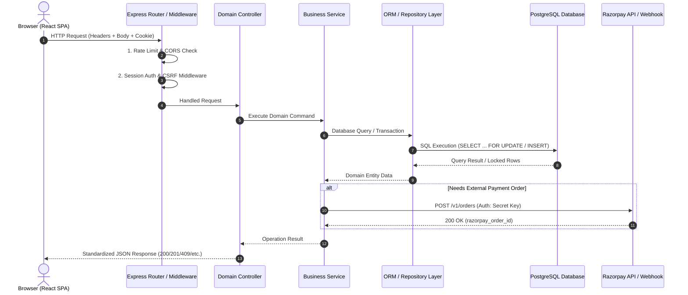
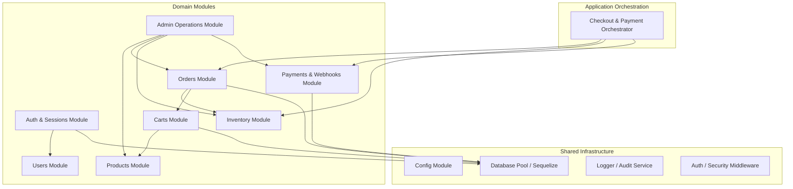
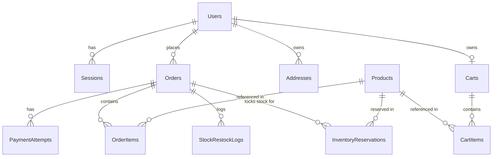
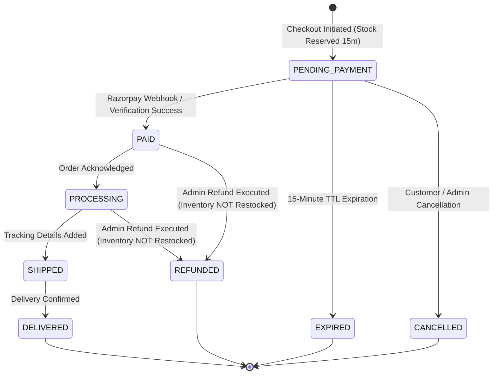
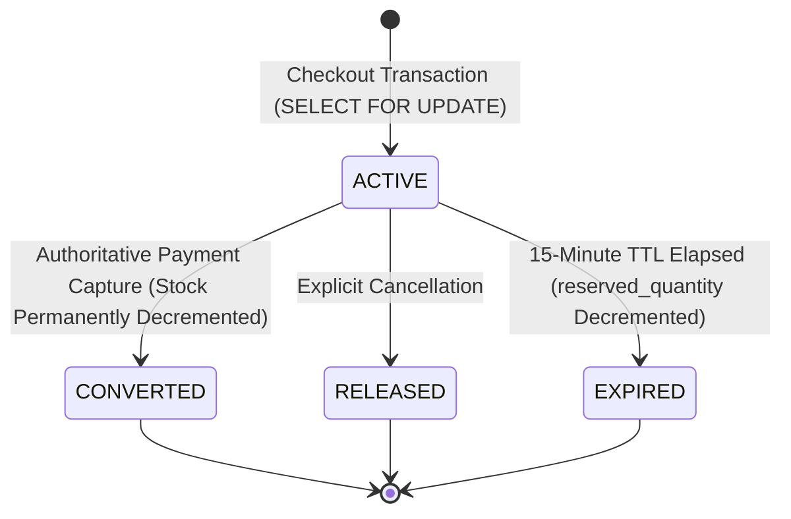
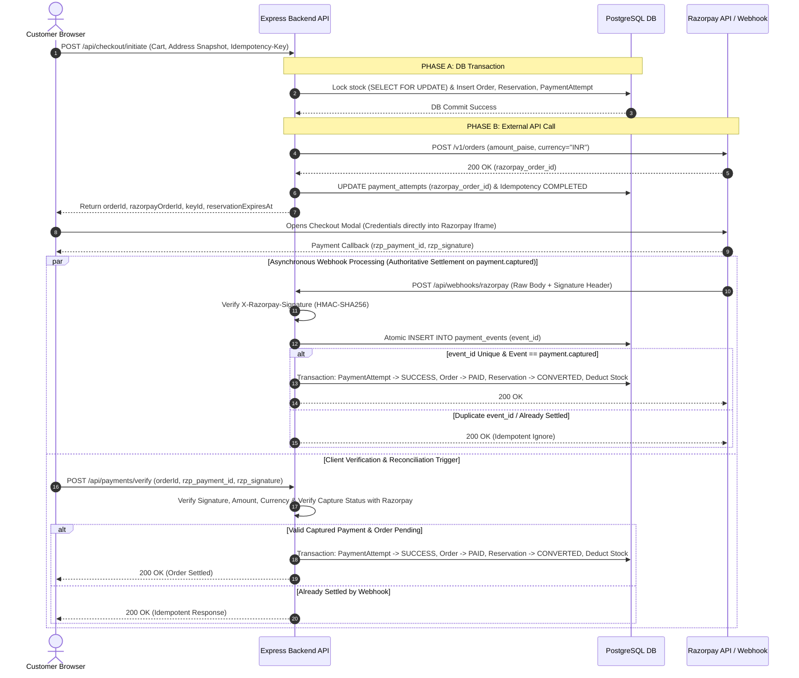

# Nexora Commerce Platform
## Technical Requirements Document (TRD)
### Version 1.2.1 — Production Engineering Specification
**Date:** September 2026  
**Status:** Approved for Implementation  
**Source of Truth:** Product Requirements Document (PRD) v2.1  
**Previous Version:** 1.2  
**Authors:** Principal Software Architect, Senior Backend Engineer, Database Architect, Security Engineer, Payment Systems Engineer, DevOps/SRE Engineer  

### TRD v1.2.1 Surgical Correction Summary
TRD v1.2.1 executes a focused surgical architectural correction pass over TRD v1.2. It resolves remaining technical inconsistencies identified during the final architecture review:
1. **PaymentAttempt State Machine:** Standardizes failure handling to `PaymentAttempt.status = 'FAILED'` with controlled `failure_reason = 'LATE_PAYMENT_RECONCILIATION_REQUIRED'`, eliminating non-standard database constraint states.
2. **Authoritative Capture Semantics:** Explicitly defines `payment.captured` (or verified backend capture) as the sole authoritative payment settlement event; `payment.authorized` alone does not settle orders.
3. **Checkout Idempotency Lifecycle:** Formalizes the idempotency state model (`IN_PROGRESS`, `COMPLETED`, `FAILED_RETRYABLE`) with global key uniqueness, safe concurrency locking, and deterministic retry behavior without duplicate orders.
4. **Failure & Recovery Determinism:** Establishes clear recovery paths for Razorpay API timeouts and payment retry failures, preventing stuck `INITIATED` payment attempts and duplicate ecommerce orders.
5. **Decoupled Late Payment Reconciliation:** Removes synchronous refund calls from the webhook path; webhooks record state and flag reconciliation for idempotent asynchronous processing.
6. **Refund Idempotency & Data Protection:** Formalizes full refund idempotency, separates physical restock operations, classifies `razorpay_signature` as sensitive metadata, and enforces payment event data minimization.
7. **Monetary Naming & Precision:** Standardizes all monetary fields across database schemas, APIs, and JSON contracts to INR Paise (`amountPaise`, `totalCostPaise`, `shippingFeePaise`) and explicitly prohibits JavaScript floating-point arithmetic for authoritative calculations.
8. **Module Decoupling & Precise Scoping:** Decouples Orders and Payments module dependencies via application orchestration, defines explicit auditable action scopes, and converts checklist claims to strict requirement specifications.

---

## Table of Contents
1. [Document Control](#1-document-control)
2. [Technical Executive Summary](#2-technical-executive-summary)
3. [Architecture Goals](#3-architecture-goals)
4. [Architecture Principles](#4-architecture-principles)
5. [System Context & Payment Data Boundary](#5-system-context--payment-data-boundary)
6. [High-Level Architecture & Authoritative State](#6-high-level-architecture--authoritative-state)
7. [Application Architecture](#7-application-architecture)
8. [Module / Domain Architecture](#8-module--domain-architecture)
9. [Repository / Folder Structure](#9-repository--folder-structure)
10. [Frontend Architecture](#10-frontend-architecture)
11. [Backend Architecture](#11-backend-architecture)
12. [Database Architecture & Query Efficiency](#12-database-architecture--query-efficiency)
13. [PostgreSQL Schema](#13-postgresql-schema)
14. [Database Constraints](#14-database-constraints)
15. [Database Indexes](#15-database-indexes)
16. [Transaction Boundaries & Checkout Phase Separation](#16-transaction-boundaries--checkout-phase-separation)
17. [Authentication Architecture](#17-authentication-architecture)
18. [Authorization, RBAC & IDOR Protection](#18-authorization-rbac--idor-protection)
19. [Session Management](#19-session-management)
20. [CSRF & Guest Anti-CSRF Protection](#20-csrf--guest-anti-csrf-protection)
21. [Guest Checkout Security](#21-guest-checkout-security)
22. [Cart Architecture](#22-cart-architecture)
23. [Product Architecture](#23-product-architecture)
24. [Order Architecture](#24-order-architecture)
25. [Inventory Architecture & State Machine](#25-inventory-architecture--state-machine)
26. [Inventory Reservation System](#26-inventory-reservation-system)
27. [Payment Architecture](#27-payment-architecture)
28. [Razorpay Integration & Data Isolation](#28-razorpay-integration--data-isolation)
29. [PaymentAttempt Architecture & Concurrency](#29-paymentattempt-architecture--concurrency)
30. [Razorpay Webhook & Event State Matrix](#30-razorpay-webhook--event-state-matrix)
31. [Idempotency & Retry Boundaries](#31-idempotency--retry-boundaries)
32. [Refund Architecture](#32-refund-architecture)
33. [Physical Restock Architecture](#33-physical-restock-architecture)
34. [API Architecture](#34-api-architecture)
35. [API Endpoint Specification](#35-api-endpoint-specification)
36. [Request / Response Contracts](#36-request--response-contracts)
37. [Validation Architecture](#37-validation-architecture)
38. [Error Handling Architecture](#38-error-handling-architecture)
39. [Rate Limiting](#39-rate-limiting)
40. [CORS / Security Headers](#40-cors--security-headers)
41. [Secrets Management](#41-secrets-management)
42. [Logging Architecture & Data Scrubbing](#42-logging-architecture--data-scrubbing)
43. [Audit Logging vs Payment Events](#43-audit-logging-vs-payment-events)
44. [Observability & Health Checks](#44-observability--health-checks)
45. [Performance Architecture](#45-performance-architecture)
46. [Reliability & Failure Recovery Matrix](#46-reliability--failure-recovery-matrix)
47. [Testing Architecture](#47-testing-architecture)
48. [Security Testing Matrix](#48-security-testing-matrix)
49. [Concurrency Testing](#49-concurrency-testing)
50. [Payment Testing](#50-payment-testing)
51. [Accessibility Testing](#51-accessibility-testing)
52. [Deployment Architecture](#52-deployment-architecture)
53. [Environment Configuration](#53-environment-configuration)
54. [CI/CD Architecture](#54-cicd-architecture)
55. [Database Migration Strategy](#55-database-migration-strategy)
56. [Backup & Restore Verification Strategy](#56-backup--restore-verification-strategy)
57. [Production Readiness](#57-production-readiness)
58. [Threat Model](#58-threat-model)
59. [Architectural Risks](#59-architectural-risks)
60. [Technical Decisions Summary](#60-technical-decisions-summary)
61. [Open Technical Decisions](#61-open-technical-decisions)
62. [Implementation Sequence & Migration Map](#62-implementation-sequence--migration-map)
63. [Requirements Traceability Matrix](#63-requirements-traceability-matrix)
64. [Definition of Done](#64-definition-of-done)
65. [Final TRD Readiness Assessment](#65-final-trd-readiness-assessment)

---

## 1. Document Control

### 1.1 Metadata
- **Document Title:** Technical Requirements Document (TRD) — Nexora Commerce Platform
- **Document Version:** 1.2.1 (Surgical Architectural Correction Pass)
**Date:** September 2026
- **Status:** APPROVED FOR IMPLEMENTATION
- **Previous Version:** 1.2
- **PRD Reference:** Nexora Commerce Platform PRD v2.1 (Approved Immutable Product Source of Truth)
- **Target Audience:** Engineering Team, Tech Leads, QA Engineers, DevOps Engineers, Security Reviewers
- **Repository Location:** `docs/TRD.md`

### 1.2 Revision History
| Version | Date | Author / Role | Description of Changes |
|---|---|---|---|
| **1.0** | 2026-09-06 | Engineering Architecture Board | Initial Technical Requirements Document derived from PRD v2.1. |
| **1.1** | 2026-09-06 | Engineering Architecture Board | Surgical correction pass against PRD v2.1: Payment data boundary, PaymentAttempt retries, strict server-side sessions (no JWTs), guest token security (headers only), dedicated `InventoryReservation` table, distinct `PaymentEvents` vs `AuditLogs`, database indexes/constraints, query efficiency standards, and idempotency boundaries. |
| **1.2** | 2026-09-06 | Principal Software Architect | Comprehensive architectural corrections: checkout transaction boundaries (Phase A DB commit before Phase B Razorpay call), failure/recovery matrix, checkout API idempotency (`Idempotency-Key`), payment retry concurrency locking, backend-authoritative payment success, Razorpay event state matrix, atomic webhook event insertion, late payment reconciliation policy, cookie name standard (`__Host-nexora_sid`), guest checkout anti-CSRF, reservation uniqueness `UNIQUE(order_id, product_id)`, partial unique index for single successful `PaymentAttempt`, admin inventory update safety (`reserved_quantity <= stock_quantity`), restock validation, full refund model, endpoint consolidation (`POST /api/checkout/initiate`), immutable address snapshotting, payment event vs audit log separation, health endpoint separation (`/live` vs `/ready`), proxy-safe rate limiting, and Playwright E2E security test matrix. |
| **1.2.1** | 2026-09-06 | Principal Software Architect | Surgical consistency correction pass: standardizes `PaymentAttempt.status = 'FAILED'` with controlled `failure_reason = 'LATE_PAYMENT_RECONCILIATION_REQUIRED'`; formalizes Razorpay `payment.captured` authoritative settlement and `/api/payments/verify` backend reconciliation semantics; establishes checkout idempotency lifecycle (`IN_PROGRESS`, `COMPLETED`, `FAILED_RETRYABLE`) with global key uniqueness; decouples late payment refunds from webhook handlers; standardizes all monetary naming and contracts to INR Paise (`amountPaise`, `totalCostPaise`, `shippingFeePaise`) with floating-point arithmetic prohibition; classifies `razorpay_signature` as sensitive metadata and enforces payment event data minimization; defines explicit auditable action set; eliminates module diagram circular dependencies via application orchestration; and transforms checklist statements into verifiable requirement specifications. |

---

## 2. Technical Executive Summary

The Nexora Commerce Platform TRD v1.2.1 translates PRD v2.1 into an implementation-ready engineering architecture. Nexora is built as a **Modular Monolith** using **Node.js (Express)**, **Sequelize ORM**, **PostgreSQL**, and **React (Vite)**.

### Key Architectural Pillars:
1. **Decoupled Checkout Transaction Boundaries:** Isolates database inventory locking (Phase A) from external Razorpay network calls (Phase B). Database locks (`SELECT ... FOR UPDATE`) are committed *before* external API calls.
2. **Server-Side Session Authentication (No JWTs):** Enforces server-side sessions with opaque 256-bit random session identifiers stored in PostgreSQL and delivered via `__Host-nexora_sid` (`HttpOnly`, `SameSite=Lax`, `Secure`) cookies. Session fixation protection rotates IDs upon authentication.
3. **Strict Payment Data Boundary & Webhook Atomicity:** Zero card credentials touch Nexora servers. Order settlement occurs strictly via authoritative backend verification of Razorpay webhooks (`POST /api/webhooks/razorpay`) upon `payment.captured` or verified backend capture with atomic `PaymentEvents` deduplication.
4. **First-Class PaymentAttempt Retry & Concurrency Protection:** One ecommerce `Order` supports multiple `PaymentAttempt` entities. Retries lock the Order row, verify status and active reservation TTL, and create a new `PaymentAttempt` with a new `razorpay_order_id` without creating duplicate orders.
5. **API Idempotency & Guest Anti-CSRF:** Enforces globally unique `Idempotency-Key` headers on checkout initiation with lifecycle states (`IN_PROGRESS`, `COMPLETED`, `FAILED_RETRYABLE`) and explicit pre-session anti-CSRF protection for guest checkouts.
6. **Immutable Order Address Snapshots:** Copies shipping address details directly into the `orders` record at checkout initiation, guaranteeing historical immutability regardless of user profile updates.
7. **Decoupled Physical Restock & Strict Inventory Integrity:** Decouples payment refunds from inventory restocking. Admin inventory updates enforce `reserved_quantity <= stock_quantity` and require explicit audit logs.
8. **Measurable Query Efficiency:** Eliminates arbitrary query-count limits; enforces N+1 query elimination, eager loading, database indexes, and p95 latency targets.

---

## 3. Architecture Goals

| Goal ID | Goal | Engineering Target | Verification Mechanism |
|---|---|---|---|
| **AG-01** | High Transactional Integrity | Zero stock overselling under 100 simultaneous checkout requests. | Automated Concurrency Integration Test |
| **AG-02** | Authoritative Payment Reconciliation | 100% of order status transitions to `PAID` occur via verified Razorpay `payment.captured` webhook or backend API capture verification. | Unit & Webhook Integration Tests |
| **AG-03** | Zero-Trust Data Isolation | 100% IDOR protection across user orders and guest order tracking. | Security Test Suite & Code Audit |
| **AG-04** | Sub-Second Latency Performance | `GET /api/products` p95 < 200ms; `POST /api/checkout/initiate` p95 < 300ms. | k6 / Autocannon Load Tests |
| **AG-05** | Complete Auditability | 100% of defined auditable actions (authentication, refunds, physical restocks, admin changes) logged to `audit_logs`. | DB & Log Verification |

---

## 4. Architecture Principles

1. **Modular Monolith:** Single process deployment with strictly isolated domain boundaries, clean service abstractions, and zero circular dependencies.
2. **PostgreSQL as Source of Truth:** Relational database constraints (foreign keys, non-negativity check constraints, composite unique indexes) enforce domain invariants at the storage layer.
3. **REST HTTP APIs:** Clean JSON REST endpoints. No GraphQL. No microservices for MVP.
4. **Backend State Authority:** The client never dictates prices, inventory totals, order status, or payment status. The server recalculates all values authoritatively.
5. **Explicit Payment Data Boundary:** Nexora application servers never ingest, handle, log, or store raw card numbers, CVVs, expiration dates, or bank credentials.
6. **Explicit Lock Ordering:** Deterministic lock acquisition sequence during checkout transactions (`ORDER BY id ASC`) to eliminate database deadlocks.
7. **Idempotency by Design:** All external webhook ingest points and payment creation operations enforce idempotency keys to tolerate retries safely.
8. **Security-First Defaults:** Secure cookie attributes, parameterized SQL queries, strict CORS, rate limiting, and zero sensitive data logging.
9. **Decoupled AI/ML Infrastructure:** System features zero runtime dependency on AI services; future vector search remains strictly out-of-band.

---

## 5. System Context & Payment Data Boundary

### 5.1 Payment Data Boundary Architecture

```
[ BROWSER (React SPA) ]
       │
       │ 1. Product selection & order placement (No card data)
       ▼
[ NEXORA BACKEND ]
       │
       │ 2. Initiates Order & PaymentAttempt (Server Secret Key)
       ▼
[ RAZORPAY API ] ───► Returns razorpay_order_id
       │
       │ 3. Sends razorpay_order_id & Key_ID to Browser
       ▼
[ RAZORPAY CHECKOUT (PCI-DSS Iframe / Modal) ]
       │
       │ 4. Customer enters card / UPI credentials directly into Razorpay
       ▼
[ RAZORPAY INFRASTRUCTURE ]
       │
       │ 5. Asynchronous Webhook (POST /api/webhooks/razorpay)
       ▼
[ NEXORA BACKEND ] ───► Verifies Signature (HMAC-SHA256) & Settles Order
```

### 5.2 Strict Payment Data Rules
- **Prohibited Credentials:** Raw card numbers, CVVs, card expiration dates, card PINs, banking credentials, and UPI PINs MUST NOT touch, pass through, store on, or log to Nexora application servers.
- **Client Handling:** Razorpay Checkout handles all payment credential collection inside its PCI-DSS Level 1 compliant modal.
- **Allowed Backend Attributes:** Nexora backend processes and stores only necessary payment metadata: `razorpay_order_id`, `razorpay_payment_id`, payment status, `amount_paise`, currency, and failure reasons. Where `razorpay_signature` is retained for verification/audit integrity, it is explicitly classified as sensitive payment metadata: it MUST NEVER be logged to stdout, files, or exception traces, MUST NEVER be exposed in customer or public API responses, and MUST NOT be included in analytics payloads.

---

## 6. High-Level Architecture & Authoritative State

### 6.1 Request & Data Flow Diagram



### 6.2 Authoritative State Principles
- **Catalog Price Authority:** Database `products.price_paise` is authoritative. Frontend-submitted prices are ignored. Authoritative monetary calculations MUST NOT use JavaScript floating-point arithmetic; all calculations are executed using integer arithmetic representing integer Paise.
- **Cart Total Authority:** Backend recalculates line items and totals during checkout initiation.
- **Payment Settlement Authority:** Order status transitions to `PAID` ONLY when authoritative payment capture is confirmed via verified Razorpay webhook (`payment.captured` on `POST /api/webhooks/razorpay`) or authoritative backend capture verification (`POST /api/payments/verify`). `payment.authorized` alone MUST NOT mark an Order as `PAID`. Frontend callbacks update UI state speculatively and remain strictly non-authoritative.

---

## 7. Application Architecture

The application is structured into three clear tiers within a single process:

1. **Presentation & Transport Tier (Express Controllers & Middleware):**
   - Parses HTTP requests, executes validation schemas, manages cookies, and formats standard JSON HTTP responses.
2. **Domain Service Tier (Business Logic):**
   - Implements domain rules, manages transaction boundaries, enforces state transitions, and integrates with external services (Razorpay).
3. **Data Access Tier (Sequelize Repositories & PostgreSQL):**
   - Handles database queries, row-level locking, migrations, and model definitions with strict database constraints.

---

## 8. Module / Domain Architecture

The backend is organized into explicit, self-contained modules. Cross-module communications occur strictly via defined service interfaces and top-level application orchestration. Direct database model access across module boundaries is prohibited.



### 8.1 Module Responsibility Matrix

| Module | Responsibilities | Dependencies | Public Interface / Exports |
|---|---|---|---|
| `auth` | User registration, login, session creation, password hashing, session validation, logout. | `users`, `db`, `shared` | `AuthService.validateSession()`, `AuthMiddleware` |
| `users` | User profile retrieval, address management. | `db` | `UserService.findById()`, `UserService.create()` |
| `products` | Product catalog retrieval, full-text search, stock querying, soft-deletion, category filtering. | `db` | `ProductService.getAvailableStock()`, `ProductService.list()` |
| `carts` | Cart item addition, quantity updates, guest cart merging, cart snapshot retrieval. | `products`, `db` | `CartService.getCartForCheckout()`, `CartService.mergeCarts()` |
| `orders` | Order creation, state machine transitions, order history, guest token tracking. | `inventory`, `carts`, `db` | `OrderService.createPendingOrder()`, `OrderService.transitionState()` |
| `inventory` | Row-locking stock reservation, TTL expiry cleanup, permanent stock deduction, physical restock. | `products`, `db` | `InventoryService.reserveStock()`, `InventoryService.deductStock()`, `InventoryService.restock()` |
| `payments` | PaymentAttempt creation, Razorpay API client, signature verification, webhook idempotency, refunds. | `db`, `shared` | `PaymentService.createAttempt()`, `WebhookService.processEvent()`, `PaymentService.refund()` |
| `admin` | Admin operational endpoints, inventory updates, order tracking, security log audit. | `products`, `orders`, `inventory`, `payments`, `db` | Admin API Routes |
| `audit` | Audit log recording for security, admin actions, and payment events. | `db` | `AuditService.logAction()`, `AuditService.logPaymentEvent()` |

---

## 9. Repository / Folder Structure

### 9.1 Root Architecture Layout

```
Ecommerce-project/
├── docs/                        # Architecture & Product Documentation
│   ├── PRD.md                   # Product Requirements Document v2.1
│   ├── TRD.md                   # Technical Requirements Document v1.2.1
│   ├── CURRENT_SYSTEM_AUDIT.md  # Legacy Baseline Audit
│   └── CURRENT_UX_AUDIT.md      # Baseline UX Audit
│
├── ecommerce-backend/           # Backend Express Application
│   ├── src/
│   │   ├── config/              # Environment & DB Configurations
│   │   │   ├── database.js      # Sequelize PostgreSQL Connection Pool
│   │   │   ├── razorpay.js      # Razorpay SDK Initialization
│   │   │   └── env.js           # Env Var Validation & Defaults
│   │   ├── middleware/          # Cross-Cutting HTTP Middlewares
│   │   │   ├── auth.middleware.js       # Session Authentication
│   │   │   ├── rbac.middleware.js       # Role-Based Access Control
│   │   │   ├── csrf.middleware.js       # CSRF Double-Submit Protection
│   │   │   ├── rawBody.middleware.js    # Raw Request Body Preserver
│   │   │   ├── rateLimiter.middleware.js# Rate Limiting Engine
│   │   │   └── errorHandler.middleware.js # Standardized Error Handler
│   │   ├── modules/             # Modular Monolith Domain Modules
│   │   │   ├── auth/            # Auth & Sessions Domain
│   │   │   ├── users/           # User Domain
│   │   │   ├── products/        # Product & Catalog Domain
│   │   │   ├── carts/           # Cart Domain
│   │   │   ├── orders/          # Orders Domain
│   │   │   ├── inventory/       # Inventory & Reservations Domain
│   │   │   ├── payments/        # Razorpay & Webhook Domain
│   │   │   ├── admin/           # Admin Console Domain
│   │   │   └── audit/           # Audit Logging Domain
│   │   ├── db/                  # Database Models, Migrations & Seeds
│   │   │   ├── models/          # Sequelize Entity Models
│   │   │   │   ├── User.js
│   │   │   │   ├── Session.js
│   │   │   │   ├── Product.js
│   │   │   │   ├── Cart.js
│   │   │   │   ├── CartItem.js
│   │   │   │   ├── Address.js
│   │   │   │   ├── Order.js
│   │   │   │   ├── OrderItem.js
│   │   │   │   ├── InventoryReservation.js
│   │   │   │   ├── PaymentAttempt.js
│   │   │   │   ├── PaymentEvent.js
│   │   │   │   ├── AuditLog.js
│   │   │   │   └── StockRestockLog.js
│   │   │   ├── migrations/      # Sequential SQL Migrations
│   │   │   └── seeders/         # Production & Test Seeders
│   │   ├── shared/              # Shared Utilities
│   │   │   ├── errors/          # Custom AppError Hierarchy
│   │   │   ├── logger.js        # Structured Pino JSON Logger
│   │   │   └── crypto.js        # Constant-time comparison & Hashing
│   │   ├── app.js               # Express App Configuration
│   │   └── server.js            # Server Bootstrap & Graceful Shutdown
│   ├── tests/                   # Automated Test Suites
│   │   ├── unit/                # Unit Tests (Vitest)
│   │   ├── integration/         # Integration & API Tests (Supertest)
│   │   ├── concurrency/         # Stock Lock Race Condition Tests
│   │   └── setup.js             # Test DB Lifecycle Setup
│   ├── package.json
│   └── vitest.config.js
│
└── ecommerce-project/           # React Frontend Application
    ├── src/
    │   ├── app/                 # Core App Initialization & Context Providers
    │   ├── components/          # Reusable Editorial UI Components
    │   ├── features/            # Feature-Driven Components
    │   ├── services/            # Axios API Client & Endpoint Wrappers
    │   ├── hooks/               # Custom React Hooks
    │   ├── styles/              # Vanilla CSS & Theme Tokens
    │   └── tests/               # React & Accessibility Tests
    ├── package.json
    └── vite.config.js
```

---

## 10. Frontend Architecture

### 10.1 Technology Stack & Organization
- **Framework:** React 19 + Vite 6
- **Routing:** React Router v7 (`createBrowserRouter`)
- **State Management:** Feature-driven React Context + Local State (Optimistic UI for cart). No Redux required.
- **HTTP Client:** Axios instance with `withCredentials: true` (for session cookie delivery) and `X-CSRF-Token` header injection.

### 10.2 Cart Optimistic UI Flow
```
User clicks "Add to Cart" / "Increment Quantity"
  │
  ├── 1. Snapshot previous cart state in memory
  ├── 2. Immediately update React state & UI DOM (Optimistic)
  ├── 3. Dispatch async API request: POST /api/cart/items
  │
  ├──► Success (200/201): Replace optimistic item with server payload
  │
  └──► Failure (4xx/5xx): 
        ├── 1. Revert React state to snapshot (Rollback)
        └── 2. Trigger accessible toast alert: "Stock unavailable or network error."
```

### 10.3 Guest Cart Storage & Merging
- **Unauthenticated State:** Cart items stored in `localStorage` under key `nexora_guest_cart` (`[{ productId, quantity }]`).
- **Authentication Event:** Upon successful login/registration, the frontend sends `localStorage` items to `POST /api/cart/merge`.
- **Server Merging Logic:** The backend adds guest items into the user's database `Cart`, resolving duplicate products by summing quantities (capped at 10 items per product). `localStorage` is subsequently cleared.

---

## 11. Backend Architecture

### 11.1 Technology Stack & Setup
- **Runtime:** Node.js (ESM Modules, Node 20 LTS)
- **Framework:** Express 4.21+
- **Database ORM:** Sequelize 6.35+
- **Database Driver:** `pg` (PostgreSQL client)

### 11.2 Express Server Middleware Chain Order
```
1. Request Initialization & Correlation ID (Pino Logger Middleware)
   ↓
2. Security Headers (Helmet.js)
   ↓
3. CORS Middleware (Strict Origin Validation)
   ↓
4. IP Rate Limiting Middleware ( express-rate-limit )
   ↓
5. Raw Body Preservation Middleware ( capturing raw body buffer for /api/webhooks/razorpay )
   ↓
6. Express Standard Body Parsers ( express.json() & express.urlencoded() )
   ↓
7. Cookie Parser ( cookie-parser )
   ↓
8. Session Authentication Middleware ( Resolves Session ID cookie -> req.user )
   ↓
9. CSRF Validation Middleware ( Enforces X-CSRF-Token on state-changing requests; ignores webhook endpoint )
   ↓
10. API Domain Routers ( /api/auth, /api/products, /api/checkout, /api/webhooks, /api/admin )
   ↓
11. 404 Route Catch-All Handler
   ↓
12. Global Error Handling Middleware ( Formats standardized JSON errors )
```

---

## 12. Database Architecture & Query Efficiency

### 12.1 PostgreSQL Core Specification
- **Engine:** PostgreSQL 15+ (Requires `pgcrypto` extension for native `gen_random_uuid()` generation).
- **Storage Engine Constraints:** ACID compliant relational engine with full transactional locking support (`SELECT ... FOR UPDATE`). SQLite is strictly prohibited in production and testing environments.
- **Monetary Storage & Precision:** All monetary values stored as 64-bit BigInt / Integer representing **INR Paise** (1 INR = 100 Paise). JavaScript floating-point arithmetic (e.g. `0.1 + 0.2`) MUST NOT be used for authoritative monetary calculations; all calculations are executed strictly using integer arithmetic. Floating point types (`FLOAT`, `DOUBLE`, `DECIMAL` without explicit scale) are strictly forbidden to prevent precision drift.

### 12.2 Query Efficiency Standards (PRD v2.1 Section 19.2)
- **Universal Query Limits Removed:** Fixed rules such as "maximum 3 SQL queries per request" are explicitly removed. Query volume is evaluated based on necessity, indexing, and execution efficiency.
- **N+1 Query Elimination:** All relational fetches must use Sequelize eager loading (`include: [OrderItem, InventoryReservation]`), explicit joins, or batching to eliminate N+1 query loops.
- **Index-Backed Access:** All critical query paths (order lookups, session authentication, product search, inventory reservation checks) must hit database indexes (see Section 15).
- **Query Profiling:** Critical endpoints (`GET /api/products`, `POST /api/checkout/initiate`, `POST /api/webhooks/razorpay`) must have query execution plans (`EXPLAIN ANALYZE`) validated during automated integration tests.
- **Primary Benchmark:** System performance is governed strictly by p95 latency targets under load (`GET /api/products` p95 < 200ms, `POST /api/checkout/initiate` p95 < 300ms).

---

## 13. PostgreSQL Schema



### 13.1 SQL DDL Schema Definitions

```sql
-- Enable cryptographic UUID extension
CREATE EXTENSION IF NOT EXISTS "pgcrypto";

-- 1. Users Table
CREATE TABLE users (
    id UUID PRIMARY KEY DEFAULT gen_random_uuid(),
    email VARCHAR(255) NOT NULL UNIQUE,
    password_hash VARCHAR(255) NOT NULL,
    role VARCHAR(50) NOT NULL DEFAULT 'customer' CHECK (role IN ('customer', 'admin')),
    full_name VARCHAR(255) NOT NULL,
    created_at TIMESTAMPTZ NOT NULL DEFAULT CURRENT_TIMESTAMP,
    updated_at TIMESTAMPTZ NOT NULL DEFAULT CURRENT_TIMESTAMP
);

-- 2. Sessions Table (Server-side Session Store - NO JWT)
-- sid stores raw opaque cryptographically secure 256-bit token
CREATE TABLE sessions (
    sid VARCHAR(255) PRIMARY KEY,
    user_id UUID NOT NULL REFERENCES users(id) ON DELETE CASCADE,
    data JSONB NOT NULL,
    expires_at TIMESTAMPTZ NOT NULL,
    created_at TIMESTAMPTZ NOT NULL DEFAULT CURRENT_TIMESTAMP,
    updated_at TIMESTAMPTZ NOT NULL DEFAULT CURRENT_TIMESTAMP
);

-- 3. Products Table
CREATE TABLE products (
    id UUID PRIMARY KEY DEFAULT gen_random_uuid(),
    name VARCHAR(255) NOT NULL,
    description TEXT NOT NULL,
    price_paise BIGINT NOT NULL CHECK (price_paise >= 0),
    stock_quantity INT NOT NULL CHECK (stock_quantity >= 0),
    reserved_quantity INT NOT NULL DEFAULT 0 CHECK (reserved_quantity >= 0),
    category VARCHAR(100) NOT NULL,
    image_url VARCHAR(1024) NOT NULL,
    is_deleted BOOLEAN NOT NULL DEFAULT FALSE,
    created_at TIMESTAMPTZ NOT NULL DEFAULT CURRENT_TIMESTAMP,
    updated_at TIMESTAMPTZ NOT NULL DEFAULT CURRENT_TIMESTAMP,
    CONSTRAINT chk_reserved_lte_stock CHECK (reserved_quantity <= stock_quantity)
);

-- 4. Carts Table
CREATE TABLE carts (
    id UUID PRIMARY KEY DEFAULT gen_random_uuid(),
    user_id UUID NULL UNIQUE REFERENCES users(id) ON DELETE CASCADE,
    created_at TIMESTAMPTZ NOT NULL DEFAULT CURRENT_TIMESTAMP,
    updated_at TIMESTAMPTZ NOT NULL DEFAULT CURRENT_TIMESTAMP
);

-- 5. CartItems Table
CREATE TABLE cart_items (
    id UUID PRIMARY KEY DEFAULT gen_random_uuid(),
    cart_id UUID NOT NULL REFERENCES carts(id) ON DELETE CASCADE,
    product_id UUID NOT NULL REFERENCES products(id) ON DELETE RESTRICT,
    quantity INT NOT NULL CHECK (quantity > 0 AND quantity <= 10),
    created_at TIMESTAMPTZ NOT NULL DEFAULT CURRENT_TIMESTAMP,
    updated_at TIMESTAMPTZ NOT NULL DEFAULT CURRENT_TIMESTAMP,
    CONSTRAINT uq_cart_product UNIQUE (cart_id, product_id)
);

-- 6. Addresses Table (User Convenience Saved Addresses)
CREATE TABLE addresses (
    id UUID PRIMARY KEY DEFAULT gen_random_uuid(),
    user_id UUID NULL REFERENCES users(id) ON DELETE CASCADE,
    full_name VARCHAR(255) NOT NULL,
    address_line1 VARCHAR(500) NOT NULL,
    city VARCHAR(100) NOT NULL,
    state VARCHAR(100) NOT NULL,
    pincode VARCHAR(20) NOT NULL,
    phone VARCHAR(20) NOT NULL,
    created_at TIMESTAMPTZ NOT NULL DEFAULT CURRENT_TIMESTAMP,
    updated_at TIMESTAMPTZ NOT NULL DEFAULT CURRENT_TIMESTAMP
);

-- 7. Orders Table (Contains Immutable Shipping Address Snapshot)
CREATE TABLE orders (
    id UUID PRIMARY KEY DEFAULT gen_random_uuid(),
    user_id UUID NULL REFERENCES users(id) ON DELETE SET NULL,
    order_status VARCHAR(50) NOT NULL DEFAULT 'PENDING_PAYMENT' 
        CHECK (order_status IN ('PENDING_PAYMENT', 'PAID', 'PROCESSING', 'SHIPPED', 'DELIVERED', 'CANCELLED', 'EXPIRED', 'REFUNDED')),
    total_cost_paise BIGINT NOT NULL CHECK (total_cost_paise >= 0),
    shipping_fee_paise BIGINT NOT NULL CHECK (shipping_fee_paise >= 0),
    -- Immutable Shipping Address Snapshot Fields
    shipping_full_name VARCHAR(255) NOT NULL,
    shipping_address_line1 VARCHAR(500) NOT NULL,
    shipping_city VARCHAR(100) NOT NULL,
    shipping_state VARCHAR(100) NOT NULL,
    shipping_pincode VARCHAR(20) NOT NULL,
    shipping_phone VARCHAR(20) NOT NULL,
    guest_token_hash VARCHAR(64) NULL,
    idempotency_key_hash VARCHAR(64) NULL,
    reservation_expires_at TIMESTAMPTZ NOT NULL,
    created_at TIMESTAMPTZ NOT NULL DEFAULT CURRENT_TIMESTAMP,
    updated_at TIMESTAMPTZ NOT NULL DEFAULT CURRENT_TIMESTAMP
);

-- 8. OrderItems Table
CREATE TABLE order_items (
    id UUID PRIMARY KEY DEFAULT gen_random_uuid(),
    order_id UUID NOT NULL REFERENCES orders(id) ON DELETE CASCADE,
    product_id UUID NOT NULL REFERENCES products(id) ON DELETE RESTRICT,
    quantity INT NOT NULL CHECK (quantity > 0),
    unit_price_paise BIGINT NOT NULL CHECK (unit_price_paise >= 0),
    created_at TIMESTAMPTZ NOT NULL DEFAULT CURRENT_TIMESTAMP,
    updated_at TIMESTAMPTZ NOT NULL DEFAULT CURRENT_TIMESTAMP
);

-- 9. InventoryReservations Table (Dedicated Reservation Entity)
CREATE TABLE inventory_reservations (
    id UUID PRIMARY KEY DEFAULT gen_random_uuid(),
    order_id UUID NOT NULL REFERENCES orders(id) ON DELETE CASCADE,
    product_id UUID NOT NULL REFERENCES products(id) ON DELETE RESTRICT,
    quantity INT NOT NULL CHECK (quantity > 0),
    expires_at TIMESTAMPTZ NOT NULL,
    status VARCHAR(50) NOT NULL DEFAULT 'ACTIVE' 
        CHECK (status IN ('ACTIVE', 'RELEASED', 'CONVERTED', 'EXPIRED')),
    created_at TIMESTAMPTZ NOT NULL DEFAULT CURRENT_TIMESTAMP,
    released_at TIMESTAMPTZ NULL,
    updated_at TIMESTAMPTZ NOT NULL DEFAULT CURRENT_TIMESTAMP,
    CONSTRAINT uq_inv_res_order_product UNIQUE (order_id, product_id)
);

-- 10. PaymentAttempts Table (First-Class Multi-Attempt Entity)
CREATE TABLE payment_attempts (
    id UUID PRIMARY KEY DEFAULT gen_random_uuid(),
    order_id UUID NOT NULL REFERENCES orders(id) ON DELETE CASCADE,
    attempt_number INT NOT NULL CHECK (attempt_number > 0),
    razorpay_order_id VARCHAR(255) NULL,
    razorpay_payment_id VARCHAR(255) NULL,
    razorpay_signature VARCHAR(512) NULL, -- Sensitive payment metadata; write-only, never logged or exposed via API
    razorpay_refund_id VARCHAR(255) NULL,
    status VARCHAR(50) NOT NULL DEFAULT 'INITIATED' 
        CHECK (status IN ('INITIATED', 'SUCCESS', 'FAILED', 'REFUNDED')),
    failure_reason VARCHAR(500) NULL,
    amount_paise BIGINT NOT NULL CHECK (amount_paise >= 0),
    created_at TIMESTAMPTZ NOT NULL DEFAULT CURRENT_TIMESTAMP,
    updated_at TIMESTAMPTZ NOT NULL DEFAULT CURRENT_TIMESTAMP,
    CONSTRAINT uq_order_attempt UNIQUE (order_id, attempt_number)
);

-- 11. PaymentEvents Table (Webhook Idempotency & Minimized Event Store)
CREATE TABLE payment_events (
    id UUID PRIMARY KEY DEFAULT gen_random_uuid(),
    event_id VARCHAR(255) NOT NULL UNIQUE,
    event_type VARCHAR(100) NOT NULL,
    order_id UUID NULL REFERENCES orders(id) ON DELETE SET NULL,
    payment_attempt_id UUID NULL REFERENCES payment_attempts(id) ON DELETE SET NULL,
    processing_status VARCHAR(50) NOT NULL DEFAULT 'PROCESSED'
        CHECK (processing_status IN ('PROCESSED', 'IGNORED_DUPLICATE', 'REQUIRES_REFUND', 'FAILED')),
    metadata_json JSONB NULL, -- Minimized & redacted event metadata (no raw sensitive payloads)
    received_at TIMESTAMPTZ NOT NULL DEFAULT CURRENT_TIMESTAMP
);

-- 12. AuditLogs Table (Security & Admin Operations Audit Log)
CREATE TABLE audit_logs (
    id UUID PRIMARY KEY DEFAULT gen_random_uuid(),
    actor_id UUID NULL REFERENCES users(id) ON DELETE SET NULL,
    action VARCHAR(100) NOT NULL,
    target_resource VARCHAR(100) NOT NULL,
    resource_id VARCHAR(255) NULL,
    ip_address VARCHAR(45) NOT NULL,
    details_json JSONB NULL,
    created_at TIMESTAMPTZ NOT NULL DEFAULT CURRENT_TIMESTAMP
);

-- 13. StockRestockLogs Table (Explicit Inventory Restock Log)
CREATE TABLE stock_restock_logs (
    id UUID PRIMARY KEY DEFAULT gen_random_uuid(),
    order_id UUID NOT NULL REFERENCES orders(id) ON DELETE CASCADE,
    product_id UUID NOT NULL REFERENCES products(id) ON DELETE RESTRICT,
    quantity_restocked INT NOT NULL CHECK (quantity_restocked > 0),
    initiated_by UUID NOT NULL REFERENCES users(id) ON DELETE RESTRICT,
    reason VARCHAR(500) NOT NULL,
    created_at TIMESTAMPTZ NOT NULL DEFAULT CURRENT_TIMESTAMP
);

-- 14. IdempotencyRecords Table (API Checkout Initiation & Mutation Deduplication)
CREATE TABLE idempotency_records (
    id UUID PRIMARY KEY DEFAULT gen_random_uuid(),
    idempotency_key VARCHAR(255) NOT NULL UNIQUE,
    status VARCHAR(50) NOT NULL DEFAULT 'IN_PROGRESS'
        CHECK (status IN ('IN_PROGRESS', 'COMPLETED', 'FAILED_RETRYABLE')),
    request_path VARCHAR(255) NOT NULL,
    request_hash VARCHAR(64) NOT NULL,
    order_id UUID NULL REFERENCES orders(id) ON DELETE SET NULL,
    payment_attempt_id UUID NULL REFERENCES payment_attempts(id) ON DELETE SET NULL,
    response_code INT NULL,
    response_body JSONB NULL,
    expires_at TIMESTAMPTZ NOT NULL,
    created_at TIMESTAMPTZ NOT NULL DEFAULT CURRENT_TIMESTAMP,
    updated_at TIMESTAMPTZ NOT NULL DEFAULT CURRENT_TIMESTAMP
);
```

---

## 14. Database Constraints

### 14.1 Integrity Constraints Summary
1. **Quantity Integrity:** `CartItems.quantity IN (1..10)`, `OrderItems.quantity > 0`, `InventoryReservations.quantity > 0`, `StockRestockLogs.quantity_restocked > 0`.
2. **Monetary Integrity:** `Products.price_paise >= 0`, `Orders.total_cost_paise >= 0`, `OrderItems.unit_price_paise >= 0`, `PaymentAttempts.amount_paise >= 0`.
3. **Stock Non-Negativity:** `Products.stock_quantity >= 0`, `Products.reserved_quantity >= 0`, `Products.reserved_quantity <= Products.stock_quantity`.
4. **Unique Payment References:** `PaymentEvents.event_id` (UNIQUE), `PaymentAttempts.razorpay_order_id` (UNIQUE WHERE NOT NULL), `PaymentAttempts.razorpay_payment_id` (UNIQUE WHERE NOT NULL).
5. **Single Successful Payment Integrity:** Partial unique index `UNIQUE(order_id) WHERE status = 'SUCCESS'` guarantees strictly one successful payment attempt per ecommerce order.
6. **Unique Inventory Reservation:** `InventoryReservations(order_id, product_id)` (UNIQUE) prevents duplicate reservation records for the same product in an order.
7. **Unique Cart Line Items:** `CartItems(cart_id, product_id)` (UNIQUE).
8. **Unique Attempt Sequence:** `PaymentAttempts(order_id, attempt_number)` (UNIQUE).
9. **Globally Unique Idempotency Key:** `IdempotencyRecords.idempotency_key` (UNIQUE) enforces distinct identification of idempotent operations at storage level.

---

## 15. Database Indexes

```sql
-- Users & Sessions Indexes
CREATE UNIQUE INDEX idx_users_email ON users(email);
CREATE INDEX idx_sessions_user_id ON sessions(user_id);
CREATE INDEX idx_sessions_expires_at ON sessions(expires_at);

-- Orders Indexes
CREATE INDEX idx_orders_user_id ON orders(user_id) WHERE user_id IS NOT NULL;
CREATE INDEX idx_orders_status ON orders(order_status);
CREATE INDEX idx_orders_created_at ON orders(created_at DESC);
CREATE INDEX idx_orders_guest_token ON orders(guest_token_hash) WHERE guest_token_hash IS NOT NULL;
CREATE INDEX idx_orders_idempotency ON orders(idempotency_key_hash) WHERE idempotency_key_hash IS NOT NULL;
CREATE INDEX idx_orders_reservation_expiry ON orders(reservation_expires_at) WHERE order_status = 'PENDING_PAYMENT';

-- Products Indexes
CREATE INDEX idx_products_category ON products(category);
CREATE INDEX idx_products_is_deleted ON products(is_deleted);
CREATE INDEX idx_products_fulltext ON products USING gin(to_tsvector('english', name || ' ' || description));

-- Cart & Order Items Indexes
CREATE INDEX idx_cart_items_cart_id ON cart_items(cart_id);
CREATE INDEX idx_order_items_order_id ON order_items(order_id);

-- InventoryReservations Indexes
CREATE UNIQUE INDEX idx_inv_res_order_product ON inventory_reservations(order_id, product_id);
CREATE INDEX idx_inv_res_product_id ON inventory_reservations(product_id);
CREATE INDEX idx_inv_res_status_expiry ON inventory_reservations(status, expires_at) WHERE status = 'ACTIVE';

-- PaymentAttempts Indexes
CREATE INDEX idx_payment_attempts_order_id ON payment_attempts(order_id);
CREATE UNIQUE INDEX idx_payment_attempts_rzp_order ON payment_attempts(razorpay_order_id) WHERE razorpay_order_id IS NOT NULL;
CREATE UNIQUE INDEX idx_payment_attempts_rzp_payment ON payment_attempts(razorpay_payment_id) WHERE razorpay_payment_id IS NOT NULL;
-- Critical Database Integrity Rule: Enforces maximum ONE successful PaymentAttempt per Order
CREATE UNIQUE INDEX uq_one_success_payment_per_order ON payment_attempts(order_id) WHERE status = 'SUCCESS';

-- PaymentEvents & Audit Logs Indexes
CREATE UNIQUE INDEX idx_payment_events_event_id ON payment_events(event_id);
CREATE INDEX idx_payment_events_order_id ON payment_events(order_id);
CREATE INDEX idx_audit_logs_actor ON audit_logs(actor_id);
CREATE INDEX idx_audit_logs_created_at ON audit_logs(created_at DESC);
CREATE INDEX idx_stock_restock_order ON stock_restock_logs(order_id);
CREATE UNIQUE INDEX idx_idempotency_key ON idempotency_records(idempotency_key);
CREATE INDEX idx_idempotency_expires_at ON idempotency_records(expires_at);
```

---

## 16. Transaction Boundaries & Checkout Phase Separation

All multi-table business operations execute within explicit PostgreSQL transactions using Sequelize (`sequelize.transaction`). To guarantee database pool availability and eliminate network lock contention, external network calls to third-party APIs (such as Razorpay) **MUST NEVER** be executed inside an open database transaction.

### 16.1 Checkout Phase Separation Architecture

Checkout initiation is strictly decoupled into two sequential phases:

```
PHASE A: DATABASE TRANSACTION (Fast, In-Memory DB Locking)
  1. Validate checkout context (authenticated user or guest CSRF token).
  2. Validate cart contents and re-verify active product status (is_deleted = false).
  3. Calculate authoritative server-side order cost (total_cost_paise, shipping_fee_paise).
  4. Validate shipping address fields and construct immutable snapshot.
  5. Check Idempotency-Key:
     - If record exists with status = 'COMPLETED' and matching hash, replay cached 201 response.
     - If record exists with status = 'IN_PROGRESS', return 409 Conflict ('CHECKOUT_IN_PROGRESS').
     - If record exists with different hash, return 409 Conflict ('IDEMPOTENCY_PAYLOAD_MISMATCH').
  6. Acquire PostgreSQL row locks: SELECT ... FOR UPDATE on requested products (ORDER BY id ASC).
  7. Verify available stock: IF (stock_quantity - reserved_quantity) < requested_qty THEN ROLLBACK & return 409 Conflict.
  8. UPDATE products SET reserved_quantity = reserved_quantity + requested_qty.
  9. INSERT INTO orders (with shipping address snapshot, status = 'PENDING_PAYMENT', reservation_expires_at = NOW() + 15m).
 10. INSERT INTO order_items for all line items.
 11. INSERT INTO inventory_reservations (status = 'ACTIVE', expires_at = NOW() + 15m).
 12. INSERT INTO payment_attempts (attempt_number = 1, status = 'INITIATED', razorpay_order_id = NULL).
 13. INSERT INTO idempotency_records (idempotency_key, status = 'IN_PROGRESS', request_path, request_hash, order_id, payment_attempt_id, expires_at = NOW() + 24h).
 14. COMMIT DATABASE TRANSACTION.

                    ─── DB TRANSACTION COMMITTED & ROW LOCKS RELEASED ───

PHASE B: RAZORPAY API CALL (External Network I/O)
  1. Call Razorpay API: POST /v1/orders (amount_paise, currency="INR", receipt=order_id).
  2. If Razorpay call succeeds:
     a. UPDATE payment_attempts SET razorpay_order_id = :rzp_order_id WHERE id = :payment_attempt_id.
     b. UPDATE idempotency_records SET status = 'COMPLETED', response_code = 201, response_body = :response_payload WHERE idempotency_key = :key.
     c. Return HTTP 201 Created to client (orderId, razorpayOrderId, keyId, reservationExpiresAt).
  3. If Razorpay call fails (Timeout / Network Error / 5xx) or local persistence fails:
     a. Order remains in PENDING_PAYMENT state with ACTIVE 15-minute stock reservation intact.
     b. UPDATE payment_attempts SET status = 'FAILED', failure_reason = :error_message (or marked reconcilable).
     c. UPDATE idempotency_records SET status = 'FAILED_RETRYABLE' WHERE idempotency_key = :key.
     d. Return retryable HTTP 502 Bad Gateway / 504 Gateway Timeout failure to client.
     e. Client may safely retry payment via POST /api/payments/retry reusing the same ecommerce Order without creating duplicate orders.
```

### 16.2 Strict Prohibitions
- **NEVER** hold `SELECT ... FOR UPDATE` locks while waiting for Razorpay HTTP responses.
- **NEVER** open a PostgreSQL transaction that wraps external network calls.
- **NEVER** keep a database connection open across an external API retry loop.

---

## 17. Authentication Architecture

The platform strictly standardizes on **Server-Side Session Authentication**. Stateless JWTs, bearer tokens, refresh tokens, and client-side localStorage access tokens are strictly prohibited.

```
Client (Browser)                 Express Server                PostgreSQL
   │                                  │                             │
   ├─── POST /api/auth/login ────────►│                             │
   │    (email, password)             ├── Verify bcrypt hash        │
   │                                  ├── Rotate & generate 256-bit │
   │                                  │   random session token      │
   │                                  ├── INSERT INTO sessions ────►│
   │                                  │                             │
   │◄── 200 OK Set-Cookie ────────────┤                             │
   │    __Host-nexora_sid=...;        │                             │
   │    HttpOnly; SameSite=Lax; Secure│                             │
   │                                  │                             │
   ├─── GET /api/orders/me ──────────►│                             │
   │    Cookie: __Host-nexora_sid=... ├── SELECT FROM sessions ────►│
   │                                  │   WHERE sid = ...           │
   │                                  │   AND expires_at > NOW()    │
   │◄── 200 OK (Orders Data) ─────────┤                             │
```

- **Password Hashing:** Passwords are hashed using `bcrypt` (cost factor 12). Plaintext passwords are never logged or stored.
- **Session Identity:** Session IDs are opaque 256-bit cryptographically secure random tokens generated via `crypto.randomBytes(32).toString('hex')`. Raw tokens are stored directly in `sessions.sid`. No cookie signing secret (`SESSION_SECRET`) is required for token validation because lookup is performed against the database store.
- **Session Fixation Prevention:** Upon successful authentication (`POST /api/auth/login`), any existing unauthenticated session is invalidated and replaced with a newly generated session ID.

---

## 18. Authorization, RBAC & IDOR Protection

Access control is enforced server-side via middleware verifying session state, user role, and resource ownership.

### 18.1 Role & Resource Access Matrix

| Resource / Action | Public Guest | Authenticated Customer | Admin |
|---|---|---|---|
| Browse Products (`GET /api/products`) | Allowed | Allowed | Allowed |
| Initiate Checkout (`POST /api/checkout/initiate`) | Allowed (via Guest Anti-CSRF) | Allowed (via Session CSRF) | Allowed |
| Track Guest Order (`GET /api/orders/guest/:id`) | Allowed (via `X-Guest-Token`) | Allowed (via `X-Guest-Token`) | Allowed |
| User Orders (`GET /api/orders/me`) | Denied (401) | Allowed (Own Orders Only) | Allowed |
| Specific Order (`GET /api/orders/:id`) | Denied (401) | Allowed (Only if `order.user_id === req.user.id`) | Allowed |
| Product Management (`POST/PUT/DELETE /api/admin/*`) | Denied (401/404) | Denied (403/404) | Allowed |
| Admin Order Refund (`POST /api/admin/orders/:id/refund`) | Denied (401/404) | Denied (403/404) | Allowed |
| Physical Restock (`POST /api/admin/orders/:id/restock`) | Denied (401/404) | Denied (403/404) | Allowed |

- **IDOR Protection:** Endpoint `GET /api/orders/:id` verifies `order.user_id === req.user.id`. Unauthorized access attempts return sanitized `404 Not Found` or `401 Unauthorized` responses to prevent resource enumeration.

---

## 19. Session Management

1. **Session ID Generation:** 256-bit entropy random token: `crypto.randomBytes(32).toString('hex')`.
2. **Cookie Standardization:** Delivered via `__Host-nexora_sid` with flags: `HttpOnly = true`, `Secure = true` (in production), `SameSite = Lax`, `Path = /`, and **no Domain attribute** (mandated by `__Host-` prefix specification).
3. **Session Data Model (`sessions.data`):** Stored as a JSONB object containing `{ userId, role, createdAt, lastAccess }`.
4. **Session Expiry:** 7-day rolling expiration. Active requests within the window automatically bump `expires_at = NOW() + INTERVAL '7 days'`.
5. **Logout Execution:** `POST /api/auth/logout` deletes the matching row in `sessions` and sends `res.clearCookie('__Host-nexora_sid', { path: '/' })`.

---

## 20. CSRF & Guest Anti-CSRF Protection

The platform implements explicit anti-CSRF protections tailored to both authenticated and unauthenticated contexts:

### 20.1 Authenticated CSRF Protection
- **Mechanism:** Double-submit header pattern using `X-CSRF-Token`.
- **Flow:** Upon session creation, server generates a 128-bit random CSRF token stored in `sessions.data.csrfToken`. The token is exposed to the frontend via a readable cookie `nexora_csrf`. The frontend attaches `X-CSRF-Token` header on all state-changing requests (`POST`, `PUT`, `PATCH`, `DELETE`).

### 20.2 Guest Checkout Anti-CSRF Protection
- **Context:** Guests initiating checkout (`POST /api/checkout/initiate`) do not possess an authenticated session.
- **Mechanism:** Prior to checkout, the client fetches a transient guest anti-CSRF token via `GET /api/checkout/csrf-token`.
- **Implementation:** Server issues a cryptographically signed guest CSRF token (valid for 30 minutes) delivered via cookie `__Host-nexora_guest_csrf`. The client submits this value in header `X-Guest-CSRF-Token` during `POST /api/checkout/initiate`. The backend validates token authenticity and expiry before processing guest checkout.
- **Exempt Endpoints:** Webhook ingestion (`POST /api/webhooks/razorpay`) is exempt from CSRF validation and relies strictly on HMAC-SHA256 signature verification.

---

## 21. Guest Checkout Security

To prevent IDOR attacks on guest order data:

1. **Token Generation:** Upon guest order placement (`POST /api/checkout/guest`), backend generates a raw 256-bit token: `rawToken = crypto.randomBytes(32).toString('hex')`.
2. **Token Storage:** Backend calculates `tokenHash = crypto.createHash('sha256').update(rawToken).digest('hex')` and stores `tokenHash` in `Orders.guest_token_hash`.
3. **Client Transmittal:** `rawToken` is returned **ONCE** in response body `{ "orderId": "...", "guestToken": "rawToken" }`.
4. **Header Transmittal ONLY:** Client transmits token strictly via HTTP header `X-Guest-Token: rawToken`. Backend hashes incoming header and performs constant-time comparison against `Orders.guest_token_hash` using `crypto.timingSafeEqual()`.
5. **Strict Prohibitions:** Guest tokens MUST NEVER appear in URLs, path segments, query parameters, application logs, stdout, exception messages, analytics, telemetry, tracing attributes, or referrer data.
6. **Narrow Scoping:** Token grants access strictly to matching `orderId` and expires in 30 days. IP rate limiting (10 req/min) protects tracking endpoints.

---

## 22. Cart Architecture

- **Authenticated Cart:** Linked to `user_id` in `Carts` table.
- **Guest Cart:** Stored in client `localStorage` and merged on login.
- **Quantity Limits:** Hard database check constraint enforces 1 to 10 items per product line item (`CartItems.quantity`).
- **Validation:** Cart totals and stock availability are re-validated against live database inventory prior to lock acquisition at checkout.

---

## 23. Product Architecture

- **Catalog Queries:** Filtered by `is_deleted = false`.
- **Search Engine:** PostgreSQL full-text search query: `to_tsvector('english', name || ' ' || description) @@ plainto_tsquery('english', :query)`.
- **Soft Deletion:** Deleting a product sets `is_deleted = true`, preserving historical foreign key references in `OrderItems`.

---

## 24. Order Architecture

### 24.1 Order State Machine Transition Diagram



### 24.2 State Machine Enforcement Table

| Current State | Next State | Authorizing Actor | Trigger Event / Endpoint | Side Effects |
|---|---|---|---|---|
| `PENDING_PAYMENT` | `PAID` | System / Webhook | Razorpay `payment.captured` webhook or verified backend capture (`POST /api/payments/verify`). `payment.authorized` alone does NOT settle order. | `InventoryReservation` -> `CONVERTED`; stock permanently deducted. |
| `PENDING_PAYMENT` | `EXPIRED` | System (Cleanup Job) | 15-minute TTL elapsed without payment | `InventoryReservation` -> `EXPIRED`; `reserved_quantity` released. |
| `PENDING_PAYMENT` | `CANCELLED` | Customer / Admin | `POST /api/orders/:id/cancel` | `InventoryReservation` -> `RELEASED`; `reserved_quantity` released. |
| `PAID` | `PROCESSING` | Admin | `PATCH /api/admin/orders/:id/status` | Fulfillment workflow initiated. |
| `PROCESSING` | `SHIPPED` | Admin | `PATCH /api/admin/orders/:id/status` | Tracking number recorded. |
| `SHIPPED` | `DELIVERED` | Admin / System | `PATCH /api/admin/orders/:id/status` | Order completed. |
| `PAID` / `PROCESSING` | `REFUNDED` | Admin | `POST /api/admin/orders/:id/refund` | Payment refunded via Razorpay API. **Stock IS NOT changed.** |

---

## 25. Inventory Architecture & State Machine

### 25.1 Inventory Quantities & Reservation States
- **`stock_quantity`:** Total physical stock owned.
- **`reserved_quantity`:** Stock locked under active 15-minute checkout TTLs.
- **`available_quantity`:** Calculated as `(stock_quantity - reserved_quantity)`.



---

## 26. Inventory Reservation System & Failure Recovery Matrix

### 26.1 PostgreSQL Row-Locking SQL (Phase A)
To eliminate race conditions and overselling, Phase A executes inside a database transaction using PostgreSQL row locks and inserts an `InventoryReservations` record:

```sql
BEGIN;

-- 1. Lock requested products in deterministic order (ORDER BY id ASC) to prevent deadlocks
SELECT id, stock_quantity, reserved_quantity 
FROM products 
WHERE id IN ('p-uuid-1', 'p-uuid-2') 
ORDER BY id ASC 
FOR UPDATE;

-- 2. Validate condition inside transaction:
-- IF (stock_quantity - reserved_quantity) >= requested_quantity THEN:
UPDATE products 
SET reserved_quantity = reserved_quantity + :requested_qty,
    updated_at = CURRENT_TIMESTAMP
WHERE id = :product_id;

-- 3. Create Order with Immutable Shipping Address Snapshot
INSERT INTO orders (
    id, user_id, order_status, total_cost_paise, shipping_fee_paise,
    shipping_full_name, shipping_address_line1, shipping_city, shipping_state, shipping_pincode, shipping_phone,
    reservation_expires_at
) VALUES (
    :order_id, :user_id, 'PENDING_PAYMENT', :total_paise, :shipping_paise,
    :full_name, :address_line1, :city, :state, :pincode, :phone,
    NOW() + INTERVAL '15 minutes'
);

-- 4. Create Dedicated InventoryReservation Record
INSERT INTO inventory_reservations (id, order_id, product_id, quantity, expires_at, status)
VALUES (gen_random_uuid(), :order_id, :product_id, :requested_qty, NOW() + INTERVAL '15 minutes', 'ACTIVE');

-- 5. Create Initial PaymentAttempt (Pre-Razorpay Call)
INSERT INTO payment_attempts (id, order_id, attempt_number, razorpay_order_id, status, amount_paise)
VALUES (gen_random_uuid(), :order_id, 1, NULL, 'INITIATED', :total_paise);

-- 6. Insert Idempotency Record (status = 'IN_PROGRESS')
INSERT INTO idempotency_records (id, idempotency_key, status, request_path, request_hash, order_id, payment_attempt_id, expires_at)
VALUES (gen_random_uuid(), :idempotency_key, 'IN_PROGRESS', '/api/checkout/initiate', :request_hash, :order_id, :payment_attempt_id, NOW() + INTERVAL '24 hours');

COMMIT;
```

### 26.2 Checkout Failure & Recovery Matrix

| Failure Case | Failure Scenario | System Handling & State Outcome | Recovery & Client Action |
|---|---|---|---|
| **CASE A** | DB transaction fails before commit (e.g. stock insufficient, constraint violation). | Transaction rolls back completely. **No Order, No OrderItems, No InventoryReservation, No PaymentAttempt** created. | Client receives HTTP 409 Conflict ("Insufficient stock") or HTTP 400 Bad Request. Client updates cart. |
| **CASE B** | DB transaction commits successfully, but external Razorpay API call fails (timeout/5xx). | Order remains `PENDING_PAYMENT`. `InventoryReservation` remains `ACTIVE` for 15 minutes. `PaymentAttempt #1` updated to `FAILED` (`failure_reason = 'GATEWAY_TIMEOUT'`). `idempotency_records` updated to `FAILED_RETRYABLE`. No stock deducted. | Client receives retryable HTTP 504 / 502 failure. Client may safely retry checkout (reusing Order) or retry payment via `POST /api/payments/retry`. Reservation expiry releases stock if abandoned. |
| **CASE C** | Razorpay Order created successfully, but saving `razorpay_order_id` to DB fails. | Ecommerce Order remains `PENDING_PAYMENT`. Razorpay Order exists on gateway. `PaymentAttempt #1` remains recoverable `INITIATED`. System does NOT pretend initialization succeeded. | Retry via `POST /api/payments/retry` inspects unconfirmed attempt or transitions stale attempt to `FAILED` and creates Attempt #2. Orphaned Razorpay Order is reconciled via receipt/order matching and **never** creates a second ecommerce Order. |
| **CASE D** | Client double-clicks checkout button or submits duplicate request. | Enforced by globally unique `Idempotency-Key` header. If `COMPLETED`, returns cached 201 response. If `IN_PROGRESS`, returns HTTP 409 Conflict (`CHECKOUT_IN_PROGRESS`). If `FAILED_RETRYABLE`, permits controlled retry on existing Order. | Eliminates duplicate ecommerce Orders, duplicate stock locks, and duplicate PaymentAttempts. |
| **CASE E** | Client retries payment after failed or abandoned attempt. | Order remains unchanged. Reservation TTL checked. `PaymentAttempt #2` created with new `razorpay_order_id`. | Single ecommerce Order maintained. Multiple PaymentAttempts linked to same Order. Stock reservation retained. |

---

## 27. Payment Architecture

The platform integrates **Razorpay Checkout** in Test Mode. The backend is strictly authoritative over all payment status transitions.



---

## 28. Razorpay Integration & Data Isolation

### 28.1 Capture Semantics & Security Policy
- **Authoritative Capture Event:** `payment.captured` is the authoritative payment success event that settles an Order to `PAID`. `payment.authorized` alone MUST NOT mark an Order as `PAID`. Where manual capture is enabled, the backend capture flow must confirm capture before settlement.
- **Environment Keys:** `RAZORPAY_KEY_ID` (Public, frontend), `RAZORPAY_KEY_SECRET` (Private, backend server), `RAZORPAY_WEBHOOK_SECRET` (Private, backend server).
- **PCI-DSS Standard:** Zero card numbers, expiration dates, CVVs, or UPI PINs ever touch or store on Nexora servers. All card entry occurs within Razorpay's PCI-DSS Level 1 iframe.
- **Sensitive Metadata Protection:** `razorpay_signature` is classified as sensitive payment metadata: it is write-only, never logged to stdout/files/traces, never exposed in client API responses, and never transmitted to analytics providers.

---

## 29. PaymentAttempt Architecture & Concurrency

An ecommerce `Order` supports multiple payment attempts linked to the same order.

```
Order: ord_99120 (Status: PENDING_PAYMENT, Total: ₹1,500.00)
 ├── PaymentAttempt #1 (Status: FAILED, rzp_order_id: order_M101, Failure: Card Declined)
 └── PaymentAttempt #2 (Status: SUCCESS, rzp_order_id: order_M102, rzp_payment_id: pay_H889)
```

### 29.1 Payment Retry Concurrency Protection (`POST /api/payments/retry`)
To prevent race conditions where simultaneous client clicks create duplicate active payment attempts:
1. Open DB transaction: `SELECT * FROM orders WHERE id = :order_id FOR UPDATE`.
2. Validate `order_status === 'PENDING_PAYMENT'` and `reservation_expires_at > NOW()`.
3. Query `PaymentAttempts` for `order_id`: If an active `INITIATED` attempt exists, verify if it is stale (> 2 minutes without gateway confirmation) and transition it to `FAILED` (`failure_reason = 'STALE_ATTEMPT_SUPERSEDED'`).
4. Calculate `next_attempt = MAX(attempt_number) + 1`.
5. Insert new `PaymentAttempt` record (`attempt_number = next_attempt`, `status = 'INITIATED'`, `amount_paise = order.total_cost_paise`).
6. Commit DB transaction.
7. Execute Phase B: Call Razorpay API (`POST /v1/orders`), save new `razorpay_order_id`, and return payload to client.
8. Database constraint `uq_one_success_payment_per_order` guarantees that strictly one `PaymentAttempt` can achieve `SUCCESS` status per Order.

---

## 30. Razorpay Webhook & Event State Matrix

### 30.1 Webhook Atomicity & Signature Verification
- **Endpoint:** `POST /api/webhooks/razorpay`
- **Verification:** HMAC-SHA256 calculation over raw request body buffer using `RAZORPAY_WEBHOOK_SECRET` compared via `crypto.timingSafeEqual`.
- **Atomic Insertion:** Deduplication is enforced by attempting an atomic database insertion into `payment_events(event_id)`. If PostgreSQL returns a unique constraint error (SQLState `23505`), processing terminates immediately and returns `200 OK`.

### 30.2 Event State Reconciliation Table

| Razorpay Event | Expected State | Validation & Checks | DB State Transitions | Response |
|---|---|---|---|---|
| `payment.authorized` | `Order.PENDING_PAYMENT`, `PaymentAttempt.INITIATED` | Signature valid, `event_id` unique, `amount_paise` matches Order, currency = "INR". | Record event in `payment_events`. **DO NOT mark Order as PAID.** If backend capture workflow is active, initiate capture request to Razorpay. | 200 OK |
| `payment.captured` | `Order.PENDING_PAYMENT`, `PaymentAttempt.INITIATED` | Signature valid, `event_id` unique, `amount_paise` matches Order, currency = "INR". | `PaymentAttempt.status = 'SUCCESS'`, `Order.order_status = 'PAID'`, `InventoryReservation.status = 'CONVERTED'`, `Products.stock_quantity -= qty`, `Products.reserved_quantity -= qty`. | 200 OK |
| `payment.failed` | `Order.PENDING_PAYMENT`, `PaymentAttempt.INITIATED` | Signature valid, `event_id` unique. | `PaymentAttempt.status = 'FAILED'`, `PaymentAttempt.failure_reason = payload.error_description`. Order remains `PENDING_PAYMENT`. | 200 OK |
| **Late Payment** (`payment.captured` after expiry) | `Order.EXPIRED` or `CANCELLED` | Signature valid, `event_id` unique, but Order reservation TTL elapsed. | **DO NOT mark Order as PAID.** **DO NOT adjust inventory.** Mark `PaymentAttempt.status = 'FAILED'`, `failure_reason = 'LATE_PAYMENT_RECONCILIATION_REQUIRED'`. Record `payment_events` with `processing_status = 'REQUIRES_REFUND'`. Return `200 OK` immediately. Asynchronous/admin reconciliation path executes refund idempotently. | 200 OK |
| Duplicate Event | Any | `event_id` already exists in `payment_events`. | No DB state changes. Skip business logic. | 200 OK |
| Mismatched Amount / Currency | `Order.PENDING_PAYMENT` | Payload amount != `Order.total_cost_paise` or currency != "INR". | Mark `PaymentAttempt.status = 'FAILED'`, `failure_reason = 'AMOUNT_OR_CURRENCY_MISMATCH'`. Log security alert. | 200 OK |
| Unknown Order / PaymentAttempt ID | Any | `razorpay_order_id` not found in `payment_attempts`. | Log error alert to `audit_logs`. | 200 OK |

---

## 31. Idempotency & Retry Boundaries

### 31.1 API Checkout Idempotency Standard
- **Header:** `Idempotency-Key: <opaque-uuid-or-string>` (max 255 chars).
- **Scope:** **Globally Unique Key**. The `idempotency_key` uniquely identifies the idempotent operation across the system.
- **Lifecycle States:**
  1. `IN_PROGRESS`: Created within the Phase A database transaction prior to the Razorpay network call. Concurrent identical requests seeing `IN_PROGRESS` are rejected with HTTP 409 Conflict (`CHECKOUT_IN_PROGRESS`).
  2. `COMPLETED`: Updated upon successful Phase B completion with response status code (201) and sanitized response payload. Replay requests matching key and payload hash immediately receive the cached response.
  3. `FAILED_RETRYABLE`: If the external Razorpay API call fails or times out, the record transitions to `FAILED_RETRYABLE`. Retrying with the same key safely reuses the existing ecommerce Order without creating duplicates.
- **Payload Tampering Protection:** If an existing key is reused with a different request payload hash (`request_hash != SHA-256(body)`), the request is rejected with HTTP 409 Conflict (`IDEMPOTENCY_PAYLOAD_MISMATCH`).

---

## 32. Refund Architecture

- **Trigger:** Admin issues full refund via `POST /api/admin/orders/:id/refund`.
- **Precondition:** Order status MUST be `PAID` or `PROCESSING`. Settled `PaymentAttempt` status MUST be `SUCCESS`.
- **Idempotency & Duplicate Protection:** Duplicate refund requests on an already refunded or in-progress order are rejected with HTTP 409 Conflict or safely return the existing refund state.
- **API Call & Persistence:** Backend invokes Razorpay Refund API (`POST /v1/payments/{razorpay_payment_id}/refund`). Persists `razorpay_refund_id` in `payment_attempts`.
- **State Transition:** On successful Razorpay response, backend updates `PaymentAttempt.status = 'REFUNDED'` and `Order.order_status = 'REFUNDED'`.
- **CRITICAL BUSINESS RULE (PRD v2.1 Section 11.1):** Refunds **MUST NOT** automatically restore or increase `Products.stock_quantity`. Stock adjustment requires an explicit, audited physical restock operation.

---

## 33. Physical Restock Architecture & Validation

- **Trigger:** Admin physical stock return via `POST /api/admin/orders/:id/restock`.
- **Validation Rules:**
  1. Order MUST exist and be in state `REFUNDED` or `CANCELLED`.
  2. Target product MUST belong to line items in `OrderItems`.
  3. `quantity_restocked` MUST be > 0.
  4. Cumulative restocked quantity MUST NOT exceed original `OrderItem.quantity`.
  5. Physical restock cannot be executed on active or converted reservations.
- **Transactional Action:**
  `UPDATE products SET stock_quantity = stock_quantity + :qty WHERE id = :product_id;`
  `INSERT INTO stock_restock_logs (order_id, product_id, quantity_restocked, initiated_by, reason) VALUES (...);`

---

## 34. API Architecture & OpenAPI Contract

The OpenAPI 3.0 specification (`docs/openapi.yaml`) serves as the single authoritative source of truth for all API contracts, schemas, headers, error responses, and authentication rules.

---

## 35. API Endpoint Specification

| Method | Endpoint Path | Auth Level | CSRF Req | Rate Limit | Description |
|---|---|---|---|---|---|
| `GET` | `/api/products` | Public | No | 100/min | List products with pagination & search. |
| `GET` | `/api/products/:id` | Public | No | 100/min | Retrieve product details. |
| `POST` | `/api/auth/register` | Public | No | 5/min | Register new user account. |
| `POST` | `/api/auth/login` | Public | No | 5/min | Authenticate user & issue session cookie. |
| `POST` | `/api/auth/logout` | Authenticated | Yes | 20/min | Invalidate current session. |
| `GET` | `/api/auth/me` | Authenticated | No | 60/min | Get logged-in user profile. |
| `GET` | `/api/cart` | Authenticated | No | 60/min | Get active user cart. |
| `POST` | `/api/cart/items` | Authenticated | Yes | 60/min | Add / update item quantity in cart. |
| `DELETE`| `/api/cart/items/:id` | Authenticated | Yes | 60/min | Remove line item from cart. |
| `POST` | `/api/cart/merge` | Authenticated | Yes | 20/min | Merge guest localStorage cart on login. |
| `GET` | `/api/checkout/csrf-token` | Public Guest | No | 30/min | Fetch transient anti-CSRF token for guest checkout. |
| `POST` | `/api/checkout/initiate` | Auth/Guest | Guest CSRF | 10/min | Initiate checkout (Phase A DB commit -> Phase B Razorpay call). |
| `GET` | `/api/orders/me` | Authenticated | No | 30/min | Get order history for customer. |
| `GET` | `/api/orders/guest/:id` | Guest (`X-Guest-Token`) | No | 10/min | Get guest order details by ID. |
| `POST` | `/api/orders/:id/cancel` | Auth/Guest | Yes | 10/min | Cancel pending order and release reserved stock. |
| `POST` | `/api/payments/retry` | Auth/Guest | Yes | 10/min | Create new PaymentAttempt for pending order (Concurrency locked). |
| `POST` | `/api/payments/verify` | Auth/Guest | Yes | 20/min | Backend payment verification/reconciliation triggered by frontend after checkout. Authoritative capture check. |
| `POST` | `/api/webhooks/razorpay` | Webhook (HMAC) | No | Unset | Authoritative Razorpay webhook ingest (Atomic event insertion on `payment.captured`). |
| `POST` | `/api/admin/products` | Admin | Yes | 30/min | Create new product. |
| `PUT` | `/api/admin/products/:id` | Admin | Yes | 30/min | Update product details & physical stock. |
| `DELETE`| `/api/admin/products/:id` | Admin | Yes | 30/min | Soft-delete product (`is_deleted = true`). |
| `GET` | `/api/admin/orders` | Admin | No | 60/min | List all system orders. |
| `PATCH`| `/api/admin/orders/:id/status`| Admin | Yes | 30/min | Transition order status (requires `tracking_number` for `SHIPPED`). |
| `POST` | `/api/admin/orders/:id/refund` | Admin | Yes | 10/min | Execute full Razorpay refund (Stock NOT restored). |
| `POST` | `/api/admin/orders/:id/restock` | Admin | Yes | 10/min | Execute explicit physical inventory restock. |
| `GET` | `/api/admin/audit-logs` | Admin | No | 30/min | Query security and administrative audit logs. |
| `GET` | `/api/health/live` | Public | No | Unset | Process liveness probe (Minimal output: `{ status: "live" }`). |
| `GET` | `/api/health/ready` | Restricted / Infra | No | Unset | Dependency readiness probe (PostgreSQL pool check). |

---

## 36. Request / Response Contracts

### 36.1 Sample Contract: `POST /api/checkout/initiate`
**Request Headers:** `Content-Type: application/json`, `X-CSRF-Token: <token>`, `Idempotency-Key: <uuid>`  
**Request Body:**
```json
{
  "shippingAddress": {
    "fullName": "Jane Doe",
    "addressLine1": "123 Tech Park Way",
    "city": "Bengaluru",
    "state": "Karnataka",
    "pincode": "560001",
    "phone": "+91-XXXXXXXXXX"
  },
  "shippingSpeed": "EXPRESS"
}
```

**Response Body (201 Created - Guest):**
```json
{
  "success": true,
  "data": {
    "orderId": "550e8400-e29b-41d4-a716-446655440000",
    "orderStatus": "PENDING_PAYMENT",
    "totalCostPaise": 299900,
    "shippingFeePaise": 10000,
    "guestToken": "a3f890b21c4e567d890a123b456c789d012e345f678a901b23c456d789e012f3",
    "paymentAttempt": {
      "attemptNumber": 1,
      "razorpayOrderId": "order_M1029384756",
      "amountPaise": 299900,
      "razorpayKeyId": "<REDACTED_RAZORPAY_KEY_ID>"
    },
    "reservationExpiresAt": "2026-09-06T00:45:00.000Z"
  },
  "meta": {
    "requestId": "req-7a8b9c1d",
    "timestamp": "2026-09-06T00:30:00.000Z"
  }
}
```

---

## 37. Validation Architecture

Input validation is performed prior to controller execution using Joi / Zod schemas.

### Validation Rules:
- **Email:** Standard email format, normalized lower-case.
- **Password:** Minimum 8 characters, at least 1 uppercase, 1 lowercase, 1 number.
- **Pincode:** Exactly 6 digits (`^[1-9][0-9]{5}$`).
- **Phone:** 10 to 12 digits numeric string.
- **Quantity:** Integer `1 <= q <= 10`.

---

## 38. Error Handling Architecture

### 38.1 Standard Error Response Structure
```json
{
  "success": false,
  "error": {
    "code": "INSUFFICIENT_INVENTORY",
    "message": "Requested quantity for 'Wireless Headphones' exceeds available stock.",
    "requestId": "req-7a8b9c1d"
  }
}
```

### 38.2 Error Code Mapping Matrix
| Status | Error Code | Trigger Scenario |
|---|---|---|
| 400 | `INVALID_INPUT` | Schema validation fails (e.g. malformed email). |
| 401 | `UNAUTHORIZED` | Invalid or expired session cookie / guest token. |
| 403 | `FORBIDDEN` | Customer attempting to access Admin endpoint. |
| 404 | `RESOURCE_NOT_FOUND` | Order or Product ID does not exist. |
| 409 | `INSUFFICIENT_INVENTORY` | Stock availability < requested quantity during locking. |
| 422 | `INVALID_TRANSITION` | Attempting forbidden order status state transition. |
| 429 | `RATE_LIMIT_EXCEEDED` | Too many requests submitted within rate limit window. |
| 500 | `INTERNAL_SERVER_ERROR` | Unhandled backend exception (stack trace suppressed). |

---

## 39. Rate Limiting

- **Auth Endpoints (`/api/auth/*`):** 5 requests / minute per IP.
- **Checkout Endpoints (`/api/checkout/*`):** 10 requests / minute per IP.
- **Guest Tracking (`/api/orders/guest/*`):** 10 requests / minute per IP.
- **Public API (`/api/products`):** 100 requests / minute per IP.

---

## 40. CORS, Proxy & Security Headers

- **Helmet Configuration:** Secure defaults enforcing CSP, HSTS, `X-Frame-Options: DENY`, `X-Content-Type-Options: nosniff`.
- **Trusted Proxy Setting:** Production Express app sets `app.set('trust proxy', 1)` to safely extract client IP addresses from `X-Forwarded-For` headers behind reverse proxies (Vercel/Render/Cloudflare) and prevent IP spoofing bypasses of rate limiters.
- **CORS Configuration:**
  ```javascript
  cors({
      origin: process.env.CLIENT_URL, // e.g. https://store.nexora.com (No wildcards)
      credentials: true,
      methods: ['GET', 'POST', 'PUT', 'PATCH', 'DELETE', 'OPTIONS'],
      allowedHeaders: ['Content-Type', 'X-CSRF-Token', 'X-Guest-CSRF-Token', 'X-Guest-Token', 'Idempotency-Key']
  })
  ```

---

## 41. Secrets Management

- **Environment Variables:** Confidential credentials stored strictly in `.env` (never committed to git).
- **Mandatory Production Secrets:** `DATABASE_URL`, `RAZORPAY_KEY_ID`, `RAZORPAY_KEY_SECRET`, `RAZORPAY_WEBHOOK_SECRET`, `CLIENT_URL`.
- **Startup Audit:** Application process crashes immediately on boot if any mandatory environment variable is missing or malformed.

---

## 42. Logging Architecture & Data Scrubbing

Structured JSON logging using **Pino** outputting to `stdout`. All logs automatically attach `requestId`.

### Prohibited Log Attributes (Data Scrubbing Standard):
The following sensitive attributes MUST BE SCRUBBED before logging to stdout, files, exception traces, or telemetry:
- Passwords & password hashes
- Raw session IDs (`sid`), cookie values, or guest tokens
- Credit card numbers, CVVs, expiration dates, UPI PINs
- `RAZORPAY_KEY_SECRET`, `RAZORPAY_WEBHOOK_SECRET`, or `razorpay_signature`
- `X-CSRF-Token` or `X-Guest-CSRF-Token` values

---

## 43. Audit Logging vs Payment Events

- **`PaymentEvents` Table:** Handles Razorpay webhook event deduplication (`event_id`), processing status (`PROCESSED`, `IGNORED_DUPLICATE`, `REQUIRES_REFUND`, `FAILED`), and minimized/redacted event metadata (retained on a time-limited schedule). Complete unredacted cardholder payloads are not stored.
- **`AuditLogs` Table:** Tracks explicitly defined, high-value auditable actions:
  1. Authentication & security events (login, logout, session revocation, brute force rate-limit lockouts).
  2. Admin product management (creation, pricing edits, stock changes, soft-deletions).
  3. Admin inventory adjustments and physical restock operations.
  4. Admin order status transitions and tracking assignment.
  5. Payment refund executions.
  Low-value automated queries and high-frequency internal events are excluded.

---

## 44. Observability & Health Checks

### 44.1 Health Check Endpoints
- **Process Liveness (`GET /api/health/live`):** Public endpoint verifying process execution. Returns minimal output `{ "status": "live" }`. Does NOT leak database hostnames or internal status.
- **Dependency Readiness (`GET /api/health/ready`):** Restricted/Internal endpoint testing PostgreSQL connection pool (`SELECT 1`). Returns `{ "status": "ready", "db": "ok" }`.

### 44.2 Core Application Metrics
1. Request count, HTTP status distribution, and latency (p50, p95, p99).
2. Checkout lock contention & HTTP 409 Conflict frequency.
3. PaymentAttempt success vs failure rate.
4. Webhook duplicate event frequency.
5. Active vs expired inventory reservation count.
6. Database connection pool utilization and query duration.

---

## 45. Performance Architecture

- `GET /api/products`: p95 < 200ms at 100 concurrent VUs.
- `POST /api/checkout/initiate`: p95 < 300ms (including DB row lock & Phase A commit).
- `POST /api/webhooks/razorpay`: p95 < 150ms.
- **N+1 Query Elimination:** Mandates Sequelize eager loading (`include: [OrderItem, InventoryReservation]`) and explicit joins. Arbitrary query-count limits are replaced by index-backed query execution plans.

---

## 46. Reliability & Failure Recovery Matrix

| Failure Scenario | System Handling & Recovery |
|---|---|
| **Database Disconnection** | Connection pool retries up to 5 times. API returns 503 Service Unavailable. |
| **Razorpay API Timeout** | Phase B times out after 5s. Order remains `PENDING_PAYMENT`. `PaymentAttempt` marked `FAILED` (`failure_reason = 'GATEWAY_TIMEOUT'`). Idempotency record marked `FAILED_RETRYABLE`. Customer safely retries via `POST /api/payments/retry` on same Order. |
| **Duplicate Webhook Delivery** | Atomic `INSERT INTO payment_events (event_id)` handles race conditions. Returns `200 OK`. |
| **Late Webhook After Expiry** | Valid payment for expired order sets `PaymentAttempt.status = 'FAILED'` with `failure_reason = 'LATE_PAYMENT_RECONCILIATION_REQUIRED'` and flags `payment_events.processing_status = 'REQUIRES_REFUND'`. Returns `200 OK` immediately. Refund executed via controlled reconciliation path. Stock is NOT restored. |
| **User Abandons Checkout** | Reservation TTL (15m) elapses. Cleanup process sets reservation `EXPIRED` and frees `reserved_quantity`. |

---

## 47. Testing Architecture

### 47.1 Test Stack & Targets
- **Test Runner:** Vitest (Unit/Integration) + Supertest (API)
- **E2E Automation:** Playwright
- **Accessibility:** React Testing Library + `vitest-axe`
- **Database:** Dedicated PostgreSQL test database (`nexora_test`). SQLite is forbidden.
- **Coverage Targets:** Unit > 85%, Integration > 80%.

### 47.2 Playwright E2E Critical User Journeys
Browser-level automated E2E tests validate 12 core flows:
1. User registration & login (Session cookie issuance).
2. Product browsing, searching, and category filtering.
3. Add to cart & optimistic UI quantity adjustment.
4. Checkout initiation (`POST /api/checkout/initiate` Phase A/B).
5. Razorpay TEST flow execution.
6. Successful payment webhook settlement on `payment.captured` & order confirmation.
7. Payment failure modal handling.
8. Payment retry flow (`POST /api/payments/retry`).
9. Customer order history viewing.
10. Guest order tracking via `X-Guest-Token`.
11. Customer access denial on Admin endpoints (403/404).
12. Admin order refund & explicit physical restock execution.

---

## 48. Security Testing Matrix

Automated security tests enforce 24 security controls (Target: High/Critical findings = 0):
1. Unauthenticated session access to protected endpoints returns 401.
2. Session ID rotation on login prevents session fixation.
3. Session cookie `__Host-nexora_sid` attributes (`HttpOnly`, `SameSite=Lax`, `Secure`).
4. Session invalidation on logout.
5. Customer role accessing `/api/admin/*` returns 403 / 404.
6. IDOR prevention on `GET /api/orders/:id` (other user's order returns 404).
7. Guest order tracking without `X-Guest-Token` header returns 401.
8. Guest token leakage check (prohibited in URLs, query params, log payloads).
9. Constant-time guest token hash comparison (`crypto.timingSafeEqual`).
10. Authenticated CSRF header validation (`X-CSRF-Token`).
11. Guest checkout anti-CSRF validation (`X-Guest-CSRF-Token`).
12. Webhook HMAC-SHA256 signature verification (`X-Razorpay-Signature`).
13. Duplicate webhook replay race condition protection (Atomic `payment_events` insertion).
14. Payment amount tampering rejection (Server recalculates total).
15. Payment currency tampering rejection (Must equal "INR").
16. Single successful PaymentAttempt enforcement (`UNIQUE(order_id) WHERE status = 'SUCCESS'`).
17. Checkout idempotency replay (`Idempotency-Key`).
18. Payment retry concurrency race protection (Order row locking).
19. Stock overselling prevention under 100 concurrent requests.
20. Non-negative inventory enforcement (`reserved_quantity <= stock_quantity`).
21. Physical restock bounds validation (Cannot restock more than purchased).
22. SQL Injection parameterization check via Sequelize.
23. XSS output escaping in React SPA.
24. Data scrubbing audit verifying zero credentials logged to stdout.

---

## 49. Concurrency Testing

An automated Vitest suite verifies race condition prevention:
- **Scenario:** Product stock = 1.
- **Action:** 100 concurrent HTTP requests invoke `POST /api/checkout/initiate` for the same product using `Promise.all()`.
- **Expected Outcome:** Exactly 1 request succeeds with 201 Created and creates an `ACTIVE` reservation. Exactly 99 requests fail with 409 Conflict. `stock_quantity` remains 1; `reserved_quantity` becomes 1. Zero overselling.

---

## 50. Payment Testing

- Mock Razorpay API responses using Test Mode stubs.
- Validate Phase A DB commit occurs prior to Phase B Razorpay call.
- Verify authoritative settlement triggers strictly on `payment.captured` and does not settle on `payment.authorized` alone.
- Verify webhook processing for `payment.captured` and `payment.failed`.
- Verify payment retries create new `PaymentAttempt` records without duplicate Orders.
- Verify late webhook payments record `LATE_PAYMENT_RECONCILIATION_REQUIRED` and trigger asynchronous refund workflows without restoring stock.
- Verify `/api/payments/verify` performs authoritative backend capture validation.

---

## 51. Accessibility Testing

- Vitest + `vitest-axe` validates all React components against WCAG 2.1 Level AA standards.
- Verifies zero automated axe-core violations, active focus indicators, and correct ARIA attributes.

---

## 52. Deployment Architecture

```
[ Client SPA ] ── (HTTPS) ──► [ Vercel / Netlify ]
                                      │
                                (HTTPS API Calls)
                                      ▼
                             [ Render / Railway (Express API) ]
                                      │
                                      ├──► [ Neon / Render PostgreSQL DB ]
                                      └──► [ Razorpay Test Mode API ]
```

---

## 53. Environment Configuration

### Required Environment Variables Matrix:
| Variable Name | Purpose | Scope | Secret? |
|---|---|---|---|
| `PORT` | HTTP server port | Backend | No |
| `NODE_ENV` | Environment (`development` \| `test` \| `production`) | Backend | No |
| `DATABASE_URL` | PostgreSQL connection string | Backend | Yes |
| `RAZORPAY_KEY_ID` | Razorpay API Key ID | Backend & Frontend | No |
| `RAZORPAY_KEY_SECRET` | Razorpay API Key Secret | Backend | Yes |
| `RAZORPAY_WEBHOOK_SECRET` | Razorpay Webhook HMAC Secret | Backend | Yes |
| `CLIENT_URL` | Frontend origin URL for CORS | Backend | No |

---

## 54. CI/CD Architecture

GitHub Actions pipeline runs on every Pull Request:
1. **Linting & Static Analysis:** `npm run lint` (ESLint static analysis for JS).
2. **Unit Tests:** `npm run test:unit`
3. **Integration & Concurrency Tests:** `npm run test:integration` (against PostgreSQL container).
4. **E2E Tests:** `npx playwright test`
5. **Frontend Build:** `npm run build`

---

## 55. Database Migration Strategy

- Sequential SQL migrations managed via Sequelize CLI (`npx sequelize-cli db:migrate`).
- Migrations are transactional (`BEGIN; ... COMMIT;`).
- Deployment pipeline runs migrations automatically prior to starting the new application process.

---

## 56. Backup & Restore Verification Strategy

- **Snapshots:** Daily automated PostgreSQL database snapshots with 7-day point-in-time recovery (PITR).
- **Restore Verification Protocol:** Monthly automated restore verification test in staging:
  1. Restores latest backup snapshot to an isolated verification database.
  2. Executes `npx sequelize-cli db:migrate` to verify migration compatibility.
  3. Runs automated data integrity assertions verifying `orders`, `users`, and `products` records are intact.

---

## 57. Production Readiness Requirements Checklist

- [ ] Phase A/B checkout decoupling must be implemented.
- [ ] All database queries must be parameterized via Sequelize.
- [ ] Security headers & trusted proxy must be configured.
- [ ] Passwords must be hashed with bcrypt (cost 12).
- [ ] Cookie flags must be set (`__Host-nexora_sid`, `HttpOnly`, `SameSite=Lax`, `Secure`).
- [ ] Guest checkout anti-CSRF protection must be implemented.
- [ ] Webhook signature verification & atomic `payment_events` deduplication must pass validation.
- [ ] Dedicated `InventoryReservation` table & `UNIQUE(order_id, product_id)` must be enforced.
- [ ] Partial index `UNIQUE(order_id) WHERE status = 'SUCCESS'` must be enforced.
- [ ] Liveness (`/live`) and Readiness (`/ready`) health probes must be separated.

---

## 58. Threat Model

| Asset | Threat | Attack Vector | Mitigation Control |
|---|---|---|---|
| **User Orders** | IDOR Data Leakage | Enumerating order IDs. | UUID primary keys + session ownership check (`order.user_id === req.user.id`). |
| **Guest Orders** | IDOR Data Leakage | Guessing guest order URL. | SHA-256 hashed guest tokens passed strictly via `X-Guest-Token` header. |
| **Product Inventory** | Overselling / Race Condition | Simultaneous checkouts. | PostgreSQL `SELECT ... FOR UPDATE` row locks + `InventoryReservations`. |
| **Payment Gateway** | Signature Tampering / Webhook Forgery | Fake payment webhooks. | HMAC-SHA256 signature verification + atomic `payment_events` deduplication. |
| **User Accounts** | Brute Force Auth | Password guessing. | IP rate limiting (5 req/min) + bcrypt hashing. |

---

## 59. Architectural Risks

1. **Third-Party Webhook Delays:** Razorpay webhooks might be delayed by external network congestion.
   - *Mitigation:* `POST /api/payments/verify` allows frontend to trigger server-side reconciliation while webhook operates asynchronously.
2. **Database Row Lock Contention:** High contention on popular products during flash sales.
   - *Mitigation:* Phase A database transaction is lightweight and releases locks before external Razorpay network calls.

---

## 60. Technical Decisions Summary

- **[TRD DECISION 01]:** Standardized on PostgreSQL row locking and dedicated `InventoryReservations` table for stock reservation.
- **[TRD DECISION 02]:** Multi-attempt `PaymentAttempt` model supporting inline payment retries per order without duplicate order creation.
- **[TRD DECISION 03]:** Server-Side Session Authentication (`__Host-nexora_sid`) with PostgreSQL storage over JWTs.
- **[TRD DECISION 04]:** Decoupled Phase A (DB transaction) from Phase B (Razorpay API call) to eliminate network lock holding.
- **[TRD DECISION 05]:** Authoritative Razorpay Capture Model: `payment.captured` (or verified backend capture) is authoritative; `payment.authorized` alone does not settle orders.
- **[TRD DECISION 06]:** Checkout Idempotency Lifecycle: `IN_PROGRESS`, `COMPLETED`, `FAILED_RETRYABLE` states with global key scope.
- **[TRD DECISION 07]:** Monetary Precision Standard: All monetary amounts represented strictly in integer INR Paise with floating-point calculations prohibited.

---

## 61. Open Technical Decisions

None. All technical decisions are finalized for TRD v1.2.1.

---

## 62. Implementation Sequence & Migration Map

| Architectural Component | Current Baseline Implementation | Target Production Architecture |
|---|---|---|
| **Database Engine** | SQLite (in-memory / file `database.sqlite`) | PostgreSQL 15+ with pgcrypto and ACID transactional row locking |
| **Payment Integration** | Fake endpoint logging card CVV | Razorpay Checkout (Test Mode) + Authoritative Webhooks |
| **Authentication** | None (All endpoints public) | Server-Side Session Auth (`Sessions` table, `__Host-nexora_sid` cookie) |
| **Cart Persistence** | Shared global cart / memory | User DB Cart + Guest `localStorage` + Merging on Login |
| **Order Data Model** | Raw JSON blob inside Order model | Relational `Orders` (with Address Snapshot) + `OrderItems` tables |
| **Inventory Management** | None (No stock management) | Row-locked `stock_quantity`, `reserved_quantity`, 15m TTL |
| **API Transport** | Unprotected Express routes | Rate-limited REST API + Helmet + CSRF Header |
| **Frontend Setup** | Basic prop-drilled React | Feature-driven React SPA + Optimistic Cart UI |
| **Testing** | Limited basic tests | Vitest + Playwright E2E + 100-User Concurrency & Security Suite |

---

## 63. Requirements Traceability Matrix

| PRD Requirement ID | TRD Section Reference | Technical Component | DB Table / Endpoint | Test Suite Reference |
|---|---|---|---|---|
| **F-001 - F-005** | Section 23 | Products Module | `products` / `GET /api/products` | Integration Test Suite |
| **F-006 - F-009** | Section 22 | Cart Module | `carts`, `cart_items` / `/api/cart` | Optimistic Cart Unit Tests |
| **F-010 - F-013** | Section 21, 24, 26 | Orders & Guest Module | `orders`, `addresses` / `/api/checkout/initiate` | Guest Token Security Tests |
| **P-001 - P-008** | Section 16, 27 - 31 | Payment & Webhook Module | `payment_attempts`, `payment_events` / `/api/webhooks/razorpay` | Webhook Signature Test Suite |
| **I-001 - I-006** | Section 25 - 26, 33 | Inventory & Lock Engine | `products`, `inventory_reservations` | Automated Concurrency Test |
| **AD-001 - AD-008**| Section 18, 32 - 33 | Admin & Restock Module | `stock_restock_logs`, `audit_logs` / `/api/admin/*` | Admin RBAC & Restock Tests |
| **S-001 - S-008** | Section 17 - 21, 40 | Security Infrastructure | `sessions`, Cookie Parser, Helmet | Security Audit Test Suite |
| **PF-001 - PF-005**| Section 45 | Optimization & Indexing | PostgreSQL Indexes | k6 Benchmark Suite |

---

## 64. Definition of Done

A feature is considered **Done** and ready for release only when it satisfies all of the following:
1. **Code & Architecture:** Complete implementation adhering strictly to modular monolith patterns and TRD v1.2.1 specifications.
2. **Database Integrity:** Migrations run cleanly, and all database check constraints, partial unique indexes, and FK constraints pass.
3. **Security:** Authorization checks validated, zero input sanitization flaws, and zero sensitive credentials logged.
4. **Automated Testing:** Unit test coverage > 85%, integration coverage > 80%, zero failing unit/integration/E2E tests, and 100% pass on concurrency tests.
5. **Observability:** Structured JSON logs emitted with request correlation IDs; audit events written for security actions.
6. **Documentation:** OpenAPI specification (`docs/openapi.yaml`) aligned with API endpoints.

---

## 65. Final TRD Readiness Assessment

- **PRD v2.1 Alignment:** 100% compliant. Zero product scope creep.
- **Architectural Integrity:** Modular monolith, PostgreSQL transactional locking, Phase A/B checkout decoupling, session auth, and Razorpay backend webhook verification fully specified.
- **Implementation Completeness:** All schema definitions, API contracts, sequence diagrams, failure recovery matrices, security controls, and testing protocols are fully articulated.

---

### TRD STATUS:
**READY FOR IMPLEMENTATION**

