# Nexora Commerce Platform
# Application Flow Specification
# Version 1.0

**Document Title:** Application Flow Specification (APP FLOW)  
**Version:** 1.0  
**Date:** September 6, 2026  
**Status:** Approved for Design, Engineering, QA, and Security Execution  
**Source of Truth:** 
- `01 — PRD v2.1` (Product Requirements Document v2.1)
- `02 — TRD v1.2.1` (Technical Requirements Document v1.2.1)

---

## Table of Contents
1. [Document Purpose](#1-document-purpose)
2. [Source of Truth](#2-source-of-truth)
3. [Application Overview](#3-application-overview)
4. [Global Application Map](#4-global-application-map)
5. [Actor Definitions](#5-actor-definitions)
6. [Public Shopping Flow](#6-public-shopping-flow)
7. [Product Discovery Flow](#7-product-discovery-flow)
8. [Search Flow](#8-search-flow)
9. [Cart Flow](#9-cart-flow)
10. [Authentication Flow](#10-authentication-flow)
11. [Session Flow](#11-session-flow)
12. [Authorization Flow](#12-authorization-flow)
13. [CSRF Flow](#13-csrf-flow)
14. [Registered Checkout Flow](#14-registered-checkout-flow)
15. [Guest Checkout Flow](#15-guest-checkout-flow)
16. [Checkout Idempotency Flow](#16-checkout-idempotency-flow)
17. [Inventory Reservation Flow](#17-inventory-reservation-flow)
18. [Concurrent Checkout Flow](#18-concurrent-checkout-flow)
19. [Payment Flow](#19-payment-flow)
20. [PaymentAttempt Flow](#20-paymentattempt-flow)
21. [Payment Retry Flow](#21-payment-retry-flow)
22. [Razorpay Flow](#22-razorpay-flow)
23. [Webhook Flow](#23-webhook-flow)
24. [Late Payment Flow](#24-late-payment-flow)
25. [Order Lifecycle Flow](#25-order-lifecycle-flow)
26. [Order Confirmation Flow](#26-order-confirmation-flow)
27. [Guest Order Tracking Flow](#27-guest-order-tracking-flow)
28. [Reservation Expiry Flow](#28-reservation-expiry-flow)
29. [Refund Flow](#29-refund-flow)
30. [Physical Restock Flow](#30-physical-restock-flow)
31. [Admin Flow](#31-admin-flow)
32. [Security Failure Flows](#32-security-failure-flows)
33. [Cart Optimistic Update Flow](#33-cart-optimistic-update-flow)
34. [Product Availability Flow](#34-product-availability-flow)
35. [Address Flow](#35-address-flow)
36. [End-to-End User Journeys](#36-end-to-end-user-journeys)
37. [State Transition Matrix](#37-state-transition-matrix)
38. [API Flow Map](#38-api-flow-map)
39. [Frontend Route Map](#39-frontend-route-map)
40. [Security Boundary Map](#40-security-boundary-map)
41. [Observability Flow](#41-observability-flow)
42. [UX State Matrix](#42-ux-state-matrix)
43. [Accessibility Flow](#43-accessibility-flow)
44. [Mobile Flow](#44-mobile-flow)
45. [QA/Test Traceability](#45-qatest-traceability)
46. [Edge Cases](#46-edge-cases)
47. [Assumptions](#47-assumptions)
48. [Open Documentation Issues](#48-open-documentation-issues)
49. [Definition of Done](#49-definition-of-done)

---

## 1. Document Purpose

This document serves as the authoritative, comprehensive Application Flow Specification (**03 — APP FLOW v1.0**) for the **Nexora Commerce Platform**.

Its purpose is to translate the product mandates of **PRD v2.1** and the technical architecture of **TRD v1.2.1** into complete, unambiguous, bidirectional interaction flows. It articulates both:
1. **The Human / Client Dimension:** What the user sees, triggers, and experiences across all responsive viewports, UI states, and edge conditions.
2. **The System / Engine Dimension:** What the backend services, PostgreSQL database engine, transaction boundaries, cryptographic middleware, and external payment gateway (Razorpay) execute at each step.

This specification is designed for immediate use by:
- **UI/UX Designers & Product Designers:** To craft high-fidelity mockups, responsive viewports, error states, and WCAG 2.1 AA interactions.
- **Frontend Engineers:** To construct deterministic React 19 components, React Router v7 routes, optimistic state reducers, and Axios interceptors.
- **Backend Engineers:** To implement Express middleware, domain services, Sequelize models, PostgreSQL row-locking transactions, and webhook processors.
- **Security & Payment Engineers:** To enforce strict trust boundaries, PCI-DSS compliance, HMAC-SHA256 signature verifications, constant-time comparisons, and anti-CSRF token validation.
- **QA & Test Automation Engineers:** To build automated Vitest unit suites, Supertest API suites, 100-user concurrency race tests, and Playwright E2E suites.
- **Autonomous Coding Agents (Antigravity / Claude Code):** To implement, test, and audit the codebase without ambiguity or undocumented assumptions.

---

## 2. Source of Truth

The requirements, data contracts, and architectural rules within this document are strictly bound by the approved specifications:
1. **Primary Product Source of Truth:** `docs/PRD.md` (**PRD v2.1 — Approved Immutable Product Source of Truth**)
2. **Primary Technical Source of Truth:** `docs/TRD.md` (**TRD v1.2.1 — Surgical Architectural Correction Pass**)

### 2.1 Strict Invariant Rules
- **No Scope Creep:** No out-of-scope features (such as user reviews, wishlists, loyalty programs, multi-currency, multi-warehouse routing, complex recommendation systems, or runtime AI/ML dependencies) may be introduced.
- **Monetary Precision Standard:** All monetary amounts are modeled and calculated exclusively as integer **INR Paise** (`price_paise`, `total_cost_paise`, `shipping_fee_paise`, `amount_paise`). JavaScript floating-point arithmetic is strictly forbidden for authoritative calculations.
- **Decoupled Checkout Transactions:** Database row locking (`SELECT ... FOR UPDATE`) in Phase A must commit before the external Razorpay API call in Phase B. External network I/O is never executed inside an open database transaction.
- **Authoritative Settlement:** Only verified backend capture (`POST /api/payments/verify`) or verified `payment.captured` webhooks (`POST /api/webhooks/razorpay`) transition an order to `PAID`. Frontend callbacks are non-authoritative.
- **First-Class Retries:** Payment retries create a new `PaymentAttempt` with a new `razorpay_order_id` under the existing ecommerce `Order`. Retries never create duplicate orders.
- **Decoupled Refund & Restock:** Payment refunds transition order/payment records to `REFUNDED` but **NEVER** automatically increment inventory. Physical restocking is an explicit, audited operational event (`StockRestockLogs`).
- **Server-Side Sessions Only:** User authentication relies exclusively on server-side sessions stored in PostgreSQL, delivered via `__Host-nexora_sid` cookies. Stateless JWTs, bearer tokens, and localStorage auth tokens are prohibited.
- **Strict Guest Token Isolation:** Guest order access tokens are 256-bit cryptographically random tokens stored as SHA-256 hashes (`guest_token_hash`). Raw tokens are returned once in the checkout response body and accepted strictly via the `X-Guest-Token` HTTP header. Guest tokens must never appear in URLs, logs, telemetry, or query parameters.

---

## 3. Application Overview

The **Nexora Commerce Platform** is an enterprise-grade modular monolith built using **Node.js (Express 4.21+)**, **PostgreSQL 15+ (Sequelize ORM)**, and **React 19 (Vite 6)**.

### Architectural Core
```
┌────────────────────────────────────────────────────────────────────────┐
│                        REACT 19 SPA (CLIENT)                           │
│  - Optimistic Cart State   - Razorpay Modal   - Semantic HTML5 / WCAG  │
└───────────────────────────────────┬────────────────────────────────────┘
                                    │ HTTPS (JSON REST + Secure Cookies)
                                    ▼
┌────────────────────────────────────────────────────────────────────────┐
│                     EXPRESS BACKEND (MODULAR MONOLITH)                 │
│  ├── Middleware: Pino Logger, Helmet, CORS, RateLimiter, Auth, CSRF    │
│  ├── Orchestration: Checkout & Payment Orchestrator                    │
│  └── Domains: Auth, Users, Products, Carts, Orders, Inventory,         │
│               Payments, Admin, Audit                                   │
└───────────────────┬────────────────────────────────┬───────────────────┘
                    │                                │
                    ▼ PostgreSQL 15+ (ACID)          ▼ External HTTPS (Secret Key)
┌──────────────────────────────────────┐  ┌──────────────────────────────┐
│       POSTGRESQL RELATIONAL DB       │  │     RAZORPAY GATEWAY         │
│  - SELECT FOR UPDATE Row Locking     │  │  - Orders API                │
│  - Check Constraints & Partial Indexes│  │  - Webhooks (HMAC-SHA256)    │
│  - Dedicated InventoryReservations   │  │  - Refund API                │
│  - Multi-Attempt PaymentAttempts     │  │  - PCI-DSS Modal Checkout    │
└──────────────────────────────────────┘  └──────────────────────────────┘
```

---

## 4. Global Application Map

The global application map illustrates all major user paths, operational loops, and failure/recovery branches across the Nexora ecosystem.

```mermaid
flowchart TD
    Start([Visitor Enters Store]) --> Home[Home / Product Discovery]
    Home --> Browse[Product Catalog Grid]
    Browse --> Search[Full-Text Search & Filter]
    Search --> Detail[Product Detail Page]
    Browse --> Detail
    
    Detail --> AddCart[Add to Cart / Optimistic UI]
    AddCart --> ViewCart[View Cart]
    ViewCart --> CheckoutDecision{Proceed to Checkout}
    
    CheckoutDecision -->|Registered User| AuthCheck[Validate Session Cookie & CSRF]
    CheckoutDecision -->|Guest Buyer| GuestCheck[Fetch Transient Guest CSRF Token]
    
    AuthCheck --> InitCheckout[POST /api/checkout/initiate]
    GuestCheck --> InitCheckout
    
    InitCheckout --> PhaseA[Phase A: PostgreSQL Transaction]
    
    PhaseA --> LockStock{SELECT FOR UPDATE: Available Stock >= Qty?}
    LockStock -->|No: Insufficient| Reject409[HTTP 409 Conflict: Insufficient Stock]
    Reject409 --> ViewCart
    
    LockStock -->|Yes: Stock OK| ReserveStock[Reserve Stock + Create Order PENDING_PAYMENT + Active 15m TTL + PaymentAttempt #1 + Idempotency IN_PROGRESS]
    ReserveStock --> CommitA[COMMIT DB Transaction & Release Row Locks]
    
    CommitA --> PhaseB[Phase B: Razorpay API Call]
    PhaseB --> RzpCreate{POST /v1/orders to Razorpay}
    
    RzpCreate -->|Gateway Timeout / Error| RzpFail[Update PaymentAttempt FAILED + Idempotency FAILED_RETRYABLE]
    RzpFail --> ClientTimeout[Client Alert: Gateway Error with Inline Retry]
    
    RzpCreate -->|200 OK: rzp_order_id| RzpSuccess[Update PaymentAttempt rzp_order_id + Idempotency COMPLETED]
    RzpSuccess --> OpenModal[Client Launches Razorpay Modal]
    
    OpenModal --> UserAction{Customer Payment Action}
    
    UserAction -->|Modal Dismissed / Card Declined| PayFail[PaymentAttempt #1 FAILED]
    PayFail --> RetryChoice{Retry Payment before 15m TTL?}
    RetryChoice -->|Yes: Click Retry| RetryFlow[POST /api/payments/retry -> PaymentAttempt #2 with New rzp_order_id]
    RetryFlow --> OpenModal
    RetryChoice -->|No: 15m Elapses| ExpiryJob[Cleanup Job: Order EXPIRED, Stock Released]
    
    UserAction -->|Success: Modal Captured| PayVerify[POST /api/payments/verify AND/OR Webhook POST /api/webhooks/razorpay]
    
    PayVerify --> WebhookCheck{Verify Signature & Payment Captured}
    WebhookCheck -->|Valid Captured Payment| SettleOrder[Transaction: Order PAID + PaymentAttempt SUCCESS + Reservation CONVERTED + Stock Decremented]
    SettleOrder --> OrderConf[Order Confirmation UI + Token for Guest]
    
    OrderConf --> TrackChoice{Track Order}
    TrackChoice -->|Registered User| UserOrders[GET /api/orders/me]
    TrackChoice -->|Guest User| GuestTrack[GET /api/orders/guest/:id with X-Guest-Token]
    
    SettleOrder --> AdminOps[Admin Operations Console]
    AdminOps --> Fulfillment[PATCH /api/admin/orders/:id/status -> PROCESSING -> SHIPPED -> DELIVERED]
    AdminOps --> RefundAction{Admin Initiates Refund?}
    RefundAction -->|Yes: Full Refund| ExecRefund[POST /api/admin/orders/:id/refund -> Razorpay Refund -> Order REFUNDED -> Stock NOT Restocked]
    ExecRefund --> RestockAction{Physical Goods Returned?}
    RestockAction -->|Yes: Restock Goods| ExecRestock[POST /api/admin/orders/:id/restock -> Stock Incremented + StockRestockLogs]
```

---

## 5. Actor Definitions

| Actor | Identification & Auth Method | Capabilities | Restrictions & Security Boundaries |
|---|---|---|---|
| **Public Visitor** | Unauthenticated | Browse catalog, search products, view details, maintain local cart in `localStorage`. | Cannot access user profiles, cannot view orders, cannot access admin routes. |
| **Guest Customer** | Cryptographic `X-Guest-Token` (256-bit SHA-256 hash) + Transient Anti-CSRF | Initiate checkout, receive single-use raw guest token, track specific guest order. | Narrowly scoped to single matching order ID. Cannot list orders, cannot access other guest orders (IDOR protected). Rate limited (10 req/min). |
| **Registered Customer** | Server-Side Session (`__Host-nexora_sid` HttpOnly cookie) + `X-CSRF-Token` | Browse catalog, server-persisted cart, merge guest cart on login, checkout, view order history (`GET /api/orders/me`), cancel pending orders. | Restricted strictly to own user ID data. Cannot access admin console (HTTP 403). IDOR protected on order lookups. |
| **Store Administrator** | Server-Side Session (`__Host-nexora_sid` with `role: 'admin'`) + `X-CSRF-Token` | Catalog management (create/edit/soft-delete), stock adjustments, view all orders, transition order status, issue full refunds, execute audited physical restocks, view audit logs. | Bound by RBAC middleware. All state-changing administrative actions generate immutable `audit_logs` entries. |
| **Razorpay Webhook Agent** | Server-to-server HTTP POST with `X-Razorpay-Signature` (HMAC-SHA256) | Deliver asynchronous payment events (`payment.captured`, `payment.failed`). | Restricted to `POST /api/webhooks/razorpay`. Excluded from browser CSRF. Must pass raw-body HMAC signature check. |

---

## 6. Public Shopping Flow

### 6.1 Flow Specification
```
VISITOR / CUSTOMER
  ↓ [1. Navigates to /]
BROWSER (React SPA)
  ↓ [2. Dispatches GET /api/products?page=1&limit=12]
EXPRESS API (Rate Limiter -> Products Controller)
  ↓ [3. Queries products where is_deleted = false]
POSTGRESQL (Index: idx_products_is_deleted)
  ↓ [4. Returns active product records with stock_quantity and reserved_quantity]
EXPRESS API
  ↓ [5. Returns 200 OK JSON with pagination metadata]
BROWSER (React SPA)
  ↓ [6. Renders responsive product grid with live stock availability]
```

### 6.2 Step-by-Step Flow Execution
1. **Entry Point:** User visits the store URL (`/` or `/products`).
2. **Preconditions:** None (public endpoint).
3. **User Action:** Browses catalog, clicks pagination controls, selects categories, or sorts by price/date.
4. **Frontend Behavior:** Displays product cards with image, title, price formatted in INR (`₹`), category badge, and stock status. If `(stock_quantity - reserved_quantity) === 0`, disables the "Add to Cart" button and renders an "Out of Stock" badge.
5. **API Interaction:** `GET /api/products?page=1&limit=12&category=electronics&sort=price_asc`.
6. **Backend Processing:** Validates query parameters; executes indexed PostgreSQL query filtering `is_deleted = false`.
7. **Database State Changes:** None (read-only query).
8. **External Service Interaction:** None.
9. **Success Outcome:** HTTP 200 OK with product array and pagination metadata (`currentPage`, `totalPages`, `totalCount`).
10. **Failure Outcome:** HTTP 400 Bad Request on malformed query; HTTP 500 on database failure with sanitized error message.
11. **Security Checks:** Rate limited to 100 requests/minute per IP; SQL injection prevented via Sequelize parameterized queries.
12. **Exit State:** Product list rendered on client; user ready for product detail view or cart addition.

---

## 7. Product Discovery Flow

### 7.1 Flow Specification
```
VISITOR / CUSTOMER
  ↓ [1. Clicks product card: /products/:id]
BROWSER (React SPA)
  ↓ [2. Dispatches GET /api/products/:id]
EXPRESS API
  ↓ [3. SELECT * FROM products WHERE id = :id AND is_deleted = false]
POSTGRESQL
  ↓ [4. Returns single product row]
EXPRESS API
  ↓ [5. Returns 200 OK JSON]
BROWSER (React SPA)
  ↓ [6. Renders Product Detail Page: image gallery, description, quantity selector (1..10)]
```

### 7.2 Step-by-Step Flow Execution
1. **Entry Point:** Product detail URL (`/products/:id`).
2. **Preconditions:** Product ID must be a valid UUID.
3. **User Action:** Views specifications, selects quantity (between 1 and 10, capped at available stock), and clicks "Add to Cart".
4. **Frontend Behavior:** Renders high-resolution image, title, formatted price, available inventory counter, and quantity dropdown/stepper.
5. **API Interaction:** `GET /api/products/:id`.
6. **Backend Processing:** Queries database by UUID; verifies `is_deleted = false`.
7. **Database State Changes:** None.
8. **External Service Interaction:** None.
9. **Success Outcome:** HTTP 200 OK with complete product payload.
10. **Failure Outcome:** HTTP 404 Not Found if product does not exist or `is_deleted = true`.
11. **Security Checks:** UUID format validation prevents malformed queries; error payload suppresses internal schema details.
12. **Exit State:** Product details displayed; ready for cart addition.

---

## 8. Search Flow

### 8.1 Flow Specification
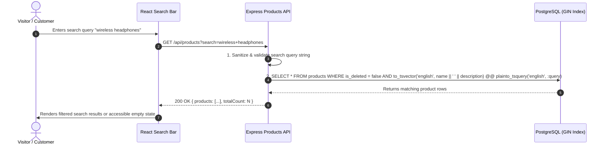

### 8.2 Detailed Step Breakdown
1. **Entry Point:** Search input field in top navigation bar.
2. **Preconditions:** None.
3. **User Action:** Types keyword into search input and submits or pauses typing (debounced 300ms).
4. **Frontend Behavior:** Renders loading skeleton, then updates product grid. If no results, renders: *"No products found matching '{query}'. Try checking your spelling or using different keywords."*
5. **API Interaction:** `GET /api/products?search=headphones&page=1&limit=12`.
6. **Backend Processing:** Validates string length (max 100 chars); executes PostgreSQL Full-Text Search against GIN index `idx_products_fulltext`.
7. **Database State Changes:** None.
8. **External Service Interaction:** None (strictly PostgreSQL native search; no external search engine).
9. **Success Outcome:** HTTP 200 OK with ranked matching products.
10. **Failure Outcome:** HTTP 400 Bad Request on invalid search strings; HTTP 500 on database failure.
11. **Security Checks:** Query parameter sanitization; rate limiting (100 req/min).
12. **Exit State:** Filtered product listing displayed.

---

## 9. Cart Flow

The cart operates in two modes:
- **Unauthenticated (Guest):** Persisted in client `localStorage` under key `nexora_guest_cart`.
- **Authenticated (User):** Persisted in PostgreSQL `carts` and `cart_items` tables.

> **CRITICAL INVARIANT:** Adding an item to the cart or updating cart quantities **DOES NOT** create an inventory reservation. Inventory reservation occurs strictly during checkout initiation inside a database transaction.

### 9.1 Flow Specification: Authenticated Cart Operations
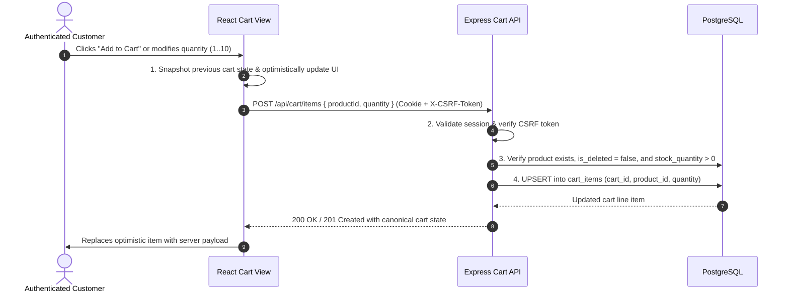

### 9.2 Cart Operations Matrix
| Operation | HTTP Method & Path | Auth Required | CSRF Required | Request Body | DB State Changes | Error Conditions |
|---|---|---|---|---|---|---|
| **View Cart** | `GET /api/cart` | Yes | No | None | None (eager fetch `CartItems` + `Products`) | 401 Unauthorized |
| **Add / Update Item** | `POST /api/cart/items` | Yes | Yes (`X-CSRF-Token`) | `{ productId: UUID, quantity: 1..10 }` | INSERT/UPDATE in `cart_items` table | 400 (Invalid Qty), 404 (Product Not Found / Deleted), 409 (Out of Stock) |
| **Remove Item** | `DELETE /api/cart/items/:id` | Yes | Yes (`X-CSRF-Token`) | None | DELETE row from `cart_items` where `cart_id = user.cart_id` | 404 (Item Not Found), 403 (Item belongs to other cart) |
| **Merge Guest Cart** | `POST /api/cart/merge` | Yes | Yes (`X-CSRF-Token`) | `{ items: [{ productId, quantity }] }` | Merges items into user's `cart_items`, summing quantities (capped at 10) | 400 (Malformed payload) |

---

## 10. Authentication Flow

Nexora standardizes strictly on **Server-Side Session Authentication** stored in PostgreSQL. Stateless JWTs, bearer tokens, and localStorage auth tokens are prohibited.

### 10.1 Registration & Login Sequence
```mermaid
sequenceDiagram
    autonumber
    actor User as Customer / Admin
    participant UI as React Auth Forms
    participant API as Express Auth Router
    participant DB as PostgreSQL (users & sessions)

    User->>UI: Submits Login Form (email, password)
    UI->>API: POST /api/auth/login { email, password }
    API->>API: 1. Rate limit check (5 req/min per IP)
    API->>DB: 2. SELECT * FROM users WHERE email = :email
    DB-->>API: User record with password_hash
    API->>API: 3. Verify password via bcrypt.compare(password, password_hash)
    
    alt Password Valid
        API->>API: 4. Generate 256-bit cryptographically random session token (sid)
        API->>API: 5. Generate 128-bit random CSRF token
        API->>DB: 6. INSERT INTO sessions (sid, user_id, data, expires_at) VALUES (sid, user.id, { role, csrfToken }, NOW() + 7 days)
        API->>DB: 7. INSERT INTO audit_logs (actor_id, action="USER_LOGIN_SUCCESS", ip_address)
        API-->>UI: 200 OK + Set-Cookie: __Host-nexora_sid=sid; HttpOnly; Secure; SameSite=Lax; Path=/ + Set-Cookie: nexora_csrf=csrfToken; Path=/; SameSite=Lax
        UI->>UI: Update AuthContext state (user profile) & trigger guest cart merge
        UI->>User: Redirect to catalog or intended checkout destination
    else Password Invalid / User Not Found
        API->>DB: INSERT INTO audit_logs (action="USER_LOGIN_FAILED", ip_address)
        API-->>UI: 401 Unauthorized { error: { code: "INVALID_CREDENTIALS", message: "Invalid email or password." } }
        UI->>User: Renders accessible error banner
    end
```

---

## 11. Session Flow

### 11.1 Session Lifecycle Rules
1. **Session Storage:** Persisted in PostgreSQL `sessions` table (`sid`, `user_id`, `data`, `expires_at`).
2. **Cookie Specification:**
   - Name: `__Host-nexora_sid`
   - Attributes: `HttpOnly = true`, `Secure = true` (in production), `SameSite = Lax`, `Path = /`, **No Domain attribute** (mandated by `__Host-` specification).
3. **Rolling Expiration:** Valid sessions have a 7-day rolling window. Every authenticated request that hits the session middleware updates `expires_at = NOW() + INTERVAL '7 days'`.
4. **Session Fixation Prevention:** Upon successful login or role change, any existing session is destroyed in PostgreSQL, and a completely new `sid` is issued.
5. **Logout Execution:**
   - Client sends `POST /api/auth/logout` with `X-CSRF-Token`.
   - Server deletes matching row in `sessions` table.
   - Server clears cookies: `res.clearCookie('__Host-nexora_sid', { path: '/' })` and `res.clearCookie('nexora_csrf', { path: '/' })`.
   - Subsequent protected requests return HTTP 401 Unauthorized.

---

## 12. Authorization Flow

Nexora enforces multi-layer Role-Based Access Control (RBAC) and Insecure Direct Object Reference (IDOR) prevention.

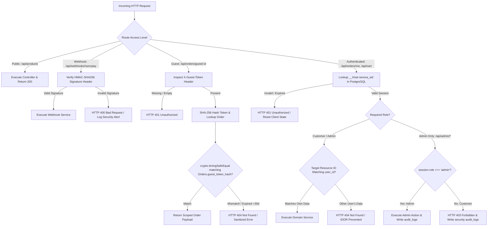

---

## 13. CSRF Flow

State-changing requests (`POST`, `PUT`, `PATCH`, `DELETE`) are protected against Cross-Site Request Forgery via distinct mechanisms tailored to authentication state.

### 13.1 Authenticated vs Guest vs Webhook CSRF Matrix
| Request Context | Mechanism | Token Origin | Header Submitted | Validation Logic |
|---|---|---|---|---|
| **Authenticated Customer / Admin** | Double-Submit Cookie Pattern | Generated on login, stored in `sessions.data.csrfToken`, set in readable cookie `nexora_csrf` | `X-CSRF-Token` | Middleware validates header token matches `session.data.csrfToken`. |
| **Guest Checkout Initiation** | Pre-Session Transient Anti-CSRF Token | Client calls `GET /api/checkout/csrf-token`, server generates signed token (30-min expiry) in `__Host-nexora_guest_csrf` cookie | `X-Guest-CSRF-Token` | Middleware validates signature and expiration of cookie/header pair. |
| **Razorpay Webhooks** | Signature Verification (Exempt from CSRF) | Razorpay Gateway | `X-Razorpay-Signature` | Validated strictly via HMAC-SHA256 over raw body buffer. CSRF middleware explicitly ignores `/api/webhooks/razorpay`. |
| **Public Read Endpoints** | Safe HTTP Methods (`GET`, `HEAD`, `OPTIONS`) | N/A | None | Exempt from CSRF verification. |

---

## 14. Registered Checkout Flow

The registered checkout workflow connects the authenticated customer from cart review to order initiation, inventory reservation, Razorpay modal interaction, and backend verification.

> **CRITICAL ARCHITECTURAL RULE:** Checkout execution is strictly decoupled into **Phase A** (Database Transaction with Row Locks, followed by immediate COMMIT) and **Phase B** (External Razorpay API call). Database locks are never held across external network calls.

### 14.1 Registered Checkout Sequence Diagram
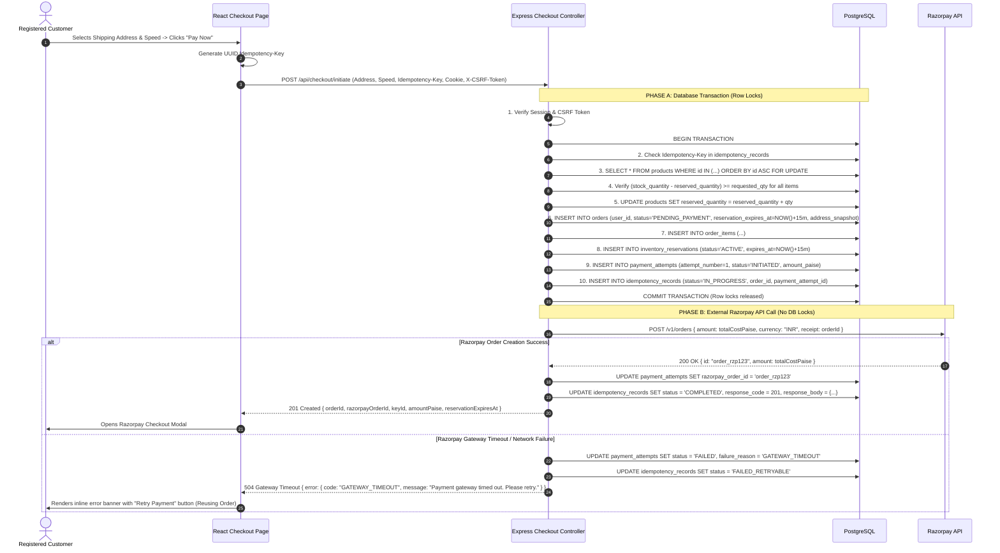

---

## 15. Guest Checkout Flow

Guest checkout allows unauthenticated customers to complete purchases with identical transactional integrity and security protections.

### 15.1 Guest Token Security Specification
1. **Generation:** When a guest initiates checkout, the server generates a 256-bit cryptographically secure token (`rawToken = crypto.randomBytes(32).toString('hex')`).
2. **Storage:** Server computes `tokenHash = crypto.createHash('sha256').update(rawToken).digest('hex')` and stores `tokenHash` in `orders.guest_token_hash`.
3. **Response:** `rawToken` is returned **EXACTLY ONCE** in the 201 Created response JSON body.
4. **Tracking Header:** Client stores `rawToken` in memory/sessionStorage and submits it strictly via HTTP header `X-Guest-Token: rawToken` on tracking requests (`GET /api/orders/guest/:id`).
5. **Constant-Time Verification:** Server hashes incoming header and validates using `crypto.timingSafeEqual(Buffer.from(calcHash), Buffer.from(storedHash))`.
6. **Strict Prohibitions:** Guest tokens **MUST NEVER** appear in URLs, query parameters, application logs, stdout, error messages, analytics, telemetry, or referrer headers.

### 15.2 Guest Checkout Sequence Diagram
```mermaid
sequenceDiagram
    autonumber
    actor Guest as Guest Buyer
    participant UI as React Guest Checkout
    participant API as Express API
    participant DB as PostgreSQL
    participant Razorpay as Razorpay API

    Guest->>UI: Enters shipping details, email, phone -> Clicks "Continue to Payment"
    UI->>API: GET /api/checkout/csrf-token
    API-->>UI: 200 OK + Set-Cookie: __Host-nexora_guest_csrf=guestCsrfToken; HttpOnly; Secure; SameSite=Lax
    
    UI->>API: POST /api/checkout/initiate (Items, Address, X-Guest-CSRF-Token, Idempotency-Key)
    API->>API: 1. Validate Guest Anti-CSRF Token & Payload Schemas
    
    Note over API,DB: PHASE A: DB Transaction
    API->>DB: BEGIN TRANSACTION
    API->>DB: Lock Products (SELECT FOR UPDATE) & Verify Available Stock
    API->>DB: Reserve Stock (reserved_quantity += qty)
    API->>API: Generate 256-bit raw guest token & compute SHA-256 hash
    API->>DB: INSERT INTO orders (user_id=NULL, guest_token_hash=tokenHash, status='PENDING_PAYMENT', reservation_expires_at=NOW()+15m)
    API->>DB: INSERT INTO order_items, inventory_reservations, payment_attempts, idempotency_records
    API->>DB: COMMIT TRANSACTION
    
    Note over API,Razorpay: PHASE B: Razorpay Call
    API->>Razorpay: POST /v1/orders { amount: totalCostPaise, currency: "INR" }
    Razorpay-->>API: 200 OK { id: "order_rzp_guest456" }
    API->>DB: UPDATE payment_attempts SET razorpay_order_id = 'order_rzp_guest456'
    API->>DB: UPDATE idempotency_records SET status = 'COMPLETED'
    API-->>UI: 201 Created { orderId, guestToken: rawToken, razorpayOrderId, keyId, reservationExpiresAt }
    
    UI->>UI: Store guestToken in client sessionStorage for confirmation & tracking
    UI->>Guest: Opens Razorpay Checkout Modal
```

---

## 16. Checkout Idempotency Flow

To prevent duplicate ecommerce orders, duplicate stock deductions, and duplicate payment gateway calls caused by network timeouts or aggressive double-clicking:

### 16.1 Idempotency Lifecycle & State Transitions
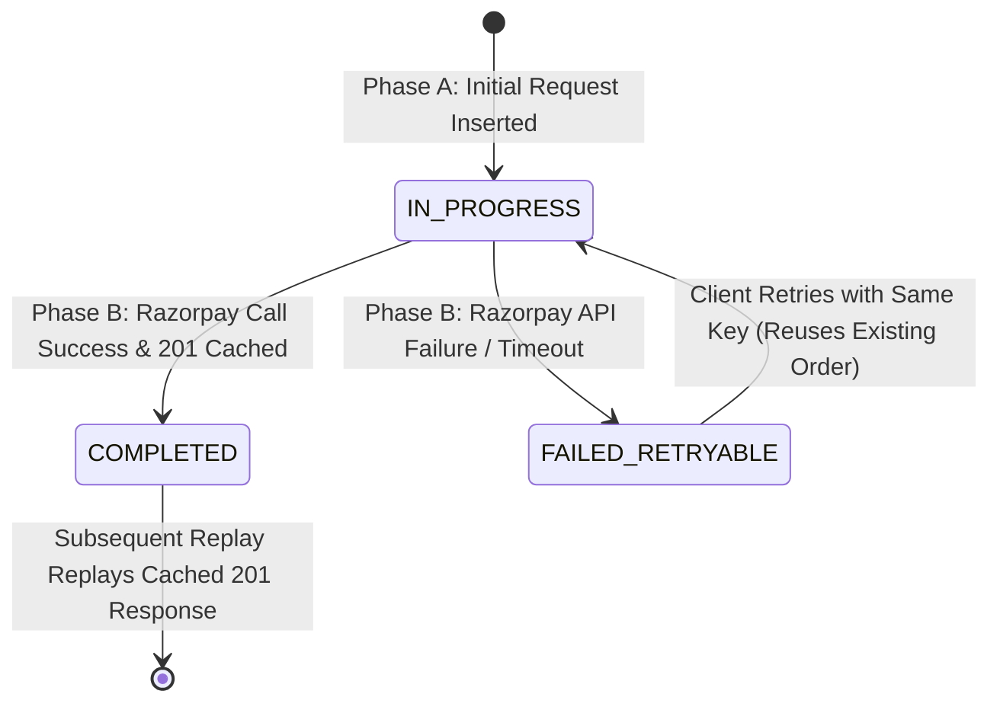

### 16.2 Client Request Idempotency Scenarios
| Client Scenario | Incoming Header / Body | System Action | HTTP Response | Resulting State |
|---|---|---|---|---|
| **Single Normal Click** | New `Idempotency-Key` | Executes Phase A (creates `IN_PROGRESS` record) and Phase B. | 201 Created | Order created, idempotency record marked `COMPLETED`. |
| **Rapid Double Click** | Same `Idempotency-Key` concurrently | Second request encounters `idempotency_records.status = 'IN_PROGRESS'`. | 409 Conflict (`CHECKOUT_IN_PROGRESS`) | Second request safely rejected; zero duplicate orders created. |
| **Network Replay / Browser Retry** | Same `Idempotency-Key` + Same Payload Hash | Backend identifies existing record with `status = 'COMPLETED'`. | 201 Created (Replayed Cached Body) | Replays original response without touching database stock or Razorpay. |
| **Payload Tampering / Key Collision** | Same `Idempotency-Key` + Different Payload Hash | Backend detects `request_hash != SHA256(new_body)`. | 409 Conflict (`IDEMPOTENCY_PAYLOAD_MISMATCH`) | Request rejected; prevents reusing keys across different orders. |
| **Retry After Gateway Timeout** | Same `Idempotency-Key` on `FAILED_RETRYABLE` | Identifies existing `PENDING_PAYMENT` order; re-attempts Phase B Razorpay call. | 201 Created | Existing Order preserved; avoids creating a second ecommerce order. |

---

## 17. Inventory Reservation Flow

### 17.1 Reservation Lifecycle State Machine
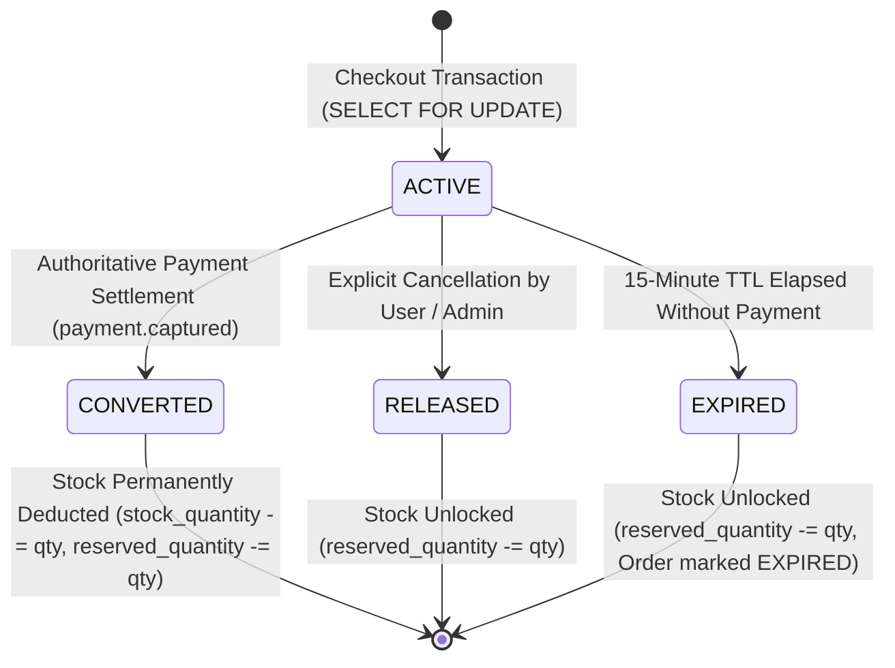

### 17.2 Transactional Reservation Rules
1. **Locking Isolation:** Stock verification and reservation must execute inside a PostgreSQL transaction using `SELECT ... FOR UPDATE` with deterministic lock ordering (`ORDER BY id ASC`) to eliminate deadlocks.
2. **Formula:** `available_quantity = (stock_quantity - reserved_quantity)`. If `available_quantity < requested_qty`, the transaction immediately aborts and returns HTTP 409 Conflict.
3. **Reservation Entity:** An explicit row is inserted into `inventory_reservations` (`order_id`, `product_id`, `quantity`, `expires_at = NOW() + INTERVAL '15 minutes'`, `status = 'ACTIVE'`).
4. **Unique Product Reservation:** Constraint `UNIQUE(order_id, product_id)` ensures an order cannot reserve duplicate rows for the same product.

---

## 18. Concurrent Checkout Flow

### 18.1 The Flash Sale Concurrency Scenario
**Scenario:** Product `PROD-101` has physical `stock_quantity = 1` and `reserved_quantity = 0`. Exactly 10 users click "Pay Now" simultaneously.

```mermaid
sequenceDiagram
    autonumber
    actor Users as 10 Concurrent Customers
    participant API as Express Backend Instances
    participant DB as PostgreSQL (Row Lock Engine)

    Users->>API: 10 Concurrent POST /api/checkout/initiate (PROD-101, Qty: 1)
    
    par Request 1 (Acquires Row Lock First)
        API->>DB: BEGIN; SELECT ... FOR UPDATE WHERE id = 'PROD-101';
        Note over DB: Lock granted to Request 1. Requests 2-10 queue on row lock.
        API->>DB: Check: stock(1) - reserved(0) = 1 >= 1 (OK)
        API->>DB: UPDATE products SET reserved_quantity = 1;
        API->>DB: INSERT Order (PENDING_PAYMENT), Reservation (ACTIVE), PaymentAttempt #1
        API->>DB: COMMIT; (Row lock released)
        API-->>Users: Request 1: 201 Created (Proceeds to Razorpay)
    and Requests 2 to 10 (Queued on Lock)
        Note over DB: Request 2 acquires lock next.
        API->>DB: SELECT ... FOR UPDATE WHERE id = 'PROD-101';
        API->>DB: Check: stock(1) - reserved(1) = 0 < 1 (INSUFFICIENT)
        API->>DB: ROLLBACK;
        API-->>Users: Request 2: 409 Conflict ("Insufficient stock")
        Note over DB: Requests 3 through 10 sequentially observe 0 available stock & ROLLBACK.
        API-->>Users: Requests 3-10: 409 Conflict ("Insufficient stock")
    end
```

### 18.2 Concurrency Guarantees
- **Overselling Prevention:** 100% guaranteed by PostgreSQL ACID row-level locking. Application-level memory checks alone are strictly insufficient.
- **Outcome:** Exactly 1 reservation created; exactly 9 requests receive HTTP 409 Conflict; `stock_quantity` remains 1; `reserved_quantity` becomes 1.

---

## 19. Payment Flow

### 19.1 Authoritative Capture vs Speculative Authorization
```
                          ┌──────────────────────────┐
                          │  Customer Enters Card /  │
                          │  UPI in Razorpay Modal   │
                          └─────────────┬────────────┘
                                        │
                                        ▼
                          ┌──────────────────────────┐
                          │    payment.authorized    │
                          └─────────────┬────────────┘
                                        │
                    ┌───────────────────┴───────────────────┐
                    │                                       │
                    ▼                                       ▼
    ┌───────────────────────────────┐       ┌───────────────────────────────┐
    │  Speculative Gateway State:   │       │ Authoritative Capture Event:  │
    │  Funds blocked by bank.       │       │ payment.captured (or backend  │
    │  DOES NOT SETTLE ORDER.       │       │ capture verify)               │
    │  Order remains PENDING_PAYMENT│       │ SETTLES ORDER TO PAID         │
    └───────────────────────────────┘       └───────────────┬───────────────┘
                                                            │
                                                            ▼
                                            ┌───────────────────────────────┐
                                            │ - PaymentAttempt -> SUCCESS   │
                                            │ - Order -> PAID               │
                                            │ - Reservation -> CONVERTED    │
                                            │ - stock_quantity -= qty       │
                                            │ - reserved_quantity -= qty    │
                                            └───────────────────────────────┘
```

---

## 20. PaymentAttempt Flow

### 20.1 PaymentAttempt Lifecycle & Multi-Attempt Model
Each ecommerce `Order` supports multiple payment attempts over its lifetime prior to settlement:

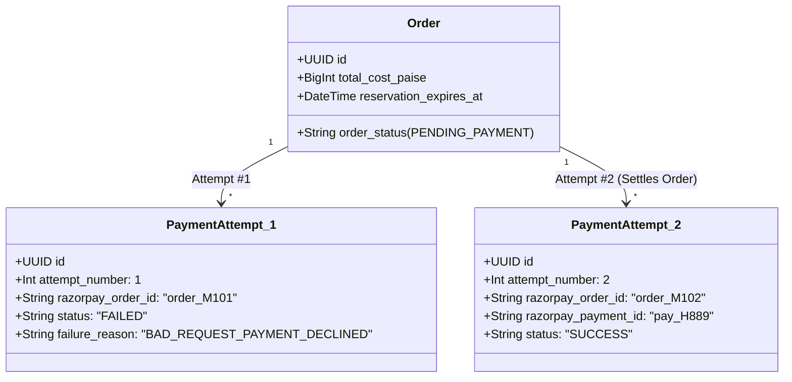

### 20.2 Database Partial Unique Index Enforcement
The PostgreSQL database enforces:
```sql
CREATE UNIQUE INDEX uq_one_success_payment_per_order 
ON payment_attempts(order_id) 
WHERE status = 'SUCCESS';
```
This guarantees at the storage engine level that **no order can ever be settled more than once**, preventing double fulfillment or race condition over-settlement.

---

## 21. Payment Retry Flow

### 21.1 Retry Sequence Specification
When a payment attempt fails or is cancelled by the user:
1. The user remains on the checkout page with an active failure banner.
2. The user clicks **"Retry Payment"**.
3. Frontend calls `POST /api/payments/retry` with `{ orderId }`.
4. Backend opens a PostgreSQL transaction: `SELECT * FROM orders WHERE id = :order_id FOR UPDATE`.
5. Backend verifies `order_status === 'PENDING_PAYMENT'` and `reservation_expires_at > NOW()`.
6. If an active `INITIATED` attempt exists, it is transitioned to `FAILED` (`failure_reason = 'STALE_ATTEMPT_SUPERSEDED'`).
7. Backend calculates `next_attempt = MAX(attempt_number) + 1` and inserts a new `PaymentAttempt` record (`attempt_number = 2`, `status = 'INITIATED'`).
8. Transaction commits.
9. Backend calls Razorpay API to generate a **NEW** `razorpay_order_id`.
10. Backend updates `PaymentAttempt #2` with the new Razorpay Order ID and returns the payload to the client.
11. Client re-opens the Razorpay modal for Attempt #2.

> **CRITICAL RULE:** Payment retries **MUST NOT** create a second ecommerce `Order`. The single ecommerce order is retained, maintaining the original stock reservation.

---

## 22. Razorpay Flow

### 22.1 PCI-DSS Trust Boundary & Data Scrubbing
```
┌────────────────────────────────────────────────────────────────────────┐
│                        PCI-DSS TRUST BOUNDARY                          │
│                                                                        │
│   [ CUSTOMER BROWSER ] ◄────────── HTTPS ──────────► [ RAZORPAY MODAL ]│
│   - Enters Card Number, CVV, PIN, UPI Credentials                      │
│   - Processed directly inside Razorpay PCI-DSS Level 1 Iframe          │
│                                                                        │
│   ====================== STRICT BOUNDARY ============================  │
│                                                                        │
│   [ NEXORA APPLICATION SERVERS & POSTGRESQL DATABASE ]                 │
│   - ZERO raw card credentials touch, process, log, or store            │
│   - Only handles: razorpay_order_id, razorpay_payment_id, status       │
│   - razorpay_signature is treated as write-only sensitive metadata:    │
│     NEVER logged to stdout, files, exception traces, or telemetry      │
└────────────────────────────────────────────────────────────────────────┘
```

---

## 23. Webhook Flow

### 23.1 Razorpay Webhook Ingestion Pipeline
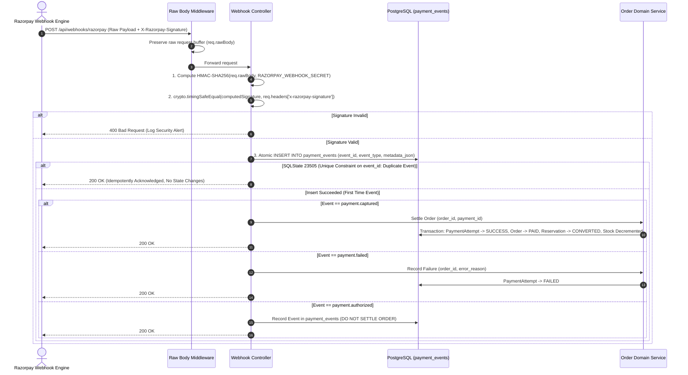

---

## 24. Late Payment Flow

### 24.1 Handling Captured Payment After Reservation Expiry
**Scenario:** Customer initiates checkout, waits 20 minutes (TTL expires at 15 minutes, releasing reservation). Customer completes payment at the gateway. Razorpay sends `payment.captured`.

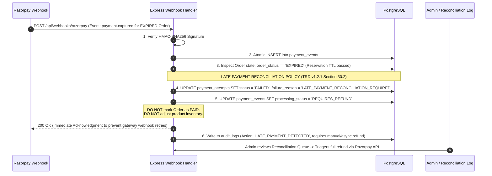

---

## 25. Order Lifecycle Flow

### 25.1 Comprehensive Order State Machine
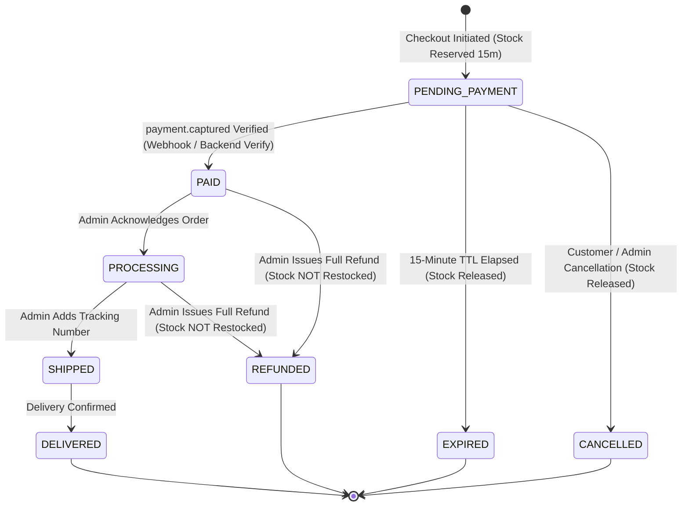

### 25.2 State Transition Matrix
| Current State | Target State | Authorizing Actor | Trigger Endpoint / Event | Side Effects & Invariants |
|---|---|---|---|---|
| `PENDING_PAYMENT` | `PAID` | Webhook / System | `payment.captured` on `/api/webhooks/razorpay` OR `/api/payments/verify` | `PaymentAttempt` -> `SUCCESS`, `InventoryReservation` -> `CONVERTED`, `stock_quantity` decremented, `reserved_quantity` decremented. |
| `PENDING_PAYMENT` | `EXPIRED` | System Cleanup Job | 15-minute TTL elapsed without payment | `InventoryReservation` -> `EXPIRED`, `reserved_quantity` released. |
| `PENDING_PAYMENT` | `CANCELLED` | Customer / Admin | `POST /api/orders/:id/cancel` | `InventoryReservation` -> `RELEASED`, `reserved_quantity` released. |
| `PAID` | `PROCESSING` | Admin | `PATCH /api/admin/orders/:id/status` | Fulfillment workflow started. |
| `PROCESSING` | `SHIPPED` | Admin | `PATCH /api/admin/orders/:id/status` | Requires `tracking_number` parameter. |
| `SHIPPED` | `DELIVERED` | Admin / System | `PATCH /api/admin/orders/:id/status` | Order complete. |
| `PAID` / `PROCESSING` | `REFUNDED` | Admin | `POST /api/admin/orders/:id/refund` | Razorpay refund executed. **Inventory is NOT changed.** |

---

## 26. Order Confirmation Flow

### 26.1 Confirmation Display Specification
1. **Trigger:** Order settles to `PAID` following verified payment capture.
2. **Frontend Polling / Redirect:** Client `POST /api/payments/verify` returns settled status `{ orderStatus: "PAID" }` and routes to `/order-confirmation/:id`.
3. **Data Displayed:**
   - Order Reference ID (UUID).
   - Order Status Badge (`PAID`).
   - Purchased Line Items (Product name, quantity, unit price formatted in INR Paise).
   - Order Cost Breakdown (Subtotal, Shipping Fee, Total Paid in INR).
   - Shipping Address Snapshot (Recipient, Address Line 1, City, State, Pincode, Phone).
4. **Guest Instruction:** For guest checkouts, the screen prominently displays instructions to bookmark or save their tracking link, leveraging the scoped `guestToken` stored in `sessionStorage`.
5. **Data Scrubbing:** Internal database primary keys of other entities, payment gateway secret signatures, and sensitive session tokens are never rendered.

---

## 27. Guest Order Tracking Flow

### 27.1 Guest Tracking Sequence
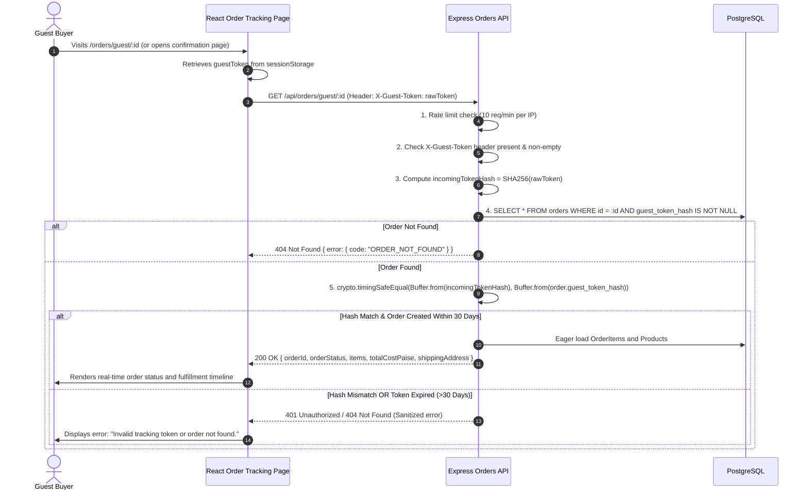

---

## 28. Reservation Expiry Flow

### 28.1 15-Minute TTL Expiration Mechanism
1. **TTL Window:** Every checkout reservation has `expires_at = created_at + INTERVAL '15 minutes'`.
2. **Release Execution:**
   - **Automated Background Cleaner:** Runs periodically (`SELECT * FROM inventory_reservations WHERE status = 'ACTIVE' AND expires_at < NOW()`).
   - **Inline Lazy Check:** When an incoming checkout or stock check runs, any stale active reservations for the target product are evaluated and lazily expired.
3. **Database Operations:**
   ```sql
   UPDATE products 
   SET reserved_quantity = reserved_quantity - :expired_qty 
   WHERE id = :product_id;
   
   UPDATE inventory_reservations 
   SET status = 'EXPIRED' 
   WHERE id = :reservation_id;
   
   UPDATE orders 
   SET order_status = 'EXPIRED' 
   WHERE id = :order_id AND order_status = 'PENDING_PAYMENT';
   ```

---

## 29. Refund Flow

### 29.1 Admin Refund Execution & Inventory Decoupling
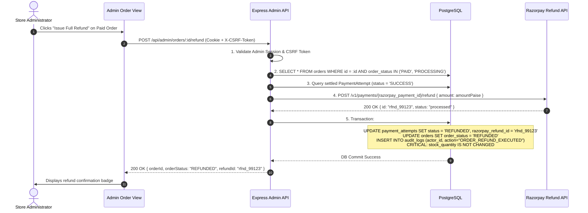

---

## 30. Physical Restock Flow

### 30.1 Dedicated Physical Restock Specification
Physical restocking is an explicit, independent operation executed only when physical items are physically returned to the warehouse inventory.

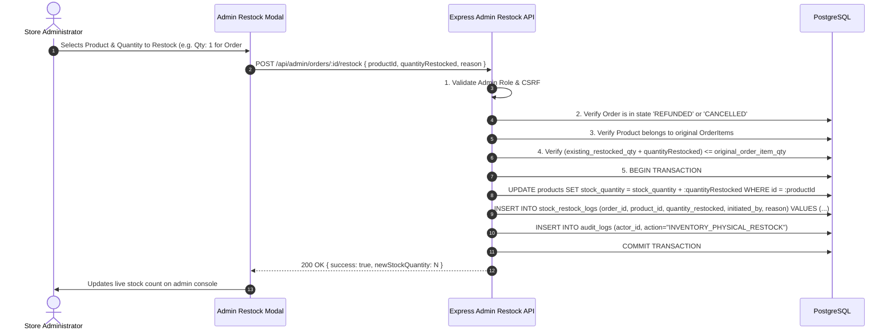

---

## 31. Admin Flow

### 31.1 Admin Operations Console Capabilities
The admin console is an operational commerce console (not a decorative analytics board):
- **Catalog Management:** Add new product, edit title/description/price/stock, soft-delete product (`is_deleted = true`).
- **Inventory Overrides:** Inline adjustment of physical `stock_quantity`, enforcing `stock_quantity >= reserved_quantity`.
- **Order Management:** Filter orders by status (`PENDING_PAYMENT`, `PAID`, `PROCESSING`, `SHIPPED`, `DELIVERED`, `REFUNDED`, `CANCELLED`, `EXPIRED`); update fulfillment state.
- **Refund Processing:** Trigger full Razorpay API refunds.
- **Physical Restock:** Perform auditable inventory restorations.
- **Audit Log Inspection:** Review structured security and operational audit logs.

---

## 32. Security Failure Flows

Standardized handling and HTTP status code mapping for all security violations:

```
                  ┌────────────────────────────────────────┐
                  │       INCOMING CLIENT REQUEST          │
                  └───────────────────┬────────────────────┘
                                      │
          ┌───────────────────────────┼───────────────────────────┐
          │                           │                           │
          ▼                           ▼                           ▼
 ┌─────────────────┐         ┌─────────────────┐         ┌─────────────────┐
 │ Missing / Bad   │         │ Customer Role   │         │ Requesting Other│
 │ Session Cookie  │         │ on Admin Route  │         │ User's Order ID │
 └────────┬────────┘         └────────┬────────┘         └────────┬────────┘
          │                           │                           │
          ▼                           ▼                           ▼
 ┌─────────────────┐         ┌─────────────────┐         ┌─────────────────┐
 │    HTTP 401     │         │    HTTP 403     │         │    HTTP 404     │
 │  UNAUTHORIZED   │         │    FORBIDDEN    │         │ NOT FOUND (IDOR)│
 └─────────────────┘         └─────────────────┘         └─────────────────┘
          │                           │                           │
          ▼                           ▼                           ▼
 ┌─────────────────┐         ┌─────────────────┐         ┌─────────────────┐
 │ Exposes NO      │         │ Logs Security   │         │ Suppresses      │
 │ Internal Data;  │         │ Alert with IP   │         │ Existence of    │
 │ Clears Client   │         │ and Actor ID    │         │ Target Resource │
 │ Auth State      │         │                 │         │                 │
 └─────────────────┘         └─────────────────┘         └─────────────────┘
```

---

## 33. Cart Optimistic Update Flow

### 33.1 Optimistic UI State Handling & Rollback
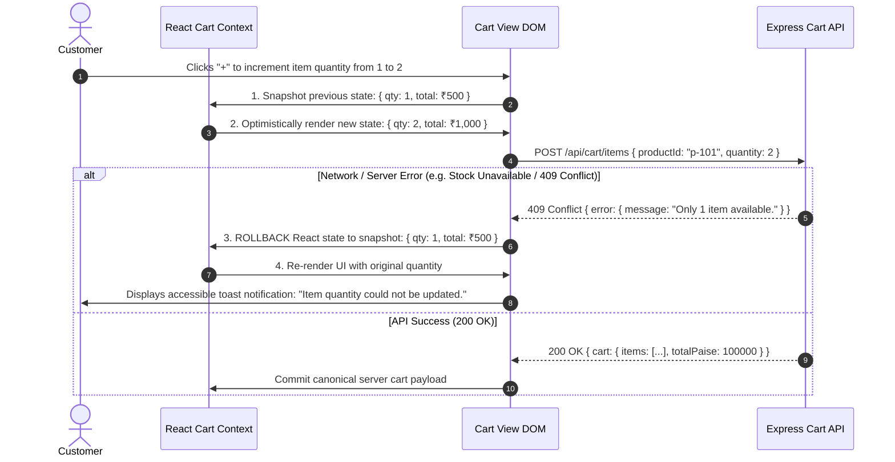

---

## 34. Product Availability Flow

### 34.1 Catalog States & Checkout Protection
- **`ACTIVE` (`stock_quantity - reserved_quantity > 0`):** Normal purchasing available.
- **`OUT_OF_STOCK` (`stock_quantity - reserved_quantity == 0`):** "Add to Cart" disabled; UI shows "Out of Stock" badge.
- **`SOFT_DELETED` (`is_deleted = true`):** Excluded from search and catalog listing. Existing cart items referencing deleted products fail validation during checkout with clear notifications to remove the item.

---

## 35. Address Flow

### 35.1 Immutable Order Address Snapshotting
1. **Customer Profile (Convenience):** Registered customers have a saved default address in the `addresses` table.
2. **Order Checkout Snapshot (Immutability):** When checkout is initiated (`POST /api/checkout/initiate`), shipping address fields (`shipping_full_name`, `shipping_address_line1`, `shipping_city`, `shipping_state`, `shipping_pincode`, `shipping_phone`) are copied directly into columns on the `orders` table.
3. **Integrity Rule:** Subsequent updates to the user's saved profile address **NEVER** alter historical address data on existing orders.

---

## 36. End-to-End User Journeys

### Journey A: Registered User Successful Purchase
1. User logs in (`POST /api/auth/login`), receives `__Host-nexora_sid` session cookie.
2. Browses catalog, adds 2 items to cart (optimistic UI).
3. Proceeds to checkout, selects saved shipping address and "Express" shipping.
4. Clicks "Pay Now". Backend runs Phase A (PostgreSQL `SELECT FOR UPDATE` locks stock, creates `PENDING_PAYMENT` order, `ACTIVE` 15m reservation, `PaymentAttempt #1`, `IN_PROGRESS` idempotency record, commits DB).
5. Backend runs Phase B (Razorpay API creates `razorpay_order_id`, updates `PaymentAttempt #1`, marks idempotency `COMPLETED`).
6. Browser launches Razorpay Checkout modal; user completes payment with test card.
7. Razorpay asynchronously dispatches `payment.captured` webhook to `POST /api/webhooks/razorpay`.
8. Backend validates HMAC-SHA256 signature, executes atomic deduplication in `payment_events`, transitions `PaymentAttempt` to `SUCCESS`, `Order` to `PAID`, `InventoryReservation` to `CONVERTED`, and permanently decrements `stock_quantity`.
9. Frontend verifies capture via `POST /api/payments/verify`, redirects user to `/order-confirmation/:id`.

### Journey B: Guest Successful Purchase
1. Visitor browses store, adds item to guest `localStorage` cart.
2. Clicks checkout; frontend fetches guest anti-CSRF token (`GET /api/checkout/csrf-token`).
3. Fills shipping form and clicks "Pay Now".
4. Backend Phase A reserves stock, generates 256-bit `guest_access_token`, hashes it via SHA-256 into `orders.guest_token_hash`, creates `PaymentAttempt #1`, and commits DB.
5. Backend Phase B creates Razorpay order; returns 201 Created with single-use raw `guestToken`.
6. Client stores `guestToken` in `sessionStorage` and opens Razorpay modal.
7. Payment succeeds; webhook settles order to `PAID`.
8. User views order confirmation and uses `X-Guest-Token` to track fulfillment at `/orders/guest/:id`.

### Journey C: Payment Failure Then In-Line Retry Success
1. Customer initiates checkout for Order #1001. `PaymentAttempt #1` created (`INITIATED`).
2. Razorpay modal opens; user's bank declines card.
3. Razorpay sends `payment.failed` webhook; backend marks `PaymentAttempt #1` as `FAILED`. Order remains `PENDING_PAYMENT`; stock reservation remains `ACTIVE` (within 15m TTL).
4. Modal closes; checkout page displays failure banner with "Retry Payment" button.
5. Customer clicks "Retry Payment" (`POST /api/payments/retry`).
6. Backend locks Order row, verifies active TTL, creates `PaymentAttempt #2`, generates new `razorpay_order_id`, and returns it. (Does NOT create a duplicate ecommerce Order).
7. Customer enters alternate UPI ID in new modal; payment succeeds.
8. Webhook validates `PaymentAttempt #2` capture, settles Order #1001 to `PAID`.

### Journey D: Insufficient Inventory Under Race Conditions
1. Product stock = 1. Customer A and Customer B click "Pay Now" simultaneously.
2. Customer A's transaction acquires PostgreSQL row lock first. Available stock = 1 >= 1. Reservation succeeds; DB commits.
3. Customer B's transaction acquires lock next. Available stock = 0 < 1. Transaction rolls back.
4. Customer B receives HTTP 409 Conflict ("Requested quantity exceeds available stock").
5. Customer B's UI displays out-of-stock toast and prompts cart adjustment.

### Journey E: Reservation Expiration
1. Customer initiates checkout for Order #1005 (Stock reserved for 15 minutes).
2. Customer abandons browser tab.
3. 15 minutes elapse. Cleanup process identifies expired reservation (`status = 'ACTIVE'` and `expires_at < NOW()`).
4. Reservation updated to `EXPIRED`; `reserved_quantity` decremented; Order transitioned to `EXPIRED`.
5. Stock is immediately available for other shoppers.

### Journey F: Duplicate Checkout Request (Double-Click)
1. Customer double-clicks "Pay Now" with identical `Idempotency-Key`.
2. First request inserts `idempotency_records` with status `IN_PROGRESS`.
3. Second request encounters `IN_PROGRESS` status and is rejected with HTTP 409 Conflict (`CHECKOUT_IN_PROGRESS`).
4. Zero duplicate orders or duplicate stock deductions occur.

### Journey G: Duplicate Razorpay Webhook
1. Razorpay delivers `payment.captured` webhook (`event_id = "evt_001"`).
2. Backend inserts `evt_001` into `payment_events` table and settles order.
3. Razorpay retries same webhook 10 seconds later (`event_id = "evt_001"`).
4. Backend encounters unique constraint violation (`SQLState 23505`) on `payment_events(event_id)`.
5. Webhook handler terminates immediately, logs idempotent ignore, and returns HTTP 200 OK.

### Journey H: Late Payment After Reservation Expiration
1. Customer checkout expires after 15 minutes (Order marked `EXPIRED`, stock released).
2. Customer completes delayed payment at bank; Razorpay sends `payment.captured`.
3. Backend webhook handler verifies signature, detects target Order is `EXPIRED`.
4. System sets `PaymentAttempt.status = 'FAILED'`, `failure_reason = 'LATE_PAYMENT_RECONCILIATION_REQUIRED'`, and flags `payment_events.processing_status = 'REQUIRES_REFUND'`.
5. Returns HTTP 200 OK to Razorpay. Order is NOT marked `PAID`; stock is NOT modified.
6. Admin reconciliation queue processes automatic full refund back to customer.

### Journey I: Admin Full Refund
1. Customer requests order cancellation on `PAID` Order #1008.
2. Admin clicks "Issue Full Refund" in admin console (`POST /api/admin/orders/:id/refund`).
3. Backend calls Razorpay Refund API (`POST /v1/payments/{id}/refund`).
4. Razorpay returns refund reference `rfnd_771`.
5. Backend updates `PaymentAttempt.status = 'REFUNDED'`, `Order.order_status = 'REFUNDED'`, and writes `audit_logs`.
6. Physical stock is **NOT** restored.

### Journey J: Admin Physical Restock
1. Physical goods for refunded Order #1008 arrive at warehouse inspection.
2. Admin opens Restock dialog, specifies restock quantity = 1, and submits (`POST /api/admin/orders/:id/restock`).
3. Backend validates restock quantity does not exceed original order line item.
4. Backend increments `products.stock_quantity`, creates `StockRestockLogs` record, and logs audit event.

### Journey K: Unauthorized Order Access (IDOR Prevention)
1. Authenticated User A (ID: `usr_111`) requests `GET /api/orders/ord_999` (belonging to User B, ID: `usr_222`).
2. Authorization middleware executes `SELECT * FROM orders WHERE id = 'ord_999'`.
3. Evaluates `order.user_id === req.user.id` (`usr_222 !== usr_111`).
4. Returns sanitized `HTTP 404 Not Found`.

### Journey L: Session Expiration & Logout
1. Authenticated customer logs out (`POST /api/auth/logout`).
2. Backend deletes matching session in PostgreSQL, clears `__Host-nexora_sid` cookie.
3. Customer tries to access `/api/orders/me`.
4. Session middleware finds no matching session row; returns HTTP 401 Unauthorized.
5. Frontend resets authentication context and redirects to login.

---

## 37. State Transition Matrix

### 37.1 Consolidated Entity State Machine Matrix
| Entity | Current State | Event / Trigger | Allowed? | Target State | Authorizing System / Actor |
|---|---|---|---|---|---|
| **Order** | `PENDING_PAYMENT` | Verified `payment.captured` | YES | `PAID` | Webhook / Verify Service |
| **Order** | `PENDING_PAYMENT` | 15m TTL Elapses | YES | `EXPIRED` | System Cleanup Job |
| **Order** | `PENDING_PAYMENT` | Cancellation Request | YES | `CANCELLED` | Customer / Admin |
| **Order** | `PAID` | Order Acknowledged | YES | `PROCESSING` | Admin |
| **Order** | `PROCESSING` | Tracking Added | YES | `SHIPPED` | Admin |
| **Order** | `SHIPPED` | Delivery Complete | YES | `DELIVERED` | Admin / System |
| **Order** | `PAID` / `PROCESSING`| Full Refund Executed | YES | `REFUNDED` | Admin |
| **Order** | `PAID` | Direct Cancellation | **NO** | N/A (Must Refund) | N/A |
| **PaymentAttempt**| `INITIATED` | Verified Capture | YES | `SUCCESS` | Webhook / Verify Service |
| **PaymentAttempt**| `INITIATED` | Gateway Decline / Timeout| YES | `FAILED` | Webhook / System |
| **PaymentAttempt**| `SUCCESS` | Full Refund Executed | YES | `REFUNDED` | Admin |
| **PaymentAttempt**| `FAILED` | Direct Re-Activation | **NO** (Must create new Attempt) | N/A | N/A |
| **InventoryReservation** | `ACTIVE` | Verified Order Payment | YES | `CONVERTED` | Webhook / Settle Service |
| **InventoryReservation** | `ACTIVE` | 15m TTL Elapses | YES | `EXPIRED` | System Cleanup Job |
| **InventoryReservation** | `ACTIVE` | Order Cancelled | YES | `RELEASED` | System Svc |
| **Session** | Active (`expires_at > NOW()`) | User Request | YES | Active (`expires_at` bumped +7d) | Session Middleware |
| **Session** | Active | Logout / Invalidation | YES | Deleted (Row removed) | Auth Service |
| **IdempotencyRecord** | `IN_PROGRESS` | Phase B Success | YES | `COMPLETED` | Checkout Orchestrator |
| **IdempotencyRecord** | `IN_PROGRESS` | Phase B Gateway Error | YES | `FAILED_RETRYABLE` | Checkout Orchestrator |

---

## 38. API Flow Map

| HTTP Method | Route Path | Access Level | CSRF Required | Idempotency Key? | Description & Key Flow |
|---|---|---|---|---|---|
| `GET` | `/api/products` | Public | No | No | Catalog list with pagination, category filter, full-text search. |
| `GET` | `/api/products/:id` | Public | No | No | Product detail payload with live stock availability. |
| `POST` | `/api/auth/register` | Public | No | No | User registration; bcrypt password hash. |
| `POST` | `/api/auth/login` | Public | No | No | User login; issues `__Host-nexora_sid` and `nexora_csrf` cookies. |
| `POST` | `/api/auth/logout` | Authenticated | Yes (`X-CSRF-Token`)| No | Session deletion and cookie clearing. |
| `GET` | `/api/auth/me` | Authenticated | No | No | Current logged-in user profile payload. |
| `GET` | `/api/cart` | Authenticated | No | No | Retrieve active user cart and line items. |
| `POST` | `/api/cart/items` | Authenticated | Yes (`X-CSRF-Token`)| No | Add/update cart line item quantity (1..10). |
| `DELETE`| `/api/cart/items/:id` | Authenticated | Yes (`X-CSRF-Token`)| No | Remove line item from user cart. |
| `POST` | `/api/cart/merge` | Authenticated | Yes (`X-CSRF-Token`)| No | Merge localStorage items into user cart on login. |
| `GET` | `/api/checkout/csrf-token`| Public Guest | No | No | Issue transient guest anti-CSRF token cookie. |
| `POST` | `/api/checkout/initiate` | Auth / Guest | Auth or Guest CSRF | Yes (`Idempotency-Key`) | Phase A DB commit (stock lock) -> Phase B Razorpay order creation. |
| `GET` | `/api/orders/me` | Authenticated | No | No | List order history for logged-in user. |
| `GET` | `/api/orders/guest/:id` | Guest | No | No | Get guest order details (Requires `X-Guest-Token`). |
| `POST` | `/api/orders/:id/cancel` | Auth / Guest | Yes | No | Cancel pending order and release reserved stock. |
| `POST` | `/api/payments/retry` | Auth / Guest | Yes | No | Create new `PaymentAttempt` for existing `PENDING_PAYMENT` order. |
| `POST` | `/api/payments/verify` | Auth / Guest | Yes | No | Authoritative backend payment capture validation & reconciliation. |
| `POST` | `/api/webhooks/razorpay` | Webhook | No (HMAC Check) | Webhook `event_id` | Authoritative Razorpay webhook ingest on `payment.captured`. |
| `POST` | `/api/admin/products` | Admin | Yes (`X-CSRF-Token`)| No | Create new catalog product. |
| `PUT` | `/api/admin/products/:id`| Admin | Yes (`X-CSRF-Token`)| No | Update product details & physical stock. |
| `DELETE`| `/api/admin/products/:id`| Admin | Yes (`X-CSRF-Token`)| No | Soft-delete catalog product (`is_deleted = true`). |
| `GET` | `/api/admin/orders` | Admin | No | No | List all system orders with filtering. |
| `PATCH`| `/api/admin/orders/:id/status`| Admin | Yes (`X-CSRF-Token`)| No | Update order fulfillment status. |
| `POST` | `/api/admin/orders/:id/refund` | Admin | Yes (`X-CSRF-Token`)| No | Execute full Razorpay refund (Stock NOT restocked). |
| `POST` | `/api/admin/orders/:id/restock`| Admin | Yes (`X-CSRF-Token`)| No | Execute explicit physical inventory restock with audit log. |
| `GET` | `/api/admin/audit-logs` | Admin | No | No | Query security and administrative audit log events. |
| `GET` | `/api/health/live` | Public | No | No | Process liveness probe. |
| `GET` | `/api/health/ready` | Restricted / Infra | No | No | PostgreSQL database readiness probe. |

---

## 39. Frontend Route Map

| Route Path | View / Component | Access Level | Description |
|---|---|---|---|
| `/` | `HomePage` | Public | Landing hero, featured products grid, search bar. |
| `/products` | `ProductCatalogPage` | Public | Paginated product grid, category filter sidebar, sorting. |
| `/products/:id` | `ProductDetailPage` | Public | Product imagery, details, stock indicator, quantity selector. |
| `/cart` | `CartPage` | Public / Auth | Cart line items, optimistic quantity updates, shipping summary. |
| `/checkout` | `CheckoutPage` | Public / Auth | Shipping address form, shipping speed selection, "Pay Now" trigger. |
| `/order-confirmation/:id`| `OrderConfirmationPage` | Public / Auth | Order summary, items, totals, guest tracking token display. |
| `/orders/guest/:id` | `GuestOrderTrackingPage`| Guest (`X-Guest-Token`) | Real-time fulfillment status for guest buyers. |
| `/account/orders` | `UserOrdersPage` | Authenticated | Historical order listing and tracking for registered customers. |
| `/login` | `LoginPage` | Public (Unauth) | Email/password login form + guest cart merge trigger. |
| `/register` | `RegisterPage` | Public (Unauth) | Account registration form. |
| `/admin/products` | `AdminProductsPage` | Admin Only | Product catalog management and stock override table. |
| `/admin/orders` | `AdminOrdersPage` | Admin Only | Order fulfillment console, refund trigger, restock modal. |
| `/admin/audit-logs` | `AdminAuditLogsPage` | Admin Only | Security and operations audit trail inspector. |

---

## 40. Security Boundary Map

```
┌────────────────────────────────────────────────────────────────────────┐
│ BROWSER (REACT SPA)                                                    │
│ - Guest tokens in sessionStorage (NEVER in URLs)                       │
│ - Session ID in __Host-nexora_sid HttpOnly cookie (Inaccessible to JS) │
│ - Double-submit CSRF tokens in X-CSRF-Token headers                    │
└───────────────────────────────────┬────────────────────────────────────┘
                                    │ HTTPS (Encrypted Transport)
                                    ▼
┌────────────────────────────────────────────────────────────────────────┐
│ NEXORA BACKEND API                                                     │
│ - Constant-time comparison on hashes & signatures                      │
│ - Zero raw card numbers, CVVs, or bank credentials ingested            │
│ - Mandatory parameterization via Sequelize ORM                         │
│ - Rate limiting on auth and checkout endpoints                         │
└───────────────────┬────────────────────────────────┬───────────────────┘
                    │                                │
                    ▼ PostgreSQL ACID                ▼ Razorpay Secret Key HTTPS
┌──────────────────────────────────────┐  ┌──────────────────────────────┐
│ POSTGRESQL DATABASE                  │  │ RAZORPAY GATEWAY             │
│ - Bcrypt password hashes (cost 12)   │  │ - PCI-DSS Level 1 Modal      │
│ - SHA-256 guest_token_hash           │  │ - Webhook HMAC-SHA256 Secret │
│ - Raw card data strictly ABSENT      │  │                              │
└──────────────────────────────────────┘  └──────────────────────────────┘
```

---

## 41. Observability Flow

### 41.1 Structured JSON Logging Standard
All log entries are emitted to `stdout` in structured JSON format with propagated `requestId`:
```json
{
  "timestamp": "2026-09-06T09:30:00.123Z",
  "level": "INFO",
  "service": "nexora-backend",
  "requestId": "req-7a8b9c1d-2e3f",
  "userId": "usr_99812",
  "action": "PAYMENT_WEBHOOK_PROCESSED",
  "details": {
    "orderId": "550e8400-e29b-41d4-a716-446655440000",
    "razorpayPaymentId": "pay_H8k9123z",
    "amountPaise": 299900,
    "status": "SUCCESS"
  }
}
```

### 41.2 Strictly Prohibited Log Fields (Data Scrubbing)
The following fields are scrubbed before output:
- Plaintext passwords and bcrypt hashes.
- Raw session identifiers (`sid`) and cookie contents.
- Credit card numbers, CVVs, expiration dates, UPI PINs.
- `RAZORPAY_KEY_SECRET`, `RAZORPAY_WEBHOOK_SECRET`, and `razorpay_signature`.
- Raw unhashed `guest_access_token` values.
- CSRF token header values.

---

## 42. UX State Matrix

Every major view supports comprehensive visual and interaction states:

| View / Flow | Loading State | Success State | Empty State | Error / Failure State |
|---|---|---|---|---|
| **Product Catalog** | Skeleton card placeholders (12 items) | Product grid with prices, badges, pagination | "No products match your criteria" | Toast alert: "Failed to load catalog" |
| **Product Detail** | Image & text shimmer placeholders | Complete specs, active quantity selector | 404 "Product not found" screen | Toast alert / retry button |
| **Cart** | Shimmer row skeletons | Line items, subtotal, shipping speed selection | "Your cart is empty. Continue shopping." | Toast: "Stock unavailable; reverted" |
| **Checkout** | Button loading spinner ("Reserving stock...") | Launches Razorpay modal | N/A | Inline banner: "Stock expired" / 409 Conflict |
| **Payment Retry**| Button spinner ("Creating payment attempt...") | Re-launches Razorpay modal | N/A | Inline error banner with "Retry" button |
| **Order Confirmation**| Shimmer card placeholders | Order summary, items, totals, tracking token | N/A | 404 "Order not found" screen |
| **Guest Tracking**| Timeline shimmer skeleton | Current status badge, tracking timeline | N/A | "Invalid tracking token or order not found" |
| **Admin Orders** | Table row skeleton loader | Filterable order table, action buttons | "No orders found for selected filter" | Error banner with reload button |

---

## 43. Accessibility Flow

In compliance with **WCAG 2.1 Level AA**:
1. **Keyboard Navigation:** All interactive elements (buttons, links, inputs, quantity selectors) are accessible via `Tab` / `Shift+Tab` and triggerable via `Enter` / `Space`.
2. **Focus Management:** Active focus ring provides a 3:1 contrast ratio against adjacent backgrounds. When modals open (e.g. restock dialog), focus is trapped within the modal and restored upon closing.
3. **Form Labels:** Every `<input>` and `<select>` has an explicit `<label for="...">` or `aria-label`.
4. **Touch Targets:** Minimum 44 × 44 CSS pixels for all interactive targets on mobile and desktop.
5. **Screen Reader Announcements:** Dynamic state changes (e.g. cart quantity updates, toast errors, out-of-stock notices) utilize `aria-live="polite"` or `aria-live="assertive"`.
6. **Reduced Motion:** CSS transitions respect `prefers-reduced-motion: reduce`.

---

## 44. Mobile Flow

- **Zero Divergent Business Logic:** Mobile viewports execute identical REST API calls, use identical session cookies, enforce identical CSRF tokens, and execute identical Phase A/B checkout decoupling.
- **Responsive Adaptations:** Single-column layout, bottom sticky checkout bar, swipe-friendly product gallery, native mobile numeric keypads for pincode and phone inputs (`inputmode="numeric"`).

---

## 45. QA / Test Traceability

| Flow ID | Target Requirement | Target API / DB State | Security / Architectural Rule | Automated Test Type |
|---|---|---|---|---|
| **QA-01** | Product Discovery & Search | `GET /api/products` | GIN index full-text search | Integration Test (Supertest) |
| **QA-02** | Optimistic Cart Update | `POST /api/cart/items` | DB rollback on failure | Unit & Component Test |
| **QA-03** | Concurrent Checkout Locking | `POST /api/checkout/initiate` | PostgreSQL row locking (`SELECT FOR UPDATE`) | Concurrency Test (100 VUs) |
| **QA-04** | Decoupled Phase A/B | `POST /api/checkout/initiate` | Commit DB before Razorpay call | Payment Integration Test |
| **QA-05** | Guest Token Isolation | `GET /api/orders/guest/:id` | Constant-time SHA-256 check; no URL exposure | Security Test Suite |
| **QA-06** | Authoritative Capture Webhook | `POST /api/webhooks/razorpay` | `payment.captured` settles order; deduplication via `payment_events` | Webhook Test Suite |
| **QA-07** | Payment Retry Multi-Attempt | `POST /api/payments/retry` | Reuses Order; new `PaymentAttempt` | Integration Test |
| **QA-08** | Decoupled Refund & Restock | `/api/admin/orders/:id/refund` & `/restock` | Refund does NOT increment stock; restock writes `StockRestockLogs` | Integration & Admin Test |
| **QA-09** | Session Expiry & Fixation | `POST /api/auth/login` | Server session rotation; `__Host-nexora_sid` flags | Security Test Suite |
| **QA-10** | WCAG 2.1 AA Compliance | All React Views | Zero axe-core automated violations | Accessibility Test (`vitest-axe`) |

---

## 46. Edge Cases

1. **Client Double-Clicks "Pay Now":** Controlled by `Idempotency-Key` header. Second request encounters `IN_PROGRESS` and receives HTTP 409 Conflict (`CHECKOUT_IN_PROGRESS`). Zero duplicate orders created.
2. **Network Timeout During Razorpay API Call (Phase B):** Phase A DB transaction is already committed. Order remains `PENDING_PAYMENT` with `ACTIVE` reservation. `PaymentAttempt #1` marked `FAILED` (`failure_reason = 'GATEWAY_TIMEOUT'`). Idempotency record marked `FAILED_RETRYABLE`. Client receives 504 Gateway Timeout with "Retry Payment" option.
3. **Browser Refresh While Razorpay Modal is Open:** Razorpay modal closes. Order remains `PENDING_PAYMENT` within 15m TTL. User revisits checkout or order page and clicks "Retry Payment" to resume.
4. **Duplicate Webhook Delivery:** Handled by atomic `INSERT INTO payment_events (event_id)`. PostgreSQL unique constraint violation returns HTTP 200 OK immediately without modifying order or stock state.
5. **Out-of-Order Webhooks (`payment.failed` after `payment.captured`):** Database constraint `uq_one_success_payment_per_order` prevents downgrading a settled `PAID` order or successful attempt.
6. **Payment Arrives After 15-Minute Reservation Expiry:** Late captured payment sets `PaymentAttempt.status = 'FAILED'`, `failure_reason = 'LATE_PAYMENT_RECONCILIATION_REQUIRED'`, and flags `payment_events.processing_status = 'REQUIRES_REFUND'`. Order is NOT settled; inventory is NOT altered; refund is queued.
7. **Customer Attempts IDOR on Other User's Order:** Returns sanitized HTTP 404 Not Found.
8. **Admin Attempts Restock Exceeding Purchased Quantity:** Restock validation rejects request with HTTP 400 Bad Request; zero stock added.
9. **Database Connection Pool Exhaustion:** Express server returns HTTP 503 Service Unavailable with sanitized JSON payload.

---

## 47. Assumptions

1. **Razorpay Test Mode:** Platform operates using Razorpay Test Mode keys for verification and evaluation.
2. **Email Delivery Simulation:** Outbound transactional emails are written to structured system audit logs rather than dispatched via live SMTP infrastructure.
3. **Lazy Expiry Support:** Stale inventory reservations may be expired lazily during incoming checkout queries in addition to scheduled background cleanup tasks.

---

## 48. Open Documentation Issues & Consistency Audit

### 48.1 Consistency Reconciliation Between PRD v2.1 and TRD v1.2.1
During this specification pass, the following alignments between PRD v2.1 and TRD v1.2.1 were verified and formalized:
1. **Monetary Unit Standard:** PRD v2.1 referenced `price_cents` / `amount_cents` conceptually. TRD v1.2.1 explicitly standardized all database columns, API schemas, and monetary calculations to integer **INR Paise** (`price_paise`, `total_cost_paise`, `shipping_fee_paise`, `amount_paise`, where 1 INR = 100 Paise). This document adheres strictly to the INR Paise standard.
2. **Unified Checkout Initiation Route:** PRD v2.1 conceptually separated `POST /api/checkout/guest`. TRD v1.2.1 consolidated checkout initiation into a single unified endpoint `POST /api/checkout/initiate` supporting both authenticated sessions (via `__Host-nexora_sid` cookie + `X-CSRF-Token`) and guest checkouts (via `__Host-nexora_guest_csrf` cookie + `X-Guest-CSRF-Token`). This document reflects the unified endpoint.
3. **Authoritative Capture Event:** PRD v2.1 mentioned `payment.authorized` in early webhook examples. TRD v1.2.1 clarified that `payment.captured` (or verified backend capture) is the sole authoritative settlement event, and `payment.authorized` alone does not settle orders. This document enforces the authoritative capture standard.

---

## 49. Definition of Done

The application flow implementation is considered **Done** only when:
1. All 45 application flow sections are implemented in compliance with TRD v1.2.1 and PRD v2.1.
2. Zero raw card credentials touch Nexora application servers or log streams.
3. Concurrency tests demonstrate 0 overselling under 100 simultaneous checkouts on stock = 1.
4. Unit test coverage exceeds 85%; integration test coverage exceeds 80%.
5. All automated accessibility tests pass WCAG 2.1 Level AA criteria with zero violations.
6. Phase A/B checkout decoupling is verified, ensuring database locks commit before external Razorpay calls.

---

### DOCUMENT STATUS:
**READY FOR DESIGN, IMPLEMENTATION, AND QA VERIFICATION**
