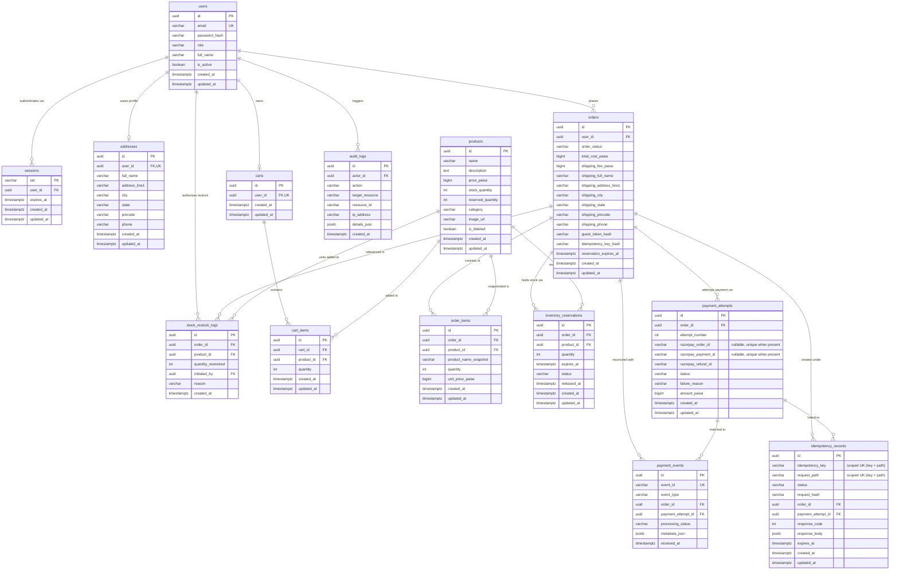

# Nexora Commerce Platform
## Backend Schema Specification
### Version 1.0 — Production Database & Domain Modeling
**Date:** September 6, 2026  
**Status:** Approved & Finalized (Authoritative Baseline for Phase 06 — Implementation Plan)  
**Author:** Principal Backend Engineer, Senior PostgreSQL Database Architect, Senior Full-Stack Engineer, Payment Systems Engineer, Security Engineer, Data Modeling Expert, Production Reliability Engineer  
**Source Documents:**
- `docs/PRD.md` (Product Requirements Document v2.1)
- `docs/TRD.md` (Technical Requirements Document v1.2.1)
- `docs/03-APP-FLOW-v1.0.md` (Application & State Flow Specification v1.0)
- `docs/04-UI-UX-DESIGN-BRIEF-v1.0.md` (UI/UX Design Brief v1.0)

### Document Revision History
| Version | Date | Status | Description |
|---|---|---|---|
| **1.0 (Initial)** | 2026-09-06 | Review Draft | Comprehensive production PostgreSQL database schema and domain model specification. |
| **1.0 (Final)** | 2026-09-06 | Final Approved | Surgical corrections applied: Scoped idempotency key uniqueness `(idempotency_key, request_path)`; decoupled payment event lifecycle (`RECEIVED` initial state); aligned late captured payment financial semantics (`SUCCESS` on attempt, `EXPIRED` on order, `REQUIRES_REFUND` event); removed persistent `razorpay_signature` storage (in-memory verification only); minimized session table schema; eliminated redundant SQL indexes; corrected ERD nullable unique representations; and explicitly clarified `(order_id, product_id)` inventory reservation ownership. |

---

## 1. Document Control & Purpose

### 1.1 Purpose
This document establishes the definitive, production-grade PostgreSQL relational database schema and domain data model for the Nexora Commerce Platform. It serves as the immutable data architecture contract and authoritative baseline for **Phase 06 — Implementation Plan** and subsequent code execution.

This specification details every entity, table definition, column data type, nullable/constraint boundary, foreign key referential integrity rule, index strategy, database locking mechanism, state-machine mapping, concurrency control protocol, and security classification.

### 1.2 Absolute Architectural Boundaries
- **Architecture Pattern:** Modular Monolith with strictly decoupled domain boundaries.
- **Engine:** PostgreSQL 15+ with ACID transactional isolation and row-level locking (`SELECT ... FOR UPDATE`).
- **ORM / Driver:** Sequelize 6.35+ on Node.js (ESM, Node 20 LTS) using `pg` driver.
- **Strict Exclusions:** No SQLite in production or testing. No microservices. No GraphQL. No JWT/client-side session tokens. No MongoDB or generic NoSQL stores. No speculative vector/AI database tables. No unconstrained JSON order products.

---

## 2. Core Schema Principles & Invariants

1. **Relational Normalization over JSON Blobs:** Legacy JSON structures (e.g., `Order.products` JSON blob) are eliminated. All purchase lines are normalized into relational `order_items` preserving immutable snapshots of product name, quantity, and unit price.
2. **Transactional Inventory Integrity:** Inventory availability is governed by:
   $$\text{available\_quantity} = \text{stock\_quantity} - \text{reserved\_quantity}$$
   Available stock is computed dynamically from authoritative counter columns or generated expressions, protected by explicit non-negativity and consistency check constraints (`CHECK (reserved_quantity <= stock_quantity)`).
3. **Decoupled Phase Checkout Boundary:** Database locks and inventory reservations (Phase A) commit strictly *prior* to initiating external network calls to Razorpay (Phase B). No external HTTP call ever executes inside an open database transaction.
4. **Multi-Attempt Payment Architecture:** An ecommerce `Order` possesses a $1:N$ relationship with `PaymentAttempt`. Payment retry operations attach a new `PaymentAttempt` (and new `razorpay_order_id`) to the *existing* `Order` without generating duplicate orders or double-allocating stock.
5. **Decoupled Refund & Restock Invariant ($\text{REFUND} \neq \text{RESTOCK}$):** Payment refunds transition order/payment status to `REFUNDED` via Razorpay API, but **never** automatically increment `stock_quantity`. Inventory restoration requires an explicit, audited administrative restock workflow recorded in `stock_restock_logs`.
6. **Authoritative Backend Settlement:** Frontend payment callback data is non-authoritative. Orders transition to `PAID` exclusively upon verified backend HMAC-SHA256 signature reconciliation or incoming `payment.captured` webhook processing with atomic deduplication.
7. **Gateway Financial Truth vs. Order Lifecycle Distinction:** When a late captured payment arrives after an order has expired, the gateway financial capture is recorded truthfully as `SUCCESS` on `payment_attempts`, while the ecommerce order remains `EXPIRED`. The discrepancy is handled cleanly via `payment_events.processing_status = 'REQUIRES_REFUND'`, triggering asynchronous refund without corrupting inventory or order state.
8. **Zero Payment Credential Ingestion & Data Minimization:** Nexora servers never handle, process, log, or persist raw credit/debit card numbers, CVVs, PINs, expiration dates, UPI MPINs, or bank passwords. Webhook and gateway signatures are verified in-memory and discarded (`verify → use → minimize retention`).

---

## 3. Technology & Database Assumptions

| Parameter | Specification | Rationale |
|---|---|---|
| **Database Engine** | PostgreSQL 15+ | Native support for `pgcrypto` (`gen_random_uuid()`), transactional DDL, JSONB querying, partial indexes, and robust row-level locking. |
| **Primary Key Standard** | `UUIDv4` (`gen_random_uuid()`) | Non-sequential, globally unique, unguessable identifiers preventing IDOR/enumeration attacks across all public/admin resources. |
| **Session Key Standard** | `VARCHAR(255)` | Opaque 256-bit cryptographically secure random token stored server-side. |
| **Monetary Representation** | `BIGINT` (INR Paise) | Eliminates IEEE 754 floating-point rounding errors. $1\text{ INR} = 100\text{ Paise}$. Zero floating point types permitted. |
| **Timestamp Standard** | `TIMESTAMPTZ` (`TIMESTAMP WITH TIME ZONE`) | UTC-normalized, timezone-aware timestamps preventing ambiguity across server locales and distributed clients. |
| **ORM / Migration Tool** | Sequelize 6.35+ CLI Migrations | Version-controlled, deterministic up/down SQL schema migrations executed in strict dependency sequence. |

---

## 4. Domain Overview & Entity Catalog

The Nexora schema contains exactly **14 relational domain entities** structured across four core operational boundaries:

```
┌─────────────────────────────────────────────────────────────────────────────────────────┐
│                                 NEXORA DOMAIN BOUNDARIES                                │
├──────────────────────────┬──────────────────────────┬───────────────────────────────────┤
│ 1. IDENTITY & SESSIONS   │ 2. CATALOG & INVENTORY   │ 3. CART & CHECKOUT AGGREGATE      │
│  - users                 │  - products              │  - carts                          │
│  - sessions              │  - inventory_reservations│  - cart_items                     │
│  - addresses             │  - stock_restock_logs    │  - orders                         │
│                          │                          │  - order_items                    │
├──────────────────────────┴──────────────────────────┴───────────────────────────────────┤
│ 4. PAYMENTS, IDEMPOTENCY & AUDIT TRAILS                                                 │
│  - payment_attempts                                                                     │
│  - payment_events (Webhook Deduplication & Audit)                                      │
│  - idempotency_records (Scoped API Mutex & Replay Store)                                │
│  - audit_logs (Administrative & Security Event Journal)                                 │
└─────────────────────────────────────────────────────────────────────────────────────────┘
```

### Entity Summary Catalog
| Entity / Table | Primary Key | Purpose & Domain Responsibility |
|---|---|---|
| `users` | `id` (UUID) | User account identities, credentials (argon2/bcrypt hash), and RBAC roles (`customer`, `admin`). |
| `sessions` | `sid` (VARCHAR) | Minimal server-side session store backing opaque `__Host-nexora_sid` authentication cookies. |
| `addresses` | `id` (UUID) | Customer convenience saved shipping addresses (1 saved address per user in MVP). |
| `products` | `id` (UUID) | E-commerce product catalog with physical inventory tracking counter columns. |
| `inventory_reservations` | `id` (UUID) | 15-minute transactional inventory locks binding products to pending orders at `(order_id, product_id)` level. |
| `carts` | `id` (UUID) | User-owned shopping carts (1 active cart per authenticated user). |
| `cart_items` | `id` (UUID) | Line items within a cart with product references and quantity caps (1..10). |
| `orders` | `id` (UUID) | Central transactional aggregate storing order lifecycle, totals, and immutable shipping snapshots. |
| `order_items` | `id` (UUID) | Historical, immutable line items linking orders to products with price and name snapshots. |
| `payment_attempts` | `id` (UUID) | Multi-attempt payment records tracking gateway orders, payment IDs, amount, and statuses. |
| `payment_events` | `id` (UUID) | Durable, idempotent webhook ingestion store recording Razorpay event IDs and minimized payload metadata. |
| `idempotency_records` | `id` (UUID) | Scoped request-level mutual exclusion and response caching store for mutation APIs (`Idempotency-Key` + `request_path`). |
| `audit_logs` | `id` (UUID) | Append-only security and operational audit trail for admin actions, auth events, and state mutations. |
| `stock_restock_logs` | `id` (UUID) | Append-only inventory restock ledger recording physical unit additions, admins, and reasons. |

---

## 5. Detailed Table Specifications

### 5.1 `users`
**Purpose:** Stores registered customer and administrator accounts, hashed credentials, and role-based access control assignments.

```sql
CREATE TABLE users (
    id UUID PRIMARY KEY DEFAULT gen_random_uuid(),
    email VARCHAR(255) NOT NULL,
    password_hash VARCHAR(255) NOT NULL,
    role VARCHAR(50) NOT NULL DEFAULT 'customer',
    full_name VARCHAR(255) NOT NULL,
    is_active BOOLEAN NOT NULL DEFAULT TRUE,
    created_at TIMESTAMPTZ NOT NULL DEFAULT CURRENT_TIMESTAMP,
    updated_at TIMESTAMPTZ NOT NULL DEFAULT CURRENT_TIMESTAMP,
    CONSTRAINT uq_users_email UNIQUE (email),
    CONSTRAINT chk_users_role CHECK (role IN ('customer', 'admin')),
    CONSTRAINT chk_users_email_format CHECK (email ~* '^[A-Za-z0-9._%+-]+@[A-Za-z0-9.-]+\.[A-Za-z]{2,}$')
);
```

- **Referential Actions:** Referenced by `sessions`, `addresses`, `carts`, `orders`, `audit_logs`, `stock_restock_logs`.
- **Delete Rule:** Hard delete disallowed in production. In testing/admin purge, `ON DELETE CASCADE` applies to `sessions`, `addresses`, `carts`; `ON DELETE SET NULL` applies to `orders` and `audit_logs`; `ON DELETE RESTRICT` applies to `stock_restock_logs`.
- **Security & Sensitivity:** High (`password_hash` is write-only, never returned in API responses; Argon2id / bcrypt work factor $\ge 12$).

---

### 5.2 `sessions`
**Purpose:** Minimal server-side session store backing HTTP-only cookie authentication. Completely replaces stateless JWT tokens.

```sql
CREATE TABLE sessions (
    sid VARCHAR(255) PRIMARY KEY,
    user_id UUID NOT NULL,
    expires_at TIMESTAMPTZ NOT NULL,
    created_at TIMESTAMPTZ NOT NULL DEFAULT CURRENT_TIMESTAMP,
    updated_at TIMESTAMPTZ NOT NULL DEFAULT CURRENT_TIMESTAMP,
    CONSTRAINT fk_sessions_user FOREIGN KEY (user_id) REFERENCES users(id) ON DELETE CASCADE
);
```

- **Minimal Session Design:** `sessions` table is strictly scoped to authentication state and lifetime validation. Transient client metadata (IP address, User-Agent) is logged to `audit_logs` during authentication events rather than bloating persistent session rows.
- **Column Details:**
  - `sid`: Raw 256-bit cryptographically secure random token (hex-encoded, 64 characters) matching client cookie `__Host-nexora_sid`.
  - `user_id`: Foreign key reference to authenticated user.
  - `expires_at`: Absolute timestamp of session expiration (7-day rolling window).
- **Index:** `idx_sessions_expires_at` for automated cron/worker cleanup of expired sessions; `idx_sessions_user_id` for fast user-level session lookups.

---

### 5.3 `addresses`
**Purpose:** Stores user convenience saved shipping profiles. Scoped to MVP single-address requirement per registered customer.

```sql
CREATE TABLE addresses (
    id UUID PRIMARY KEY DEFAULT gen_random_uuid(),
    user_id UUID NOT NULL,
    full_name VARCHAR(255) NOT NULL,
    address_line1 VARCHAR(500) NOT NULL,
    city VARCHAR(100) NOT NULL,
    state VARCHAR(100) NOT NULL,
    pincode VARCHAR(20) NOT NULL,
    phone VARCHAR(20) NOT NULL,
    created_at TIMESTAMPTZ NOT NULL DEFAULT CURRENT_TIMESTAMP,
    updated_at TIMESTAMPTZ NOT NULL DEFAULT CURRENT_TIMESTAMP,
    CONSTRAINT fk_addresses_user FOREIGN KEY (user_id) REFERENCES users(id) ON DELETE CASCADE,
    CONSTRAINT uq_addresses_user UNIQUE (user_id),
    CONSTRAINT chk_addresses_pincode CHECK (pincode ~ '^[1-9][0-9]{5}$')
);
```

- **Design Rationale:** `CONSTRAINT uq_addresses_user UNIQUE (user_id)` strictly enforces the PRD v2.1 MVP requirement of at most one saved profile per customer.
- **Order Snapshot Isolation:** Modifying this record never mutates past or in-flight orders, as `orders` embeds an immutable physical address snapshot.

---

### 5.4 `products`
**Purpose:** E-commerce catalog cataloguing items, pricing, display assets, and atomic physical inventory counters.

```sql
CREATE TABLE products (
    id UUID PRIMARY KEY DEFAULT gen_random_uuid(),
    name VARCHAR(255) NOT NULL,
    description TEXT NOT NULL,
    price_paise BIGINT NOT NULL,
    stock_quantity INT NOT NULL DEFAULT 0,
    reserved_quantity INT NOT NULL DEFAULT 0,
    category VARCHAR(100) NOT NULL,
    image_url VARCHAR(1024) NOT NULL,
    is_deleted BOOLEAN NOT NULL DEFAULT FALSE,
    created_at TIMESTAMPTZ NOT NULL DEFAULT CURRENT_TIMESTAMP,
    updated_at TIMESTAMPTZ NOT NULL DEFAULT CURRENT_TIMESTAMP,
    CONSTRAINT chk_products_price_paise CHECK (price_paise >= 0),
    CONSTRAINT chk_products_stock_quantity CHECK (stock_quantity >= 0),
    CONSTRAINT chk_products_reserved_quantity CHECK (reserved_quantity >= 0),
    CONSTRAINT chk_products_reserved_lte_stock CHECK (reserved_quantity <= stock_quantity)
);
```

- **Available Quantity Invariant:** Exposed as dynamic query calculation `(stock_quantity - reserved_quantity)`.
- **Soft Deletion:** Products marked `is_deleted = TRUE` are hidden from customer catalog listings but remain in PostgreSQL to preserve historical referential integrity with `order_items`.
- **Hard Delete Restriction:** Hard deletion is blocked by `ON DELETE RESTRICT` on `order_items` and `inventory_reservations`.

---

### 5.5 `carts`
**Purpose:** Represents an active shopping cart owned by a registered customer.

```sql
CREATE TABLE carts (
    id UUID PRIMARY KEY DEFAULT gen_random_uuid(),
    user_id UUID NOT NULL,
    created_at TIMESTAMPTZ NOT NULL DEFAULT CURRENT_TIMESTAMP,
    updated_at TIMESTAMPTZ NOT NULL DEFAULT CURRENT_TIMESTAMP,
    CONSTRAINT fk_carts_user FOREIGN KEY (user_id) REFERENCES users(id) ON DELETE CASCADE,
    CONSTRAINT uq_carts_user UNIQUE (user_id)
);
```

- **Uniqueness:** Exactly one active cart per registered user (`uq_carts_user`).
- **Guest Carts:** Guests maintain client-side carts in `localStorage` until checkout initiation or login/merge (`POST /api/cart/merge`).

---

### 5.6 `cart_items`
**Purpose:** Relational line items contained within an active cart.

```sql
CREATE TABLE cart_items (
    id UUID PRIMARY KEY DEFAULT gen_random_uuid(),
    cart_id UUID NOT NULL,
    product_id UUID NOT NULL,
    quantity INT NOT NULL,
    created_at TIMESTAMPTZ NOT NULL DEFAULT CURRENT_TIMESTAMP,
    updated_at TIMESTAMPTZ NOT NULL DEFAULT CURRENT_TIMESTAMP,
    CONSTRAINT fk_cart_items_cart FOREIGN KEY (cart_id) REFERENCES carts(id) ON DELETE CASCADE,
    CONSTRAINT fk_cart_items_product FOREIGN KEY (product_id) REFERENCES products(id) ON DELETE RESTRICT,
    CONSTRAINT uq_cart_items_cart_product UNIQUE (cart_id, product_id),
    CONSTRAINT chk_cart_items_quantity CHECK (quantity > 0 AND quantity <= 10)
);
```

- **Integrity Rule:** `CONSTRAINT uq_cart_items_cart_product UNIQUE (cart_id, product_id)` strictly prevents duplicate rows for the same product in a single cart.
- **Stock Decoupling:** Placing an item in a cart does **NOT** reserve stock. Stock reservation occurs strictly during checkout initiation.

---

### 5.7 `orders`
**Purpose:** Central transactional aggregate recording order lifecycle, financial totals, immutable shipping address snapshot, and guest tracking tokens.

```sql
CREATE TABLE orders (
    id UUID PRIMARY KEY DEFAULT gen_random_uuid(),
    user_id UUID NULL,
    order_status VARCHAR(50) NOT NULL DEFAULT 'PENDING_PAYMENT',
    total_cost_paise BIGINT NOT NULL,
    shipping_fee_paise BIGINT NOT NULL DEFAULT 0,
    -- Immutable Shipping Address Snapshot
    shipping_full_name VARCHAR(255) NOT NULL,
    shipping_address_line1 VARCHAR(500) NOT NULL,
    shipping_city VARCHAR(100) NOT NULL,
    shipping_state VARCHAR(100) NOT NULL,
    shipping_pincode VARCHAR(20) NOT NULL,
    shipping_phone VARCHAR(20) NOT NULL,
    -- Guest Access & Idempotency Security
    guest_token_hash VARCHAR(64) NULL,
    idempotency_key_hash VARCHAR(64) NULL,
    reservation_expires_at TIMESTAMPTZ NOT NULL,
    created_at TIMESTAMPTZ NOT NULL DEFAULT CURRENT_TIMESTAMP,
    updated_at TIMESTAMPTZ NOT NULL DEFAULT CURRENT_TIMESTAMP,
    CONSTRAINT fk_orders_user FOREIGN KEY (user_id) REFERENCES users(id) ON DELETE SET NULL,
    CONSTRAINT chk_orders_status CHECK (
        order_status IN ('PENDING_PAYMENT', 'PAID', 'PROCESSING', 'SHIPPED', 'DELIVERED', 'CANCELLED', 'EXPIRED', 'REFUNDED')
    ),
    CONSTRAINT chk_orders_total_cost_paise CHECK (total_cost_paise >= 0),
    CONSTRAINT chk_orders_shipping_fee_paise CHECK (shipping_fee_paise >= 0)
);
```

- **Guest Security:** `guest_token_hash` stores the hex-encoded SHA-256 hash of a 256-bit raw random token. The raw token is returned to the client exactly once at checkout initiation and never logged or stored.
- **Historical Immutability:** All shipping fields (`shipping_*`) are permanent copies taken at checkout time.

---

### 5.8 `order_items`
**Purpose:** Immutable line items linking an order to purchased products, capturing exact unit prices and product name snapshots at purchase time.

```sql
CREATE TABLE order_items (
    id UUID PRIMARY KEY DEFAULT gen_random_uuid(),
    order_id UUID NOT NULL,
    product_id UUID NOT NULL,
    product_name_snapshot VARCHAR(255) NOT NULL,
    quantity INT NOT NULL,
    unit_price_paise BIGINT NOT NULL,
    created_at TIMESTAMPTZ NOT NULL DEFAULT CURRENT_TIMESTAMP,
    updated_at TIMESTAMPTZ NOT NULL DEFAULT CURRENT_TIMESTAMP,
    CONSTRAINT fk_order_items_order FOREIGN KEY (order_id) REFERENCES orders(id) ON DELETE CASCADE,
    CONSTRAINT fk_order_items_product FOREIGN KEY (product_id) REFERENCES products(id) ON DELETE RESTRICT,
    CONSTRAINT chk_order_items_quantity CHECK (quantity > 0),
    CONSTRAINT chk_order_items_unit_price_paise CHECK (unit_price_paise >= 0)
);
```

- **Snapshot Invariant:** If a product is repriced or renamed in the `products` table after purchase, `order_items.unit_price_paise` and `order_items.product_name_snapshot` remain unmodified, ensuring audit and tax fidelity.
- **Relational Integrity:** `ON DELETE RESTRICT` on `product_id` prevents deleting product records that have associated historical orders.

---

### 5.9 `inventory_reservations`
**Purpose:** Dedicated transactional inventory reservation record enforcing 15-minute TTL locks per distinct product in an order.

```sql
CREATE TABLE inventory_reservations (
    id UUID PRIMARY KEY DEFAULT gen_random_uuid(),
    order_id UUID NOT NULL,
    product_id UUID NOT NULL,
    quantity INT NOT NULL,
    expires_at TIMESTAMPTZ NOT NULL,
    status VARCHAR(50) NOT NULL DEFAULT 'ACTIVE',
    released_at TIMESTAMPTZ NULL,
    created_at TIMESTAMPTZ NOT NULL DEFAULT CURRENT_TIMESTAMP,
    updated_at TIMESTAMPTZ NOT NULL DEFAULT CURRENT_TIMESTAMP,
    CONSTRAINT fk_inv_res_order FOREIGN KEY (order_id) REFERENCES orders(id) ON DELETE CASCADE,
    CONSTRAINT fk_inv_res_product FOREIGN KEY (product_id) REFERENCES products(id) ON DELETE RESTRICT,
    CONSTRAINT uq_inv_res_order_product UNIQUE (order_id, product_id),
    CONSTRAINT chk_inv_res_status CHECK (status IN ('ACTIVE', 'RELEASED', 'CONVERTED', 'EXPIRED')),
    CONSTRAINT chk_inv_res_quantity CHECK (quantity > 0)
);
```

- **Reservation Ownership Clarification:**
  - Inventory reservations are owned strictly at the **`(order_id, product_id)` aggregate level**, enforced by `CONSTRAINT uq_inv_res_order_product UNIQUE (order_id, product_id)`.
  - An order reserves stock for each distinct product by aggregating the quantity requested across line items. This decouples the transactional inventory locking mechanism from presentation-level line items while maintaining 100% mathematical consistency with `order_items`.
- **State Lifecycle:**
  - `ACTIVE`: Reservation holds stock (`reserved_quantity` incremented on product).
  - `CONVERTED`: Order successfully paid (`reserved_quantity` and `stock_quantity` decremented permanently).
  - `RELEASED` / `EXPIRED`: Order expired, cancelled, or superseded (`reserved_quantity` decremented, returning stock to available pool).

---

### 5.10 `payment_attempts`
**Purpose:** First-class entity tracking each distinct payment initiation attempt for an order, supporting retries without duplicate order creation.

```sql
CREATE TABLE payment_attempts (
    id UUID PRIMARY KEY DEFAULT gen_random_uuid(),
    order_id UUID NOT NULL,
    attempt_number INT NOT NULL,
    razorpay_order_id VARCHAR(255) NULL,
    razorpay_payment_id VARCHAR(255) NULL,
    razorpay_refund_id VARCHAR(255) NULL,
    status VARCHAR(50) NOT NULL DEFAULT 'INITIATED',
    failure_reason VARCHAR(500) NULL,
    amount_paise BIGINT NOT NULL,
    created_at TIMESTAMPTZ NOT NULL DEFAULT CURRENT_TIMESTAMP,
    updated_at TIMESTAMPTZ NOT NULL DEFAULT CURRENT_TIMESTAMP,
    CONSTRAINT fk_payment_attempts_order FOREIGN KEY (order_id) REFERENCES orders(id) ON DELETE CASCADE,
    CONSTRAINT uq_payment_attempts_order_attempt UNIQUE (order_id, attempt_number),
    CONSTRAINT chk_payment_attempts_attempt_number CHECK (attempt_number > 0),
    CONSTRAINT chk_payment_attempts_status CHECK (status IN ('INITIATED', 'SUCCESS', 'FAILED', 'REFUNDED')),
    CONSTRAINT chk_payment_attempts_amount_paise CHECK (amount_paise >= 0)
);
```

- **Partial Unique Indexes & Gateway Identifier Rules:**
  - `razorpay_order_id` is unique when non-null (`idx_payment_attempts_rzp_order`).
  - `razorpay_payment_id` is nullable and unique when non-null (`idx_payment_attempts_rzp_payment`).
  - `uq_one_success_payment_per_order` guarantees that at most ONE `PaymentAttempt` per `Order` can achieve `SUCCESS` status:
    ```sql
    CREATE UNIQUE INDEX uq_one_success_payment_per_order ON payment_attempts(order_id) WHERE status = 'SUCCESS';
    ```
- **Zero Signature Retention:** `razorpay_signature` is **not persisted**. HMAC signatures are verified in-memory upon webhook/callback arrival and immediately discarded adhering to data minimization standards.

---

### 5.11 `payment_events`
**Purpose:** Durable webhook event journal ensuring strict HMAC verification and idempotency deduplication for Razorpay webhooks.

```sql
CREATE TABLE payment_events (
    id UUID PRIMARY KEY DEFAULT gen_random_uuid(),
    event_id VARCHAR(255) NOT NULL,
    event_type VARCHAR(100) NOT NULL,
    order_id UUID NULL,
    payment_attempt_id UUID NULL,
    processing_status VARCHAR(50) NOT NULL DEFAULT 'RECEIVED',
    metadata_json JSONB NULL,
    received_at TIMESTAMPTZ NOT NULL DEFAULT CURRENT_TIMESTAMP,
    CONSTRAINT uq_payment_events_event_id UNIQUE (event_id),
    CONSTRAINT fk_payment_events_order FOREIGN KEY (order_id) REFERENCES orders(id) ON DELETE SET NULL,
    CONSTRAINT fk_payment_events_attempt FOREIGN KEY (payment_attempt_id) REFERENCES payment_attempts(id) ON DELETE SET NULL,
    CONSTRAINT chk_payment_events_status CHECK (
        processing_status IN ('RECEIVED', 'PROCESSING', 'PROCESSED', 'IGNORED_DUPLICATE', 'REQUIRES_REFUND', 'FAILED')
    )
);
```

- **Processing Lifecycle States:**
  1. `RECEIVED`: Event payload verified and deduplicated in DB, awaiting business reconciliation.
  2. `PROCESSING`: Reconciliation transaction actively executing.
  3. `PROCESSED`: Reconciliation successfully committed; order transitioned to `PAID` and inventory deducted.
  4. `IGNORED_DUPLICATE`: Event recognized as duplicate; skipped without re-running business logic.
  5. `REQUIRES_REFUND`: Late payment captured on an already `EXPIRED` order; flagged for asynchronous refund.
  6. `FAILED`: Processing failed due to transient database or server error; eligible for safe retry.
- **Data Minimization:** `metadata_json` stores only sanitized event metadata (e.g. `{ "razorpay_payment_id": "pay_...", "amount": 299900, "captured": true }`). No card numbers, CVVs, or secret keys are ever logged or stored.

---

### 5.12 `idempotency_records`
**Purpose:** Manages scoped API mutual exclusion and caches mutation responses for network retry resilience.

```sql
CREATE TABLE idempotency_records (
    id UUID PRIMARY KEY DEFAULT gen_random_uuid(),
    idempotency_key VARCHAR(255) NOT NULL,
    request_path VARCHAR(255) NOT NULL,
    status VARCHAR(50) NOT NULL DEFAULT 'IN_PROGRESS',
    request_hash VARCHAR(64) NOT NULL,
    order_id UUID NULL,
    payment_attempt_id UUID NULL,
    response_code INT NULL,
    response_body JSONB NULL,
    expires_at TIMESTAMPTZ NOT NULL,
    created_at TIMESTAMPTZ NOT NULL DEFAULT CURRENT_TIMESTAMP,
    updated_at TIMESTAMPTZ NOT NULL DEFAULT CURRENT_TIMESTAMP,
    CONSTRAINT uq_idempotency_scope UNIQUE (idempotency_key, request_path),
    CONSTRAINT fk_idempotency_order FOREIGN KEY (order_id) REFERENCES orders(id) ON DELETE SET NULL,
    CONSTRAINT fk_idempotency_attempt FOREIGN KEY (payment_attempt_id) REFERENCES payment_attempts(id) ON DELETE SET NULL,
    CONSTRAINT chk_idempotency_status CHECK (status IN ('IN_PROGRESS', 'COMPLETED', 'FAILED_RETRYABLE'))
);
```

- **Scoped Uniqueness Boundary:** Uniqueness is enforced on `(idempotency_key, request_path)`. This guarantees that an idempotency key from one operational scope (e.g., `POST /api/checkout/initiate`) never collides with an identical key used in a different API scope (e.g., `POST /api/admin/inventory/restock`).
- **Lifecycle:** 
  1. `IN_PROGRESS` locks the scoped key. Concurrent duplicate requests receive HTTP 409 Conflict.
  2. `COMPLETED` stores the serialized HTTP status code and response payload. Subsequent replays receive the cached response immediately.
  3. `FAILED_RETRYABLE` is set if a transient failure occurs prior to lock commitment, allowing safe retry.

---

### 5.13 `audit_logs`
**Purpose:** Append-only compliance and security journal recording administrative mutations, authentication events, state changes, and refunds.

```sql
CREATE TABLE audit_logs (
    id UUID PRIMARY KEY DEFAULT gen_random_uuid(),
    actor_id UUID NULL,
    action VARCHAR(100) NOT NULL,
    target_resource VARCHAR(100) NOT NULL,
    resource_id VARCHAR(255) NULL,
    ip_address VARCHAR(45) NOT NULL,
    details_json JSONB NULL,
    created_at TIMESTAMPTZ NOT NULL DEFAULT CURRENT_TIMESTAMP,
    CONSTRAINT fk_audit_logs_actor FOREIGN KEY (actor_id) REFERENCES users(id) ON DELETE SET NULL
);
```

- **Explicit Action Catalog:** `AUTH_LOGIN_SUCCESS`, `AUTH_LOGIN_FAILED`, `AUTH_LOGOUT`, `ORDER_STATUS_CHANGED`, `PAYMENT_REFUND_INITIATED`, `PAYMENT_REFUND_COMPLETED`, `INVENTORY_RESTOCKED`, `PRODUCT_CREATED`, `PRODUCT_UPDATED`, `PRODUCT_DELETED`.
- **Zero Sensitive Data:** Passwords, session tokens, raw guest tokens, and card numbers are strictly prohibited from `details_json`.

---

### 5.14 `stock_restock_logs`
**Purpose:** Dedicated physical inventory restock ledger enforcing accountability and auditability for manual stock replenishments.

```sql
CREATE TABLE stock_restock_logs (
    id UUID PRIMARY KEY DEFAULT gen_random_uuid(),
    order_id UUID NULL,
    product_id UUID NOT NULL,
    quantity_restocked INT NOT NULL,
    initiated_by UUID NOT NULL,
    reason VARCHAR(500) NOT NULL,
    created_at TIMESTAMPTZ NOT NULL DEFAULT CURRENT_TIMESTAMP,
    CONSTRAINT fk_restock_order FOREIGN KEY (order_id) REFERENCES orders(id) ON DELETE SET NULL,
    CONSTRAINT fk_restock_product FOREIGN KEY (product_id) REFERENCES products(id) ON DELETE RESTRICT,
    CONSTRAINT fk_restock_admin FOREIGN KEY (initiated_by) REFERENCES users(id) ON DELETE RESTRICT,
    CONSTRAINT chk_restock_quantity CHECK (quantity_restocked > 0)
);
```

- **Enforces $\text{REFUND} \neq \text{RESTOCK}$:** When an order is refunded, `order_id` may be optionally referenced in this log when physical units are physically received back into warehouse inventory by an admin.

---

## 6. Relationships & Referential Integrity Matrix

| Parent Table | Child Table | Foreign Key Column | Cardinality | ON DELETE | ON UPDATE | Referential Intent & Justification |
|---|---|---|---|---|---|---|
| `users` | `sessions` | `user_id` | $1:N$ | `CASCADE` | `CASCADE` | User deletion clears all active login sessions immediately. |
| `users` | `addresses` | `user_id` | $1:1$ | `CASCADE` | `CASCADE` | Deleting a user cleans up their saved profile address. |
| `users` | `carts` | `user_id` | $1:1$ | `CASCADE` | `CASCADE` | Deleting a user deletes their active cart aggregate. |
| `users` | `orders` | `user_id` | $1:N$ | `SET NULL` | `CASCADE` | **Critical:** Order records must survive user account deletion for legal/financial audit. |
| `users` | `audit_logs` | `actor_id` | $1:N$ | `SET NULL` | `CASCADE` | Audit log rows are permanent and must never be deleted. |
| `users` | `stock_restock_logs` | `initiated_by` | $1:N$ | `RESTRICT` | `CASCADE` | Admin account cannot be hard deleted if tied to restock ledger. |
| `carts` | `cart_items` | `cart_id` | $1:N$ | `CASCADE` | `CASCADE` | Clearing or deleting a cart cascades to all its items. |
| `products` | `cart_items` | `product_id` | $1:N$ | `RESTRICT` | `CASCADE` | Cannot delete product if currently in active carts (must soft delete). |
| `orders` | `order_items` | `order_id` | $1:N$ | `CASCADE` | `CASCADE` | Order line items belong strictly to the order lifecycle. |
| `products` | `order_items` | `product_id` | $1:N$ | `RESTRICT` | `CASCADE` | **Critical:** Products with historical sales cannot be hard deleted. |
| `orders` | `inventory_reservations`| `order_id` | $1:N$ | `CASCADE` | `CASCADE` | Cancelling/purging order removes active reservation record. |
| `products` | `inventory_reservations`| `product_id` | $1:N$ | `RESTRICT` | `CASCADE` | Active reservation locks product from hard deletion. |
| `orders` | `payment_attempts` | `order_id` | $1:N$ | `CASCADE` | `CASCADE` | Payment attempts are child entities of the order aggregate. |
| `orders` | `payment_events` | `order_id` | $1:N$ | `SET NULL` | `CASCADE` | Webhook audit record is preserved even if order is purged. |
| `payment_attempts` | `payment_events` | `payment_attempt_id`| $1:N$ | `SET NULL` | `CASCADE` | Webhook audit record preserved independently. |
| `orders` | `idempotency_records`| `order_id` | $1:N$ | `SET NULL` | `CASCADE` | Idempotency history preserved for audit trail. |
| `orders` | `stock_restock_logs` | `order_id` | $1:N$ | `SET NULL` | `CASCADE` | Restock record survives even if related order is purged. |
| `products` | `stock_restock_logs` | `product_id` | $1:N$ | `RESTRICT` | `CASCADE` | Restock ledger permanently protects product reference. |

---

## 7. Entity Relationship Diagram (ERD)



---

## 8. Database Indexes & Query Performance Strategy

### 8.1 Cleaned Non-Redundant Index Catalog

```sql
-- ============================================================================
-- 1. USERS & SESSIONS INDEXES
-- ============================================================================
-- Note: users(email) already backed by CONSTRAINT uq_users_email UNIQUE

-- Fast lookup for authenticated session validation middleware
CREATE INDEX idx_sessions_user_id ON sessions(user_id);

-- Used by background TTL worker to clean up expired sessions
CREATE INDEX idx_sessions_expires_at ON sessions(expires_at);

-- ============================================================================
-- 2. PRODUCTS INDEXES
-- ============================================================================
-- Category filtering in product catalog (p95 < 200ms)
CREATE INDEX idx_products_category ON products(category);

-- Filter active vs soft-deleted products
CREATE INDEX idx_products_is_deleted ON products(is_deleted);

-- Full-text search across product title and description
CREATE INDEX idx_products_fulltext ON products USING gin(to_tsvector('english', name || ' ' || description));

-- ============================================================================
-- 3. CARTS & CART ITEMS INDEXES
-- ============================================================================
CREATE INDEX idx_cart_items_cart_id ON cart_items(cart_id);
CREATE INDEX idx_cart_items_product_id ON cart_items(product_id);

-- ============================================================================
-- 4. ORDERS & ORDER ITEMS INDEXES
-- ============================================================================
-- Customer order history queries (filtered by user, ordered by creation)
CREATE INDEX idx_orders_user_created ON orders(user_id, created_at DESC) WHERE user_id IS NOT NULL;

-- Admin order dashboard filtering by state
CREATE INDEX idx_orders_status_created ON orders(order_status, created_at DESC);

-- Guest order lookup via SHA-256 token hash (constant-time index scan)
CREATE INDEX idx_orders_guest_token_hash ON orders(guest_token_hash) WHERE guest_token_hash IS NOT NULL;

-- Background worker checking for expired reservations (PENDING_PAYMENT > 15m)
CREATE INDEX idx_orders_pending_reservation_expiry ON orders(reservation_expires_at) 
    WHERE order_status = 'PENDING_PAYMENT';

-- Eager loading order items for order details
CREATE INDEX idx_order_items_order_id ON order_items(order_id);

-- ============================================================================
-- 5. INVENTORY RESERVATIONS INDEXES
-- ============================================================================
-- Note: (order_id, product_id) already backed by CONSTRAINT uq_inv_res_order_product UNIQUE

-- Worker finding active reservations ready for automated expiry release
CREATE INDEX idx_inv_res_active_expiry ON inventory_reservations(status, expires_at) 
    WHERE status = 'ACTIVE';

CREATE INDEX idx_inv_res_product_id ON inventory_reservations(product_id);

-- ============================================================================
-- 6. PAYMENT ATTEMPTS & EVENTS INDEXES
-- ============================================================================
CREATE INDEX idx_payment_attempts_order_id ON payment_attempts(order_id);

-- Partial unique indexes ensuring Razorpay identifiers map strictly to 1 attempt when present
CREATE UNIQUE INDEX idx_payment_attempts_rzp_order ON payment_attempts(razorpay_order_id) 
    WHERE razorpay_order_id IS NOT NULL;

CREATE UNIQUE INDEX idx_payment_attempts_rzp_payment ON payment_attempts(razorpay_payment_id) 
    WHERE razorpay_payment_id IS NOT NULL;

-- CRITICAL DOMAIN INTEGRITY: Guarantees strictly at most ONE successful payment attempt per order
CREATE UNIQUE INDEX uq_one_success_payment_per_order ON payment_attempts(order_id) 
    WHERE status = 'SUCCESS';

-- Note: payment_events(event_id) already backed by CONSTRAINT uq_payment_events_event_id UNIQUE
CREATE INDEX idx_payment_events_order_id ON payment_events(order_id);

-- ============================================================================
-- 7. IDEMPOTENCY & AUDIT INDEXES
-- ============================================================================
-- Note: (idempotency_key, request_path) already backed by CONSTRAINT uq_idempotency_scope UNIQUE
CREATE INDEX idx_idempotency_records_expires_at ON idempotency_records(expires_at);

CREATE INDEX idx_audit_logs_actor ON audit_logs(actor_id);
CREATE INDEX idx_audit_logs_action_created ON audit_logs(action, created_at DESC);
CREATE INDEX idx_audit_logs_resource ON audit_logs(target_resource, resource_id);

CREATE INDEX idx_stock_restock_product ON stock_restock_logs(product_id);
CREATE INDEX idx_stock_restock_order ON stock_restock_logs(order_id);
```

---

## 9. Monetary Model & Currency Invariants

### 9.1 The Integer Arithmetic Mandate
- **Unit of Record:** All financial values across the database, application domain models, and JSON API payloads are stored and transmitted as **Integer Paise** (`BIGINT` / `INT` in JavaScript `Number.isSafeInteger` or `BigInt`).
- **Prohibited:** Any floating-point types (`FLOAT`, `DOUBLE`, `REAL`, `NUMERIC` without fixed scale).
- **Floating-Point Arithmetic Prohibition:** Authoritative financial operations (e.g., cart total calculations, line items summation, shipping additions) **must never** execute floating-point math:
  ```javascript
  // STRICTLY PROHIBITED
  const total = (itemPrice * 100 + shipping * 100) / 100; // Unsafe float drift

  // REQUIRED AUTHORITATIVE ARITHMETIC
  const totalCostPaise = lineItems.reduce((acc, item) => acc + (item.unitPricePaise * item.quantity), 0) + shippingFeePaise;
  ```

### 9.2 Gateway Conversion Rules
| Value | Nexora Database (`BIGINT` Paise) | Razorpay API Payload (`INT` Paise) | Customer UI Display (`String` INR) |
|---|---|---|---|
| ₹2,999.00 | `299900` | `299900` | `"₹2,999"` or `"₹2,999.00"` |
| ₹49.50 | `4950` | `4950` | `"₹49.50"` |
| Free Shipping | `0` | `0` | `"Free"` |

---

## 10. State-Machine & Lifecycle Mappings

### 10.1 Order State Machine Mapping

```
                                 ┌──────────────────┐
                                 │ PENDING_PAYMENT  │
                                 └─────────┬────────┘
                    ┌──────────────────────┼──────────────────────┐
                    │ (payment captured)   │ (15m TTL expires)    │ (user/admin cancel)
                    ▼                      ▼                      ▼
             ┌──────────────┐       ┌──────────────┐       ┌──────────────┐
             │     PAID     │       │   EXPIRED    │       │  CANCELLED   │
             └──────┬───────┘       └──────────────┘       └──────────────┘
                    │ (admin process)
                    ▼
             ┌──────────────┐
             │  PROCESSING  │
             └──────┬───────┘
                    │ (shipping dispatch)
                    ▼
             ┌──────────────┐
             │   SHIPPED    │
             └──────┬───────┘
                    │ (carrier delivery)
                    ▼
             ┌──────────────┐
             │  DELIVERED   │
             └──────────────┘
             
     [ANY SETTLED STATE: PAID / PROCESSING / SHIPPED / DELIVERED]
                    │ (admin refund via Razorpay API)
                    ▼
             ┌──────────────┐
             │   REFUNDED   │  (NOTE: REFUND != RESTOCK)
             └──────────────┘
```

| Current State | Allowed Next State | Trigger / Event | Database Mutation Implication |
|---|---|---|---|
| `PENDING_PAYMENT` | `PAID` | Verified `payment.captured` or `/api/payments/verify` | Update `orders.order_status = 'PAID'`; Convert `inventory_reservations.status = 'CONVERTED'`; Deduct `products.stock_quantity -= qty` & `products.reserved_quantity -= qty`. |
| `PENDING_PAYMENT` | `EXPIRED` | 15-Minute Reservation Expiry Worker | Update `orders.order_status = 'EXPIRED'`; Update `inventory_reservations.status = 'EXPIRED'`; Decrement `products.reserved_quantity -= qty`. |
| `PENDING_PAYMENT` | `CANCELLED` | Explicit user/admin cancellation | Update `orders.order_status = 'CANCELLED'`; Update `inventory_reservations.status = 'RELEASED'`; Decrement `products.reserved_quantity -= qty`. |
| `PAID` | `PROCESSING` | Admin order fulfillment dispatch | Update `orders.order_status = 'PROCESSING'`; Write `audit_logs`. |
| `PROCESSING` | `SHIPPED` | Admin attaches tracking dispatch | Update `orders.order_status = 'SHIPPED'`; Write `audit_logs`. |
| `SHIPPED` | `DELIVERED` | Delivery confirmation | Update `orders.order_status = 'DELIVERED'`; Write `audit_logs`. |
| `PAID` / `PROCESSING` / `SHIPPED` / `DELIVERED` | `REFUNDED` | Admin executes full refund via Razorpay API | Update `orders.order_status = 'REFUNDED'`, `payment_attempts.status = 'REFUNDED'`, write `audit_logs`. **Zero inventory changes.** |

---

### 10.2 PaymentAttempt State Machine Mapping

| Current State | Allowed Next State | Trigger / Verification | Database Implication |
|---|---|---|---|
| `INITIATED` | `SUCCESS` | Verified backend capture signature or `payment.captured` webhook (Normal Checkout) | Update `payment_attempts.status = 'SUCCESS'`, record `razorpay_payment_id`. Order transitions to `PAID`. (Enforced by `uq_one_success_payment_per_order`). |
| `INITIATED` | `SUCCESS` | Late `payment.captured` webhook arrives after order marked `EXPIRED` | Update `payment_attempts.status = 'SUCCESS'`, record `razorpay_payment_id`. **Order remains `EXPIRED`.** `payment_events.processing_status = 'REQUIRES_REFUND'`. Flagged for asynchronous refund reconciliation. |
| `INITIATED` | `FAILED` | `payment.failed` webhook, Razorpay modal dismiss, or API timeout | Update `payment_attempts.status = 'FAILED'`, record `failure_reason`. |
| `SUCCESS` | `REFUNDED` | Full refund executed via `POST /api/admin/orders/:id/refund` or async late-capture refund | Update `payment_attempts.status = 'REFUNDED'`, record `razorpay_refund_id`. |

---

### 10.3 Inventory Reservation State Machine Mapping

| Current State | Allowed Next State | Trigger | Physical Inventory Effect |
|---|---|---|---|
| `ACTIVE` | `CONVERTED` | Order transitioned to `PAID` | `stock_quantity -= reserved_qty`, `reserved_quantity -= reserved_qty`. Permanent deduction. |
| `ACTIVE` | `RELEASED` | Order explicitly cancelled | `reserved_quantity -= reserved_qty`. Available pool restored. |
| `ACTIVE` | `EXPIRED` | 15-minute TTL elapsed without payment | `reserved_quantity -= reserved_qty`. Available pool restored. |

---

## 11. Transactional Concurrency & Checkout Model

### 11.1 The Decoupled Phase Checkout Boundary
To ensure high transactional throughput and prevent database connection exhaustion, the checkout flow is partitioned into two isolated phases:

```
[CLIENT: POST /api/checkout/initiate]
                     │
                     ▼
┌─────────────────────────────────────────────────────────────┐
│ PHASE A: PostgreSQL ACID Transaction (Atomic Local DB)      │
│  1. BEGIN TRANSACTION                                       │
│  2. Acquire Row Locks: SELECT ... FROM products             │
│     WHERE id IN (...) ORDER BY id ASC FOR UPDATE            │
│  3. Verify (stock_quantity - reserved_quantity) >= req_qty  │
│  4. UPDATE products SET reserved_quantity = reserved_qty + q│
│  5. INSERT INTO orders (status = 'PENDING_PAYMENT')         │
│  6. INSERT INTO order_items (...)                           │
│  7. INSERT INTO inventory_reservations (status = 'ACTIVE')  │
│  8. INSERT INTO payment_attempts (status = 'INITIATED')     │
│  9. COMMIT TRANSACTION (Releases DB row locks immediately!) │
└────────────────────────────┬────────────────────────────────┘
                             │
                             ▼
┌─────────────────────────────────────────────────────────────┐
│ PHASE B: External Gateway Call (Outside DB Transaction)     │
│  10. Call Razorpay API: orders.create({ amount, currency }) │
│  11. Success: UPDATE payment_attempts                       │
│      SET razorpay_order_id = rzp_order.id                   │
│  12. Return { orderId, razorpayOrderId, amountPaise } to UI │
│                                                             │
│  [IF PHASE B FAILS / TIMEOUTS]:                             │
│  - DB state remains valid in PENDING_PAYMENT.               │
│  - User can retry payment without duplicating order!       │
└─────────────────────────────────────────────────────────────┘
```

### 11.2 Acceptance Test: 10 Concurrent Checkouts with Stock = 1
- **Scenario:** 10 simultaneous requests ($Req_1 \dots Req_{10}$) attempt to purchase the last unit ($stock\_quantity = 1, reserved\_quantity = 0$) of Product $P_1$.
- **Execution Mechanism:**
  1. All 10 requests issue `SELECT ... FROM products WHERE id = 'P1' FOR UPDATE`.
  2. PostgreSQL transaction manager serializes lock acquisition. $Req_1$ acquires lock; $Req_2 \dots Req_{10}$ block.
  3. $Req_1$ evaluates $available = (1 - 0) = 1 \ge 1$. Passes.
  4. $Req_1$ updates `reserved_quantity = 1`, inserts `orders`, `order_items`, `inventory_reservations`, `payment_attempts`, and commits.
  5. $Req_2$ unblocks, reads committed row ($stock\_quantity = 1, reserved\_quantity = 1$).
  6. $Req_2$ evaluates $available = (1 - 1) = 0 < 1$. Condition fails!
  7. $Req_2$ rolls back transaction and returns `HTTP 409 Conflict` with `INSUFFICIENT_STOCK`.
  8. $Req_3 \dots Req_{10}$ sequentially unblock, evaluate $available = 0$, fail, rollback, and return `HTTP 409 Conflict`.
- **Result:** Exactly 1 reservation succeeds; 9 requests receive conflict. **Zero overselling. Zero negative inventory.**

---

## 12. Payment Retries & Multi-Attempt Architecture

When a customer's payment fails or is dismissed in the Razorpay checkout modal, they can retry payment from the Order Detail / Checkout Retry screen:

1. Client requests `POST /api/checkout/orders/:id/retry-payment`.
2. Backend starts a short transaction:
   ```sql
   SELECT * FROM orders WHERE id = :orderId FOR UPDATE;
   ```
3. Backend validates:
   - `order.order_status == 'PENDING_PAYMENT'`
   - `order.reservation_expires_at > NOW()` (active reservation)
4. Backend finds the highest `attempt_number` for this order:
   ```sql
   SELECT COALESCE(MAX(attempt_number), 0) + 1 FROM payment_attempts WHERE order_id = :orderId;
   ```
5. Backend creates a new `payment_attempts` record (`attempt_number = 2`, `status = 'INITIATED'`).
6. Transaction commits.
7. Backend calls Razorpay API to generate a *new* `razorpay_order_id`.
8. Backend updates `payment_attempts.razorpay_order_id` and returns the new gateway order to the client.
9. **Result:** The original `orders` ID and reserved inventory are preserved. No duplicate order records are created.

---

## 13. Razorpay Webhook & Payment Reconciliation Model

### 13.1 Webhook Ingestion & Idempotent Processing Protocol
- **Endpoint:** `POST /api/webhooks/razorpay`
- **Security:** Preserves raw body buffer and validates signature in-memory using HMAC-SHA256 with `RAZORPAY_WEBHOOK_SECRET` via `crypto.timingSafeEqual`.
- **Processing Flow:**
  ```sql
  -- Step 1: Atomic Deduplication Ingestion (Defaults to 'RECEIVED')
  INSERT INTO payment_events (id, event_id, event_type, processing_status, metadata_json, received_at)
  VALUES (gen_random_uuid(), :eventId, :eventType, 'RECEIVED', :minimizedMetadata, CURRENT_TIMESTAMP)
  ON CONFLICT (event_id) DO NOTHING;
  ```
  - **Deduplication vs Business Processing:**
    - If 0 rows inserted: The `event_id` already exists. The webhook handler queries the existing record. If status is `PROCESSED`, it returns `HTTP 200 OK` immediately without re-executing business logic. If status is `RECEIVED` or `FAILED`, reconciliation continues or retries safely.
    - If 1 row inserted: Proceed with authoritative business reconciliation.

### 13.2 Reconciliation Cases
1. **Normal Capture (`payment.captured` & `order_status = 'PENDING_PAYMENT'`):**
   - Acquire lock: `SELECT * FROM orders WHERE id = :orderId FOR UPDATE`.
   - Update `orders.order_status = 'PAID'`.
   - Update `payment_attempts.status = 'SUCCESS'`, saving `razorpay_payment_id`.
   - Convert `inventory_reservations.status = 'CONVERTED'`.
   - Deduct `products.stock_quantity -= qty` and `products.reserved_quantity -= qty`.
   - Update `payment_events.processing_status = 'PROCESSED'`.
2. **Late Payment Arrives on Expired Order (`payment.captured` & `order_status = 'EXPIRED'`):**
   - Order reservation has already expired and stock was released back to catalog.
   - **Gateway Financial Truth:** Money was captured by Razorpay $\rightarrow$ update `payment_attempts.status = 'SUCCESS'`, saving `razorpay_payment_id`.
   - **Ecommerce Order Truth:** Order remains `orders.order_status = 'EXPIRED'` (inventory is NOT modified).
   - Update `payment_events.processing_status = 'REQUIRES_REFUND'`.
   - Write high-priority entry to `audit_logs` (`action = 'LATE_PAYMENT_RECONCILIATION_FLAGGED'`).
   - Flag order for automated or administrative refund via Razorpay Refund API (`POST /v1/payments/{payment_id}/refund`).

---

## 14. Idempotency & API Mutual Exclusion

Mutation endpoints (e.g. `POST /api/checkout/initiate`) require an `Idempotency-Key` HTTP header. Uniqueness is scoped strictly to `(idempotency_key, request_path)`:

```sql
-- Step 1: Attempt Scoped Mutex Acquisition
INSERT INTO idempotency_records (
    id, idempotency_key, request_path, status, request_hash, expires_at
) VALUES (
    gen_random_uuid(), :idempotencyKey, :requestPath, 'IN_PROGRESS', :sha256BodyHash, NOW() + INTERVAL '24 hours'
)
ON CONFLICT (idempotency_key, request_path) DO UPDATE 
SET updated_at = CURRENT_TIMESTAMP
WHERE idempotency_records.status = 'FAILED_RETRYABLE';
```

- **Scoped Conflict Detection:**
  - If `status = 'IN_PROGRESS'`: Concurrent duplicate request in-flight for this operation scope $\rightarrow$ return `HTTP 409 Conflict`.
  - If `status = 'COMPLETED'`: Request previously succeeded in this scope $\rightarrow$ return cached `response_code` and `response_body` directly.
  - If `request_hash` does not match: Key reused with different payload within the same scope $\rightarrow$ return `HTTP 422 Unprocessable Entity`.

---

## 15. Guest Access & Token Security Model

### 15.1 Token Generation & Storage
```
[GUEST CHECKOUT INITIATED]
           │
           ├── 1. Generate 256-bit CSPRNG token: rawToken = crypto.randomBytes(32).toString('hex')
           ├── 2. Compute SHA-256 hash: tokenHash = crypto.createHash('sha256').update(rawToken).digest('hex')
           ├── 3. Persist to DB: INSERT INTO orders (guest_token_hash, ...) VALUES (tokenHash, ...)
           │
           └── 4. Return rawToken in JSON response body ONCE: { "orderId": "...", "guestToken": rawToken }
```

### 15.2 Verification Rules
- **Header Delivery Only:** Guests must present raw token via `X-Guest-Order-Token` header.
- **Prohibited:** Tokens in URL query parameters (`?token=...`) are strictly prohibited to prevent leakage in server access logs, browser history, and HTTP `Referer` headers.
- **Constant-Time Verification:** Incoming header is hashed with SHA-256 and compared against `orders.guest_token_hash` using constant-time equality (`crypto.timingSafeEqual`).

---

## 16. Audit & Restock Logging Model

### 16.1 Audit Logs Specification (`audit_logs`)
Captures all security, administrative, and financial lifecycle events:
- **Captured Fields:** `actor_id` (User ID or NULL for system), `action` (Standardized enum string), `target_resource` (`orders`, `products`, `users`, `payments`), `resource_id`, `ip_address`, `details_json` (sanitized payload metadata).
- **Sanitization Rule:** Zero passwords, cookies, CVVs, raw guest tokens, or secret keys.

### 16.2 Explicit Restock Ledger (`stock_restock_logs`)
- **Strict Separation:** Payment refunding **never** restores product stock.
- **Restock Flow:**
  1. Admin inspects returned physical merchandise in warehouse.
  2. Admin executes `POST /api/admin/inventory/restock` with `{ productId, quantity, orderId, reason }`.
  3. Database transaction:
     ```sql
     UPDATE products SET stock_quantity = stock_quantity + :qty WHERE id = :productId;
     INSERT INTO stock_restock_logs (order_id, product_id, quantity_restocked, initiated_by, reason)
     VALUES (:orderId, :productId, :qty, :adminUserId, :reason);
     INSERT INTO audit_logs (actor_id, action, target_resource, resource_id, details_json)
     VALUES (:adminUserId, 'INVENTORY_RESTOCKED', 'products', :productId, :metadata);
     ```

---

## 17. Security & Data Classification Matrix

| Data Element | Storage Location | Sensitivity Level | Storage Method | Logging & Telemetry Policy | Exposure Policy |
|---|---|---|---|---|---|
| **User Passwords** | `users.password_hash` | Critical / Secret | Argon2id / bcrypt hash ($\text{cost} \ge 12$) | Strictly prohibited in logs | Never exposed in any API |
| **Session Identifiers** | `sessions.sid` | Critical / Secret | 256-bit cryptographically secure string | Redacted in logs | Transmitted only via `__Host-nexora_sid` HttpOnly cookie |
| **Guest Order Token** | `orders.guest_token_hash` | High / Secret | SHA-256 hash in DB (Raw in memory only) | Prohibited in logs & telemetry | Returned once in checkout response; received via header |
| **Card / CVV / PIN** | **NONE (External)** | Critical PCI Data | **Zero Storage** (Direct to Razorpay iframe) | Strictly prohibited | Never touches Nexora servers |
| **Razorpay Signature** | Transient Memory | High / Sensitive | Verified in-memory; **Zero DB retention** | Prohibited in general logs | Never stored in DB; discarded after verification |
| **Webhook Signature** | Transient Memory | High / Secret | Verified in middleware buffer; **Zero DB retention** | Prohibited in logs | Never stored in DB |
| **Customer PII** | `users`, `addresses`, `orders` | PII / Confidential | Plaintext relational storage | Masked in telemetry | Exposed only to authenticated owner and admins |
| **Audit Metadata** | `audit_logs.details_json` | Internal Operational | JSONB sanitized metadata | Structured JSON logging | Admin review only |

---

## 18. Critical Query Patterns & Execution Profiles

| Operation / Query Pattern | Tables Involved | Expected Index Hit | Transaction / Locking Requirement | Auth Boundary |
|---|---|---|---|---|
| **1. User Login** | `users` | `uq_users_email` (Unique Constraint Index) | Read-only | Public |
| **2. Session Validation** | `sessions` $\bowtie$ `users` | `sessions.PRIMARY`, `users.PRIMARY` | Read-only | Cookie Middleware |
| **3. Catalog Browsing** | `products` | `idx_products_category`, `idx_products_is_deleted` | Read-only | Public |
| **4. Product Full-Text Search** | `products` | `idx_products_fulltext` (GIN) | Read-only | Public |
| **5. Cart Fetch with Details** | `carts` $\bowtie$ `cart_items` $\bowtie$ `products` | `idx_cart_items_cart_id`, `products.PRIMARY` | Read-only | Owner / Auth |
| **6. Checkout Initiation (Phase A)** | `products`, `orders`, `order_items`, `inventory_reservations`, `payment_attempts` | `products.PRIMARY`, `uq_inv_res_order_product` | **`BEGIN ... SELECT ... FOR UPDATE` (Phase A)** | Customer / Guest |
| **7. Webhook Event Deduplication** | `payment_events` | `uq_payment_events_event_id` (Unique Constraint Index) | Read/Write (`ON CONFLICT DO NOTHING`) | Razorpay HMAC |
| **8. Authoritative Order Settlement** | `orders`, `payment_attempts`, `inventory_reservations`, `products` | `orders.PRIMARY`, `payment_attempts.PRIMARY` | **`BEGIN ... FOR UPDATE`** | Webhook / System |
| **9. Guest Order Tracking** | `orders` $\bowtie$ `order_items` | `idx_orders_guest_token_hash` | Read-only | Guest Token Header |
| **10. Customer Order History** | `orders` $\bowtie$ `order_items` | `idx_orders_user_created` | Read-only | Owner / Auth |
| **11. Admin Inventory Restock** | `products`, `stock_restock_logs`, `audit_logs` | `products.PRIMARY`, `stock_restock_logs.PRIMARY` | **`BEGIN ... UPDATE products`** | Admin Only |

---

## 19. Migration Strategy (From Learning SQLite to Production PostgreSQL)

```
[LEGACY LEARNING SYSTEM]
SQLite Database
├── Products (basic columns)
└── Orders (products stored as raw JSON string)
                       │
                       │ (Automated Migration Process)
                       ▼
[PRODUCTION POSTGRESQL V1.0 SCHEMA]
PostgreSQL 15+ Engine
├── 001_initial_core_tables.sql (users, addresses, products, carts, cart_items)
├── 002_orders_and_order_items.sql (orders with shipping snapshot, order_items relational)
├── 003_reservations_and_payments.sql (inventory_reservations, payment_attempts, payment_events)
├── 004_audit_restock_idempotency.sql (idempotency_records, audit_logs, stock_restock_logs)
└── 005_indexes_and_integrity_constraints.sql (partial unique indexes, foreign keys, check constraints)
```

### Migration Execution Steps
1. **DDL Execution:** Run versioned Sequelize/SQL migrations creating all 14 PostgreSQL tables with full constraint definitions.
2. **Catalog Transformation:** Extract existing product items into `products` table, seeding initial `stock_quantity` and setting `reserved_quantity = 0`.
3. **Historical Order Normalization:**
   - Parse legacy SQLite `Order.products` JSON strings.
   - For each JSON item, resolve product reference and insert relational rows into `order_items` recording historical `product_name_snapshot`, `quantity`, and `unit_price_paise`.
   - Map legacy total costs to integer Paise.
4. **Validation Verification:** Execute automated reconciliation queries verifying that `SUM(order_items.unit_price_paise * quantity) = orders.total_cost_paise - orders.shipping_fee_paise` across all migrated orders.

---

## 20. Seed Data Strategy

All development and test environments require deterministic, sanitized seed fixtures containing zero real PII or secrets:

```
seeders/
├── 01-users.seed.js      # 1 Admin (admin@nexora.local), 2 Customers (customer1@nexora.local, customer2@nexora.local)
├── 02-products.seed.js   # 12 Sample Luxury Editorial Products with controlled stock (e.g. stock=1 for race test)
├── 03-addresses.seed.js  # Standardized test shipping addresses
└── 04-orders.seed.js     # Deterministic sample orders across all lifecycle states (PENDING, PAID, DELIVERED)
```

- **Passwords:** Standardized test password `Password123!` hashed via Argon2id during seed execution.
- **Stock Scenarios:** Explicitly seeds at least one product with `stock_quantity = 1, reserved_quantity = 0` to enable automated concurrent checkout test suites.

---

## 21. Testability Requirements & Deterministic Test Support

The schema provides explicit structural support for automated test execution:

1. **Deterministic Concurrency Testing:** `products.reserved_quantity` and `inventory_reservations` with `SELECT ... FOR UPDATE` enable running 100 simultaneous simulated checkouts against `stock_quantity = 1` to verify zero overselling.
2. **Isolated Guest Access Validation:** `orders.guest_token_hash` index allows rapid validation of guest anti-IDOR test cases (validating that guest $A$ cannot query guest $B$'s order).
3. **Webhook Deduplication & Lifecycle Testing:** `payment_events.event_id` unique constraint and `processing_status` lifecycle enable sending duplicate webhook payloads to verify idempotent `HTTP 200` responses and correct status progression (`RECEIVED` $\rightarrow$ `PROCESSED`).
4. **Scoped Idempotency Key Testing:** `idempotency_records.status` and `(idempotency_key, request_path)` scoping allow asserting operation-level mutual exclusion and cached response replay.

---

## 22. Requirements Traceability Matrix

| Requirement | Source Reference | Schema Entity / Column | Constraint / Index | Architectural Rationale |
|---|---|---|---|---|
| **Server-Side Session Auth** | PRD §5.1, TRD §17 | `sessions` (`sid`, `user_id`, `expires_at`) | `PK(sid)`, `idx_sessions_expires_at` | Minimal session schema replacing stateless JWTs; enables instant server-side revocation. |
| **Inventory Reservation TTL** | PRD §5.4, TRD §26 | `inventory_reservations`, `products.reserved_quantity` | `uq_inv_res_order_product`, `chk_products_reserved_lte_stock` | Prevents overselling with 15-minute transactional lock holding at `(order_id, product_id)` level. |
| **Relational Order History** | PRD §5.5, TRD §24 | `order_items` (`product_name_snapshot`, `unit_price_paise`) | `FK ON DELETE RESTRICT (product_id)` | Eliminates JSON order blobs; guarantees immutable historical audit. |
| **Multi-Attempt Payment Retries**| PRD §5.5, TRD §29 | `payment_attempts` (`order_id`, `attempt_number`, `rzp_order_id`) | `uq_payment_attempts_order_attempt`, `uq_one_success_payment_per_order` | Allows payment retry without duplicate orders or duplicate stock holds. |
| **Webhook Idempotency & Lifecycle**| PRD §5.5, TRD §30 | `payment_events` (`event_id`, `processing_status`) | `uq_payment_events_event_id` | Eliminates duplicate payment processing with explicit `RECEIVED` $\rightarrow$ `PROCESSED` lifecycle. |
| **Late Capture Financial Truth** | TRD §30.2 | `payment_attempts.status = 'SUCCESS'`, `payment_events.processing_status = 'REQUIRES_REFUND'` | `uq_one_success_payment_per_order` | Acknowledges gateway capture truthfully while preserving expired order status and triggering refund. |
| **Decoupled Refund & Restock** | PRD §5.5, TRD §33 | `stock_restock_logs` (`initiated_by`, `quantity_restocked`) | `FK ON DELETE RESTRICT (initiated_by)` | Guarantees $\text{REFUND} \neq \text{RESTOCK}$; forces auditable manual restocking. |
| **Guest Order Security** | PRD §5.5, TRD §21 | `orders.guest_token_hash` | `idx_orders_guest_token_hash` | Protects raw token; prevents URL query parameter leakage and IDOR. |
| **Scoped API Idempotency** | TRD §31 | `idempotency_records` (`idempotency_key`, `request_path`, `status`) | `uq_idempotency_scope (key + path)` | Prevents double order placement scoped to specific operation path. |
| **Zero Card & Signature Retention** | PRD §14, TRD §5 | **Zero Card Fields; In-Memory Signature Verification** | Architecture Boundary | Adheres strictly to PCI DSS SAQ-A data minimization boundary. |

---

## 23. Schema Decisions Requiring Confirmation

All architectural decisions in this specification are fully resolved against the authoritative source documents (PRD v2.1, TRD v1.2.1, App Flow v1.0, and UI/UX Design Brief v1.0). There are **zero unresolved contradictions**.

### Summary of Authoritative Standards Applied:
1. **Session Cookie Name & Minimal Model:** Standardized on `__Host-nexora_sid` (`HttpOnly`, `SameSite=Lax`, `Secure`) with minimal server-side session schema.
2. **Monetary Naming & Type:** Standardized across all tables and contracts on integer **Paise** (`BIGINT` / `INT`, e.g. `price_paise`, `total_cost_paise`).
3. **Scoped Idempotency:** Scoped uniqueness enforced on `(idempotency_key, request_path)`.
4. **Payment Event Lifecycle:** Webhook events default to `RECEIVED` upon ingestion and update to `PROCESSED` (or `REQUIRES_REFUND` / `FAILED`) upon reconciliation completion.
5. **Gateway Financial Semantics:** Late captured payments acknowledge gateway financial success (`payment_attempts.status = 'SUCCESS'`) without un-expiring the order or re-deducting stock, recording `payment_events.processing_status = 'REQUIRES_REFUND'`.
6. **Zero Signature Retention:** Signatures are verified in-memory upon arrival and discarded.
7. **Reservation Ownership:** Enforced at `(order_id, product_id)` aggregate level.

---

## 24. Final Schema Validation Checklist

- [x] **Relational OrderItems:** Relational `order_items` replaces legacy JSON blob with immutable snapshots.
- [x] **Inventory Concurrency:** Product row locking (`SELECT ... FOR UPDATE`) with `reserved_quantity <= stock_quantity` check constraint.
- [x] **Reservation Ownership:** Scoped to `(order_id, product_id)` aggregate level.
- [x] **Payment Retry Support:** First-class `payment_attempts` with `uq_one_success_payment_per_order` partial unique index.
- [x] **Late Capture Truth:** Gateway capture recorded as `SUCCESS` on attempt, order remains `EXPIRED`, event marked `REQUIRES_REFUND`.
- [x] **Webhook Deduplication & Lifecycle:** Durable `payment_events` defaulting to `RECEIVED`, progressing to `PROCESSED`.
- [x] **Scoped Idempotency:** Dedicated `idempotency_records` table with `(idempotency_key, request_path)` scoped uniqueness.
- [x] **Guest Token Security:** High-entropy token stored strictly as SHA-256 hash in `orders.guest_token_hash`.
- [x] **Minimal Server-Side Session Store:** PostgreSQL-backed `sessions` table delivering `__Host-nexora_sid` cookies. No JWTs.
- [x] **PCI DSS & Data Minimization:** Zero card numbers, CVVs, expiration dates, or persistent signatures.
- [x] **Refund & Restock Decoupled:** $\text{REFUND} \neq \text{RESTOCK}$ enforced via distinct `stock_restock_logs`.
- [x] **Historical Immutability:** `orders` contains immutable shipping address snapshot fields.
- [x] **Clean Non-Redundant Indexes:** Duplicate unique indexes removed; query-supporting and partial indexes retained.
- [x] **Integer Monetary Precision:** All monetary amounts represented in INR Paise (`BIGINT`).
- [x] **Timezone-Aware Timestamps:** All datetime fields use `TIMESTAMPTZ`.
- [x] **Anti-Overengineering Review:** Zero speculative AI, microservice, or multi-currency tables introduced.

---
**Status:** 05-BACKEND-SCHEMA-v1.0 is FINAL and ready for Phase 06.
