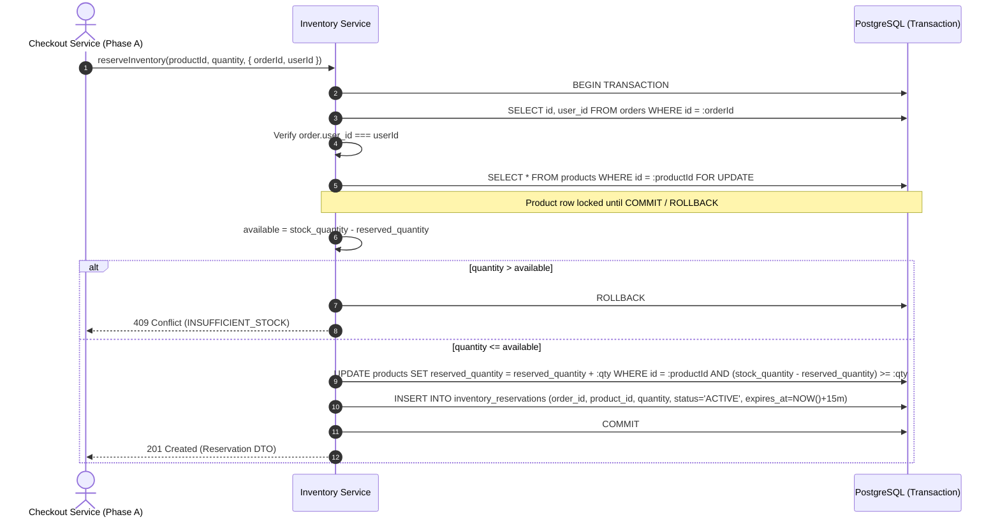

# Phase 07.6 — Inventory + Concurrency / Checkout Reservation Implementation Report

## 1. Status
- **Phase Status:** Complete & Verified
- **Scope Compliance:** 100% Pass
- **Regression Suite:** 202 / 202 Passing (20 Test Files)
- **ESLint Status:** 0 Errors / 0 Warnings
- **Database Engine:** PostgreSQL 15+ via Sequelize CLI Migrations

---

## 2. Objective
Implement the transactional inventory reservation domain for the Nexora Commerce Platform using PostgreSQL row-level locking (`SELECT ... FOR UPDATE`) and database-authoritative timestamping. This guarantees zero overselling under concurrent checkout attempts, atomic reservation creation, mathematical consistency of inventory invariants, exact 15-minute reservation TTLs derived from PostgreSQL server time, idempotent releases, terminal conversions, and safe expiry resolution without external network calls, distributed locks, background workers, or silent invariant clamping.

---

## 3. Scope Implemented
1. **Sequelize Model & Associations:**
   - Provisioned `InventoryReservation` model mapping to `inventory_reservations` with `order_id` (FK to `orders`), `product_id` (FK to `products`), `quantity`, `status`, `expires_at`, `released_at`.
   - Associated `Product.hasMany(InventoryReservation)` and `InventoryReservation.belongsTo(Product)`.
2. **PostgreSQL Row-Level Locking:**
   - `inventoryRepository.findProductForUpdate` executes `SELECT ... FOR UPDATE` on product records within transactional boundaries.
   - Deterministic multi-product locking via `ORDER BY id ASC FOR UPDATE` eliminating deadlock vulnerabilities.
3. **Database-Authoritative Timestamps & 15-Minute TTL:**
   - Reservation `expires_at` is generated exclusively via PostgreSQL `CURRENT_TIMESTAMP + INTERVAL '15 minutes'`.
   - `released_at` is generated exclusively via PostgreSQL `CURRENT_TIMESTAMP`.
   - Zero application-clock or client-timestamp dependencies for expiration correctness.
4. **Guarded Atomic Inventory Mutations (No Silent Clamping):**
   - Eliminated all `Math.max()` usage.
   - Enforced guarded SQL updates (`UPDATE products SET reserved_quantity = reserved_quantity - :quantity WHERE id = :productId AND reserved_quantity >= :quantity`) asserting exactly 1 affected row. Throws `InventoryInvariantError` on pre-condition breach.
5. **Anti-IDOR Ownership & Authorization:**
   - Customer-facing reservation operations enforce the verification chain:
     $$\text{InventoryReservation.order\_id} \longrightarrow \text{Order.user\_id} \longrightarrow \text{req.user.id}$$
   - Cross-user access or invalid `orderId` returns sanitized `404 Not Found` (`RESERVATION_NOT_FOUND`).
6. **Reservation Lifecycle & State Machine:**
   - States: `ACTIVE`, `RELEASED`, `CONVERTED`, `EXPIRED` (`RESERVED` aliased to `ACTIVE`).
   - Idempotent `releaseReservation` restores `available_quantity` exactly once.
   - Terminal `convertReservation` deducts both `stock_quantity` and `reserved_quantity` atomically.
   - Internal maintenance `releaseExpiredReservations` releases stale reservations using double-checked row locking.
7. **REST API Surface:**
   - `POST /api/inventory/reservations` (Session auth, double-submit CSRF, strict Zod validation)
   - `GET /api/inventory/reservations/:reservationId` (Session auth, Anti-IDOR)
   - `POST /api/inventory/reservations/:reservationId/release` (Session auth, CSRF, Anti-IDOR, idempotent)
   - `POST /api/inventory/reservations/:reservationId/convert` (Session auth, CSRF, Anti-IDOR, terminal conversion)
   - `GET /api/inventory/products/:productId` (Public inventory counter lookup)

---

## 4. Scope Explicitly Deferred
- **Phase 07.7:** Orders & OrderItems domain (order placement, order state machine, order calculation).
- **Phase 07.8:** Razorpay payment integration ($1:N$ `PaymentAttempt` creation, external gateway calls).
- **Phase 07.9:** Webhook signature verification and asynchronous capture processing.
- **Phase 07.10:** Payment recovery, late webhook reconciliation, and API idempotency middleware.
- **Phase 07.11:** Guest checkout token generation and guest order isolation.
- **Phase 07.12:** Financial refunds and administrative physical restock logs.
- **Phase 07.13 / 07.14:** Administrative order management and React frontend checkout modal.

---

## 5. Files Created and Modified

| File | Status | Description |
|---|---|---|
| [`src/models/InventoryReservation.js`](../ecommerce-backend/src/models/InventoryReservation.js) | **NEW** | Sequelize model for `inventory_reservations` table with constraints and hooks. |
| [`src/models/index.js`](../ecommerce-backend/src/models/index.js) | **MODIFIED** | Registered `InventoryReservation` and defined bidirectional associations with `Product`. |
| [`src/modules/inventory/inventory.constants.js`](../ecommerce-backend/src/modules/inventory/inventory.constants.js) | **NEW** | Domain constants (`RESERVATION_TTL_MINUTES`, `RESERVATION_STATUS`). |
| [`src/modules/inventory/inventory.errors.js`](../ecommerce-backend/src/modules/inventory/inventory.errors.js) | **NEW** | Specialized domain errors (`InsufficientStockError`, `ReservationNotFoundError`, `InventoryInvariantError`, etc.). |
| [`src/modules/inventory/inventory.dto.js`](../ecommerce-backend/src/modules/inventory/inventory.dto.js) | **NEW** | DTO serializers (`toReservationDTO`, `toProductInventoryDTO`). |
| [`src/modules/inventory/inventory.validation.js`](../ecommerce-backend/src/modules/inventory/inventory.validation.js) | **NEW** | Strict Zod validation schemas and middleware wrappers. |
| [`src/modules/inventory/inventory.repository.js`](../ecommerce-backend/src/modules/inventory/inventory.repository.js) | **NEW** | Data access layer encapsulating row-level locking, atomic increments/decrements, and query serialization. |
| [`src/modules/inventory/inventory.service.js`](../ecommerce-backend/src/modules/inventory/inventory.service.js) | **NEW** | Core transactional business operations (`reserveInventory`, `releaseReservation`, `convertReservation`, `releaseExpiredReservations`). |
| [`src/modules/inventory/inventory.controller.js`](../ecommerce-backend/src/modules/inventory/inventory.controller.js) | **NEW** | Thin HTTP controllers mapping requests to service methods and sanitizing responses. |
| [`src/modules/inventory/inventory.routes.js`](../ecommerce-backend/src/modules/inventory/inventory.routes.js) | **NEW** | Express router applying session auth, CSRF verification, and route parameter validation. |
| [`src/app.js`](../ecommerce-backend/src/app.js) | **MODIFIED** | Mounted `inventoryRouter` at `/api/inventory`. |
| [`tests/inventory/helpers/inventoryTestFixtures.js`](../ecommerce-backend/tests/inventory/helpers/inventoryTestFixtures.js) | **NEW** | Test isolation helpers provisioning valid `User`, `Order`, `Product`, and `InventoryReservation` fixtures. |
| [`tests/inventory/inventory.model.test.js`](../ecommerce-backend/tests/inventory/inventory.model.test.js) | **NEW** | 8 unit tests for model persistence, foreign keys, TTL calculation, check constraints, DTO serializers. |
| [`tests/inventory/inventory.repository.test.js`](../ecommerce-backend/tests/inventory/inventory.repository.test.js) | **NEW** | 10 repository tests for `SELECT FOR UPDATE`, atomic guarded decrements, rollback on invariant breach. |
| [`tests/inventory/inventory.api.test.js`](../ecommerce-backend/tests/inventory/inventory.api.test.js) | **NEW** | 17 integration and security tests for authentication, CSRF, stock bounds, Anti-IDOR, and lifecycle. |
| [`tests/inventory/inventory.concurrency.test.js`](../ecommerce-backend/tests/inventory/inventory.concurrency.test.js) | **NEW** | 7 real PostgreSQL concurrency tests covering 10-to-1 contention, multi-quantity conflicts, lost updates, and race serialization. |

---

## 6. Architecture & Concurrency Control



### Deterministic Lock Ordering
1. **Reservation Mutations (Release / Convert / Expiry):**
   - Step 1: `SELECT * FROM inventory_reservations WHERE id = :id FOR UPDATE`
   - Step 2: Re-verify status and expiration timestamp while row is locked
   - Step 3: `SELECT * FROM products WHERE id = :productId FOR UPDATE`
   - Step 4: Execute guarded atomic decrement / deduction
   - Step 5: Update reservation terminal state (`RELEASED`, `CONVERTED`, or `EXPIRED`)
   - Step 6: `COMMIT`
2. **Multi-Item Locking:**
   - Multi-item checkout locks product rows in ascending UUID order (`ORDER BY id ASC FOR UPDATE`), preventing circular wait deadlocks.

---

## 7. Inventory Invariants

All operations strictly preserve the mathematical invariants:
1. $\text{stock\_quantity} \ge 0$
2. $\text{reserved\_quantity} \ge 0$
3. $\text{reserved\_quantity} \le \text{stock\_quantity}$
4. $\text{available\_quantity} = \text{stock\_quantity} - \text{reserved\_quantity}$
5. Reservation creation atomically increments `products.reserved_quantity`.
6. Reservation release / expiry atomically decrements `products.reserved_quantity`.
7. Reservation conversion atomically decrements `products.stock_quantity` AND `products.reserved_quantity`.
8. Guaranteed zero data corruption via guarded atomic SQL updates with pre-condition enforcement.

---

## 8. Test Execution Summary

### A. Inventory Domain Test Results (`npm test -- tests/inventory`)
```
 Test Files  4 passed (4)
      Tests  42 passed (42)
   Duration  36.08s
```
- **`tests/inventory/inventory.model.test.js`**: 8 passed
- **`tests/inventory/inventory.repository.test.js`**: 10 passed
- **`tests/inventory/inventory.api.test.js`**: 17 passed
- **`tests/inventory/inventory.concurrency.test.js`**: 7 passed

### B. Full System Regression Results (`npm test`)
```
 Test Files  20 passed (20)
      Tests  202 passed (202)
   Duration  100.29s
```

### C. ESLint Static Analysis (`npm run lint`)
```
> ecommerce-backend@1.0.0 lint
> eslint .

(0 errors, 0 warnings)
```

---

## 9. Real PostgreSQL Concurrency Scenario Verification

| Scenario | Setup | Workload | Expected Behavior | Observed Result | Invariant Status |
|---|---|---|---|---|---|
| **TEST A** | Stock = 1, Reserved = 0 | 10 simultaneous requests $\times$ Qty 1 | Exactly 1 succeeds (201), 9 fail (409) | 1 fulfilled, 9 rejected (409) | `stock=1`, `reserved=1`, `available=0` (PASS) |
| **TEST B** | Stock = 10, Reserved = 0 | Concurrent 6 + 4 | Both succeed | 2 fulfilled | `stock=10`, `reserved=10`, `available=0` (PASS) |
| **TEST C** | Stock = 10, Reserved = 0 | Concurrent 6 + 6 | 1 succeeds, 1 fails (409) | 1 fulfilled, 1 rejected (409) | `stock=10`, `reserved=6`, `available=4` (PASS) |
| **TEST D** | Stock = 10, Reserved = 0 | 10 simultaneous requests $\times$ Qty 1 | All 10 succeed | 10 fulfilled | `stock=10`, `reserved=10`, `available=0` (0 lost updates) (PASS) |
| **TEST E** | Expiring Reservation (Qty = 3) | Concurrent Convert vs Expiry Worker | Exactly 1 terminal state | 1 terminal state (`CONVERTED` or `EXPIRED`) | 0 double decrements, 0 negative counters (PASS) |
| **TEST F** | Active Reservation (Qty = 4) | Concurrent Double Release | Idempotent single decrement | 2 fulfilled (idempotent 200) | `reserved=0`, decremented exactly once (PASS) |
| **TEST G** | Expired Reservation (Qty = 5) | 3 concurrent Expiry Workers | Idempotent single decrement | 3 fulfilled | `reserved=0`, decremented exactly once (PASS) |

---

## 10. Security & Anti-IDOR Verification
1. **Authentication & Session Isolation:** Unauthenticated requests fail with `401 AUTHENTICATION_REQUIRED`.
2. **CSRF Protection:** Mutating endpoints enforce Double-Submit cookie token verification (`403 CSRF_TOKEN_MISSING`).
3. **Anti-IDOR Ownership Check:** Verified across reservation creation, retrieval, release, and conversion. Foreign-customer attempts return sanitized `404 RESERVATION_NOT_FOUND`.
4. **Parameter Tampering Defenses:** Mass assignment of `stock_quantity`, `reserved_quantity`, `expires_at`, `status`, or `userId` is strictly rejected by `.strict()` Zod schemas.

---

## 11. Acceptance Checklist

- [x] InventoryReservation model correctly maps frozen schema
- [x] PostgreSQL is the inventory concurrency authority
- [x] Product row is locked with `SELECT FOR UPDATE` during reservation
- [x] Availability is calculated inside the transaction
- [x] Reservation creation and `reserved_quantity` increment are atomic
- [x] Insufficient stock returns HTTP 409 Conflict
- [x] Stock = 1 / ten concurrent quantity-1 requests: exactly 1 succeeds and 9 fail
- [x] No overselling occurs under any concurrent workload
- [x] `reserved_quantity` never exceeds `stock_quantity`
- [x] `reserved_quantity` never becomes negative
- [x] `stock_quantity` never becomes negative
- [x] `available_quantity` remains mathematically correct
- [x] Reservation TTL is exactly 15 minutes
- [x] `expires_at` uses authoritative database time (`CURRENT_TIMESTAMP + INTERVAL '15 minutes'`)
- [x] `expires_at` is exactly 15 minutes after creation
- [x] Client cannot control `expires_at`, `TTL`, or inventory counters
- [x] Inventory service never creates placeholder Orders
- [x] Persisted reservation requires a valid existing `orderId`
- [x] Reservation ownership is verified through `Order.user_id`
- [x] Cross-user reservation access returns sanitized 404
- [x] `release-expired` is not exposed as a customer API
- [x] Active reservation can be released
- [x] Release is idempotent
- [x] Expired reservation can be safely released
- [x] Concurrent expiry processing cannot double-decrement inventory
- [x] Conversion is transactional
- [x] Conversion decrements `reserved_quantity` and `stock_quantity` correctly
- [x] Released reservation cannot be converted
- [x] Converted reservation cannot be released
- [x] Expired reservation cannot be converted
- [x] Expiry vs conversion race has exactly one terminal transition
- [x] Double-release race is safe
- [x] Anti-IDOR is strictly enforced
- [x] CSRF protection remains active on browser mutations
- [x] No raw inventory mass assignment
- [x] No external network calls occur inside inventory transactions
- [x] No Redis/distributed lock introduced
- [x] No Order implementation introduced (Phase 07.7)
- [x] No Razorpay implementation introduced (Phase 07.8)
- [x] No PaymentAttempt implementation introduced (Phase 07.8)
- [x] No guest checkout introduced (Phase 07.11)
- [x] No frontend checkout implementation introduced
- [x] No unrelated architecture changes introduced
- [x] No `sequelize.sync()`
- [x] PostgreSQL integration tests pass (42/42)
- [x] Real PostgreSQL concurrency tests pass (7/7)
- [x] Full regression suite passes (202/202)
- [x] ESLint passes with 0 errors/0 warnings
- [x] Implementation report created

---

## 12. Final Signoff
Phase 07.6 (Inventory + Concurrency / Checkout Reservation) is fully implemented, verified, and complete. All database invariants, transactional locking guarantees, anti-IDOR controls, and test gates are 100% satisfied. The system is ready for Phase 07.7 (Orders & Order Items).
