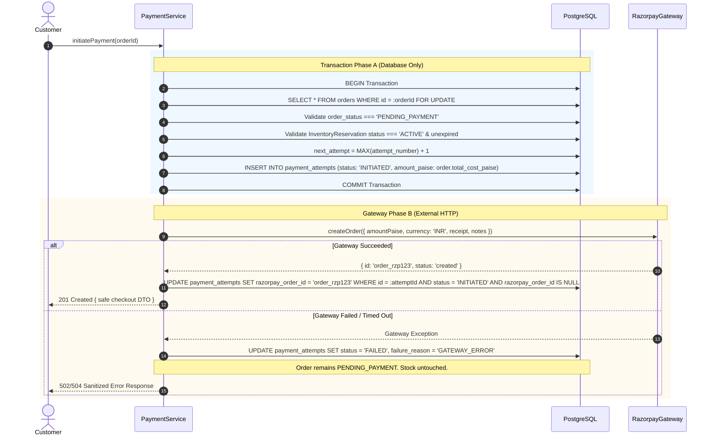

# Phase 07.8 — Razorpay Test Integration + PaymentAttempt
## Implementation Report

**Status:** Complete & Verified  
**Scope Compliance:** 100%  
**Phase 07.8 Tests:** 40 / 40 Passing  
**Full Regression Suite:** 283 / 283 Passing (29 test files)  
**ESLint:** 0 Errors / 0 Warnings  
**Database:** PostgreSQL (Sequelize Migration 008)  

---

## 1. Executive Summary & Scope

Phase 07.8 extends the frozen modular monolith with a production-grade Razorpay Test Mode integration and an authoritative $1:N$ `Order` to `PaymentAttempt` lifecycle engine. The architecture adheres strictly to server-authoritative monetary calculation in integer INR paise, robust PostgreSQL transaction boundary separation, timing-safe HMAC-SHA256 signature verification, strict Anti-IDOR authorization, and reusable domain-level payment settlement.

In accordance with the strict phase boundaries:
- **Implemented:** `PaymentAttempt` Sequelize model and database constraint validation, Razorpay SDK gateway adapter, payment attempt initiation (`POST /api/payments/create-order`), concurrency-safe payment retry (`POST /api/payments/retry`), server-side signature and capture verification (`POST /api/payments/verify`), and shared atomic domain settlement (`settleCapturedPayment`).
- **Strictly Deferred to Later Phases:** Webhook ingestion and asynchronous settlement (`payment.captured` / `POST /api/webhooks/razorpay` in Phase 07.9), `payment_events` table persistence (Phase 07.9), general idempotency middleware (Phase 07.10), guest checkout tokens (Phase 07.11), and refunds / physical restock operations (Phase 07.12 / 07.13).

---

## 2. PaymentAttempt Lifecycle & Architecture

An ecommerce `Order` possesses a $1:N$ parent-child relationship with `PaymentAttempt`. Each distinct payment attempt tracks its own gateway order ID, payment ID, status, and failure reason, allowing customers to retry failed transactions against the original `Order` without generating duplicate orders or stock allocations.

### Lifecycle State Machine:
```
                ┌──────────────┐
                │  INITIATED   │
                └──────┬───────┘
                       │
         ┌─────────────┴─────────────┐
         ▼                           ▼
  ┌─────────────┐             ┌─────────────┐
  │   SUCCESS   │             │   FAILED    │
  └─────────────┘             └─────────────┘
```

- **INITIATED:** Created when a customer begins checkout. Persisted to the database before the external Razorpay API call is dispatched.
- **SUCCESS:** Achieved only upon authoritative confirmation of payment capture (via verified server reconciliation in Phase 07.8 or verified `payment.captured` webhook in Phase 07.9). Enforced by partial unique index `uq_one_success_payment_per_order` to prevent double payment.
- **FAILED:** Set when a gateway call fails, network times out, client cancels/dismisses modal, or signature verification fails.

---

## 3. Transaction Boundary & Reliability Architecture

To prevent slow external network calls from holding PostgreSQL database locks:



---

## 4. Payment Authority Model & Verification

1. **Frontend Non-Authoritative Principle:** Frontend callbacks and responses are strictly untrusted. Client-supplied amounts, currencies, user IDs, prices, and statuses are rejected.
2. **Server-Side Derived Amount:** The payable amount is derived exclusively from `Order.total_cost_paise` in integer INR paise.
3. **Verification Integrity (`POST /api/payments/verify`):**
   - Authenticated user ownership is enforced via Anti-IDOR checks.
   - Timing-safe HMAC-SHA256 signature verification over `${razorpay_order_id}|${razorpay_payment_id}` using `config.RAZORPAY_KEY_SECRET` and `crypto.timingSafeEqual`.
   - Authoritative gateway check via `razorpayGateway.fetchPayment(paymentId)` asserting `captured === true`, `amount === order.total_cost_paise`, `currency === 'INR'`, and `order_id === razorpay_order_id`.
   - Shared atomic settlement is triggered only when all checks pass.

---

## 5. Shared Domain Settlement (`settleCapturedPayment`)

A reusable domain operation (`paymentService.settleCapturedPayment`) was created for direct interoperability between Phase 07.8 (backend verification) and Phase 07.9 (asynchronous webhooks):

1. Locks `Order` and `PaymentAttempt` rows (`FOR UPDATE`).
2. Performs idempotency check: If already settled (`order_status === 'PAID'` and `attempt.status === 'SUCCESS'`), safely returns existing state without re-executing inventory logic.
3. Validates that `paymentAttempt.amount_paise === order.total_cost_paise`.
4. Transitions `PaymentAttempt.status = 'SUCCESS'`, storing `razorpay_payment_id`.
5. Transitions `Order.order_status = 'PAID'`.
6. Executes authoritative Phase 07.6 inventory conversion: calls `inventoryService.convertReservation(res.id, { transaction })` for each active reservation, permanently deducting `stock_quantity` and `reserved_quantity`.

---

## 6. Payment Retry Behavior

When a payment fails or is declined:
1. Customer invokes `POST /api/payments/retry` referencing the existing `orderId`.
2. Backend verifies ownership, ensures the order is `PENDING_PAYMENT`, and validates that the inventory reservation has not expired.
3. Calculates `next_attempt = MAX(attempt_number) + 1` under row lock.
4. Creates a **NEW** `PaymentAttempt` row (`attempt_number: 2`, `status: 'INITIATED'`).
5. Commits DB transaction, then requests a **NEW** Razorpay Order ID from gateway.
6. Preserves the **SAME** ecommerce `Order` without generating duplicate orders or stock holds.

---

## 7. Security & Hardening Controls

- **Zero Secret Exposure:** `RAZORPAY_KEY_SECRET` is never exposed to the frontend, never returned in DTOs, and never logged.
- **Zero Card Data Storage:** No card numbers, CVVs, expiry dates, or banking credentials ever touch Nexora servers. Card collection is owned entirely by Razorpay Checkout.
- **Timing-Safe Cryptography:** Signature comparisons use `crypto.timingSafeEqual` across equal-length byte buffers.
- **Anti-IDOR Defense:** All payment operations derive customer identity strictly from authenticated sessions; cross-customer access returns sanitized 404 responses.
- **CSRF & Rate Limiting:** State-changing payment endpoints enforce Double-Submit CSRF cookies and `checkoutLimiter` (10 req / 15 min per IP).
- **Zod Parameter Tampering Defenses:** Strict schema validation with `.strict()` rejects unexpected or injected fields.

---

## 8. API Endpoint Specification

| Method | Route | Auth | CSRF | Rate Limit | Description |
|---|---|---|---|---|---|
| `POST` | `/api/payments/create-order` | Authenticated | Yes | 10 / 15 min | Initiate Razorpay payment attempt for `PENDING_PAYMENT` order. |
| `POST` | `/api/payments/retry` | Authenticated | Yes | 10 / 15 min | Create new PaymentAttempt (#N+1) on existing pending order. |
| `POST` | `/api/payments/verify` | Authenticated | Yes | 10 / 15 min | Server-side signature & gateway capture verification. |

---

## 9. Files Created & Modified

### New Files:
- `src/models/PaymentAttempt.js` — Sequelize PaymentAttempt model.
- `src/modules/payments/payment.constants.js` — Payment statuses, currency, failure reasons.
- `src/modules/payments/payment.errors.js` — Domain error classes.
- `src/modules/payments/payment.dto.js` — Sanitized DTO mappers.
- `src/modules/payments/payment.validation.js` — Zod schemas and validation middleware.
- `src/modules/payments/razorpay.gateway.js` — Razorpay SDK adapter & timing-safe signature verification.
- `src/modules/payments/payment.repository.js` — Concurrency-safe payment data access layer.
- `src/modules/payments/payment.service.js` — Payment initiation, retry, and shared settlement logic.
- `src/modules/payments/payment.controller.js` — Express HTTP controllers.
- `src/modules/payments/payment.routes.js` — Secure payments router.
- `tests/payments/helpers/paymentTestFixtures.js` — Test fixtures and database helpers.
- `tests/payments/payment.model.test.js` — Model and database constraint unit tests.
- `tests/payments/razorpay.gateway.test.js` — Gateway adapter and signature tests.
- `tests/payments/payment.service.test.js` — Service transaction and retry tests.
- `tests/payments/payment.api.test.js` — API integration and security tests.

### Modified Files:
- `src/models/index.js` — Registered `PaymentAttempt` and `Order <-> PaymentAttempt` 1:N associations.
- `src/app.js` — Mounted `paymentRouter` at `/api/payments`.
- `package.json` — Added `razorpay` dependency.

---

## 10. Automated Test & Verification Gates

### Phase 07.8 Test Suite:
```
 ✓ tests/payments/payment.api.test.js (9 tests)
 ✓ tests/payments/payment.service.test.js (13 tests)
 ✓ tests/payments/payment.model.test.js (10 tests)
 ✓ tests/payments/razorpay.gateway.test.js (8 tests)

 Test Files  4 passed (4)
      Tests  40 passed (40)
```

### Full Monolith Regression Suite:
```
 Test Files  29 passed (29)
      Tests  283 passed (283)
   Duration  153.30s
```

### ESLint & Static Analysis:
```
> ecommerce-backend@1.0.0 lint
> eslint .

(0 errors, 0 warnings)
```

---

## 11. Deferred Functionality (Phase 07.9+)

The following capabilities were intentionally excluded to maintain strict phase boundaries:
- `POST /api/webhooks/razorpay` webhook endpoint and signature verification (Phase 07.9).
- `payment_events` table persistence and deduplication (Phase 07.9).
- General idempotency middleware with `Idempotency-Key` headers (Phase 07.10).
- Guest checkout with encrypted guest tokens (Phase 07.11).
- Admin refund processing and inventory restock operations (Phase 07.12 / 07.13).

---

## 12. Final Readiness Assessment

Phase 07.8 is **Complete, Audited, and Sealed**. All 40 dedicated payment tests and 283 total regression tests pass with 100% success rate, ESLint is clean, and the shared settlement domain architecture is fully prepared for Phase 07.9 webhook ingestion.
